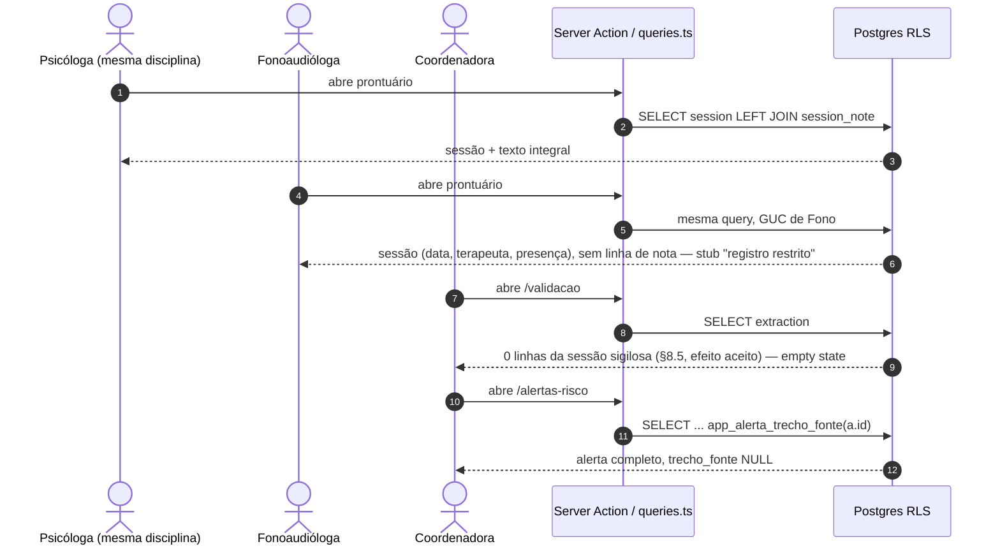

## 📝 Spec fechada (Tech Lead — 24/08/2026)

> As 3 decisões de produto abertas foram travadas com o Rômulo nesta sessão. **Nenhum item
> "a validar"** — pré-requisito de handoff `AGENTS.md` §5.2 fechado. A spec original está
> preservada no Apêndice A.

Implementar sigilo profissional por disciplina em anotações de sessão dentro do prontuário
multidisciplinar: `session_note.visibility_level ∈ ('multidisciplinary','discipline_only')`.

---

## 0. Por que a spec original subiria verde e morta

Três achados de levantamento no código real. Cada um invalida uma premissa da versão anterior:

**A0.1 — Discriminador cego.** `session.disciplina` é `text` livre por clínica (`src/db/schema.ts:977`).
Valores reais no seed: `ABA`, `Fonoaudiologia`, `Terapia Ocupacional`, `Psicopedagogia`,
`Convencional`, `TCC`. **A string `'psicologia'` não existe.** Uma policy que compara com o
literal `'psicologia'` nunca casa: a coluna existe, a UI marca, os testes passam e **nenhuma
nota fica sigilosa**. Mesmo padrão de falha de #289 e #318.

**A0.2 — O texto vaza por artefato derivado, não pela nota.** A issue só trata `session_note`,
mas o texto literal do diário é copiado para:

| Onde | Coluna | Quem lê hoje | Rota |
|---|---|---|---|
| `extraction` | `trecho_fonte` (`schema.ts:1097`) | coordenador, clínica toda | `/validacao`, `/revisao/[sessionId]`, `/duvidas`, `/excecoes`, briefing, `/pacientes/[id]/tcc` |
| `alerta_risco_clinico` | `trecho_fonte` — *"citação literal do diário"* (`schema.ts:1674`) | coordenador, **clínica-wide** via `app_alerta_risco_visivel` (`0049:174`) | `/alertas-risco` |
| `audio_capture` | áudio bruto da sessão | `app_session_clinica_visivel` | diário |
| export do acervo (#374) | dump NDJSON de `session_note` + `extraction` | solicitante | `src/lib/export/acervo/coletor.ts:352,380` |

`BACKLOG.md:429` já nomeia exatamente essas duas colisões (`alerta_risco_scope` clínica-wide
e `trecho_fonte` guardando citação literal) como o motivo de a #119 seguir aberta.

**A0.3 — Existe decisão travada que a spec original ignorava.**
`docs/agente/protocolo-terapia-convencional.md` **§8.5 (AV-6, travada pelo dono em 29/07/2026)**
aponta a implementação em RLS **para esta issue**:

> Camada 3 vê por padrão **apenas** o `alerta_risco` e os **metadados da sessão** (data,
> terapeuta, existência ou não de alerta). **Não** vê o corpo do resumo. O corpo é acessível
> só por **escalonamento do próprio psicólogo** ou **exigência legal** — ambas **sempre auditadas**.
> *"Nenhuma policy, migração ou código foi escrito aqui — este documento apenas registra a
> decisão para que #119 a implemente sem reabrir o debate."*

Não reabrir. Implementar.

---

## 1. Decisões travadas nesta sessão

### D1 — Discriminador: "mesma disciplina da sessão", genérico. Nunca a string `'psicologia'`.

`discipline_only` significa **"só quem é da disciplina desta sessão"**, não "só psicologia".
Serve Psicologia, TCC, Convencional e qualquer disciplina futura, sem hardcode e sem
depender de como a clínica digitou o nome.

Leitor autorizado de uma sessão `s` sob sigilo:

```
s.terapeuta_id = app.user_id
OR EXISTS (SELECT 1 FROM care_team_membership m
            WHERE m.patient_id   = s.patient_id
              AND m.user_id      = app.user_id
              AND m.vigencia_fim IS NULL
              AND m.disciplina   = s.disciplina)
```

Comparação é **igualdade exata** entre dois valores da **mesma clínica** e da **mesma origem
de escrita** (o seletor de disciplina). Não normalizar com `lower()`/`unaccent()`: normalizar
aqui esconderia o dia em que as duas pontas divergirem, e a divergência é bug de escrita, não
de leitura. Se `session.disciplina = 'desconhecida'` (backfill legado da `0036`), a nota é
legível **só pelo terapeuta da sessão** — fail-closed, é o comportamento correto.

### D2 — Mascaramento = esconder a **linha**, não a coluna. RLS filtra linha; não mascara campo.

A spec original pedia "registro mascarado (data e presença visíveis, texto nulo)". Isso **já
acontece de graça**: data (`agendada_para`), terapeuta e presença (`estado`, `check_in_em`)
vivem em **`session`**, que esta issue **não toca**. Escondendo a linha de `session_note`, a
sessão continua na timeline com data e presença, e o corpo simplesmente não existe para
aquele leitor.

Vantagem sobre uma view com `CASE`: é **fail-closed por construção**. Nenhum `SELECT texto`
futuro, em nenhuma rota, pode vazar — a linha não está lá. Uma view com coluna mascarada
teria que ser adotada por cada consumidor, e o consumidor esquecido vaza em silêncio.

**Exceção única:** `alerta_risco_clinico`. Ali a linha **precisa** continuar visível (D4), então
só a coluna `trecho_fonte` é restrita — via `REVOKE SELECT (trecho_fonte)` + função
`SECURITY DEFINER` acessora. É o único ponto do desenho que usa mascaramento de coluna, e é
por isso que ele é a exceção anotada, não o padrão.

### D3 — Sem break-glass de coordenador nesta issue.

§8.5 é explícito: o acesso excepcional é ato **do psicólogo que atende** (escalonamento), não
do coordenador. Esta issue entrega **só o default-deny**. O escalonamento (com prazo,
revogação, notificação e `audit_log` de leitura autorizada) e a quebra por exigência legal
(`is_super_admin`) viram **issues próprias** — abrir na conclusão desta.

Consequência que **não é bug e precisa aparecer na UI**: a fila de `/validacao` da Camada 3
deixa de listar itens de sessão sigilosa. É o *"efeito colateral aceito, e é real"* nomeado no
próprio §8.5. Renderizar **empty state**, jamais erro.

### D4 — Alerta de risco: coordenador vê o alerta, **não** vê o `trecho_fonte`.

| Campo | Coordenador/RT sob sigilo | Disciplina da sessão |
|---|---|---|
| `categoria`, `severidade`, `certeza` | ✅ | ✅ |
| `prazo_minutos`, `prazo_reconhecimento`, `status` | ✅ | ✅ |
| `detalhe` (descrição do agente) | ✅ | ✅ |
| **`trecho_fonte`** (citação literal) | ❌ `NULL` | ✅ |

Sustenta §8.3 P3 (o RT recebe todo alerta — é o que a responsabilidade técnica exige) sem
entregar de graça o conteúdo íntimo. O trilho de escalonamento da #101 (estágios 0/1/2, e-mail
ao RT) **não pode regredir**: `app_escalonar_risco_vencidos` roda como owner e não é afetado —
**medir isso, não deduzir** (T6.3).

---

## 2. Arquitetura



**Estado atual que o desenho reusa** (`0006_fase2_rls.sql`, reescrito por `0085`):
`session_note`, `extraction`, `audio_capture` e `session_protocol_scope` **já** gateiam por
`app_session_clinica_visivel(session_id)`. Um helper novo, encaixado como `AND` ao lado dele,
cobre as três tabelas de conteúdo de uma vez.

Helpers a criar (todos `SECURITY DEFINER STABLE SET search_path = public`, com
`REVOKE ALL … FROM PUBLIC` + `GRANT EXECUTE … TO app_role`, mesmo idioma da `0049:192`):

| Função | Retorna | Papel |
|---|---|---|
| `app_session_sob_sigilo(p_session uuid)` | `boolean` | `EXISTS(session_note WHERE session_id = p_session AND visibility_level = 'discipline_only')` |
| `app_session_disciplina_liberada(p_session uuid)` | `boolean` | predicado do D1 |
| `app_session_conteudo_visivel(p_session uuid)` | `boolean` | `app_session_clinica_visivel(p) AND (NOT app_session_sob_sigilo(p) OR app_session_disciplina_liberada(p))` |
| `app_alerta_trecho_fonte(p_alerta uuid)` | `text` | `trecho_fonte` se `app_session_conteudo_visivel(a.session_id)` **ou** `a.session_id IS NULL`; senão `NULL` |

⚠️ `a.session_id` é **nullable** (`schema.ts:1651`) — alerta de origem `rpd`/`instrumento_formal`
ancora em `rpd_entry_id`/`origem_extraction_id`. `session_id IS NULL` ⇒ **não há sigilo de sessão
a aplicar** ⇒ devolve o trecho. Um `app_session_conteudo_visivel(NULL)` devolveria `NULL`, e
`NULL` num `AND` de policy **esconde a linha em silêncio**. Tratar o `NULL` explicitamente.

⚠️ `app_session_sob_sigilo` lê `session_note`, que tem **`FORCE ROW LEVEL SECURITY`**. Funciona
porque a role dona tem `BYPASSRLS` — mesmo mecanismo que faz `app_session_clinica_visivel` ler
`session`. **Verificar medindo** (`SELECT rolbypassrls FROM pg_roles`), não por leitura de
código: se não tiver, o helper devolve `false` para todo mundo e o sigilo vira invisibilidade
universal — falha silenciosa, CI verde.

---

## 3. Tasks atomizadas

**10 tasks = 10 commits.** Cada task é *um* comportamento, fecha *um* commit, e sai **verde
sozinha** — nada de commit vermelho intencional. Onde a task tem teste, a ordem interna é
sempre **teste vermelho primeiro, implementação depois**, no mesmo commit.

Ordem **obrigatória e sequencial** (T3 depende de T2 depende de T1; T5 depende de T4; T7
carrega migração + código no mesmo commit por necessidade, ver ali):

```
T1 schema ─ T2 helpers ─ T3 barreira de leitura ─ T4 caminho de escrita ─┬─ T5 UI toggle
                                                                         ├─ T6 prontuário
                                                                         ├─ T7 alerta de risco
                                                                         ├─ T8 fila /validacao
                                                                         └─ T9 export acervo
                                                                                    │
                                                                         T10 medição + fechamento
```

T5–T9 são independentes entre si (podem sair em qualquer ordem, ou em paralelo). T10 é o
último e depende de todos.

> **Idioma dos commits:** este repo usa Conventional Commits em **inglês** por padrão
> (`docs/arquitetura/convencoes-de-codigo.md`), **mas** se o executor for o Jules, a regra do
> `CLAUDE.md` prevalece: commits, PR, comentários e plano em **PT-BR**. As mensagens sugeridas
> abaixo estão em PT-BR por isso.

---

### T1 — Schema: enum + coluna + índice parcial

- **Depende de:** —
- **Arquivos:** `src/db/schema.ts` · `db/migrations/0120_*.sql` + `db/migrations/meta/0120_snapshot.json` (gerados)
- **O quê:**
  1. `pgEnum("session_note_visibility_level", ["multidisciplinary","discipline_only"])`, junto dos outros enums (perto de `sessionNoteTipo`, `schema.ts:89`).
  2. Coluna `visibilityLevel` em `sessionNote`, **NOT NULL DEFAULT `'multidisciplinary'`**.
  3. Índice parcial `idx_session_note_sigilo` em `(session_id) WHERE visibility_level = 'discipline_only'`.
  4. `pnpm db:generate`.
- **Reusa:** idioma de enum/índice parcial já em `sessionNote` (`uq_session_note_tipo`, `idx_session_note_session`, `schema.ts:1039-1040`).
- **Por que o default importa:** preserva o significado de **toda** linha existente. Zero backfill.
- **Armadilhas:** commitar `.sql` **e** `meta/0120_snapshot.json` juntos; **nunca** escrever à mão DDL que sai de `schema.ts` (`CLAUDE.md` §Migrações regra 1).
- **Testes:** nenhum novo — o gate é o `migrations.test.ts` existente.
- **Done when:**
  - `pnpm db:generate` numa **2ª** execução responde `No schema changes, nothing to migrate`
  - `pnpm test src/db/migrations.test.ts` → 8/8 verdes
  - `pnpm db:migrate` e `\d session_note` mostra a coluna com o default
- **Commit:** `feat(db): adiciona visibility_level em session_note (#119 T1)`

---

### T2 — Helpers SQL de sigilo

- **Depende de:** T1
- **Arquivos:** `db/migrations/0121_sigilo_helpers.sql` (à mão) + entrada em `db/migrations/meta/_journal.json`
- **O quê:** as 4 funções da tabela do §2, cada uma `SECURITY DEFINER STABLE SET search_path = public`, seguidas de `REVOKE ALL … FROM PUBLIC` + `GRANT EXECUTE … TO app_role`.
- **Reusa:** idioma exato de `app_alerta_risco_visivel` (`0049:174-194`) e `app_session_clinica_visivel` (`0006:10-22`).
- **Armadilhas:**
  - **Entrada manual no `_journal.json`** com `idx: 121` e `when` = `when` da 0120 **+ 1000**. Última hoje: `0119_furry_domino`, `when: 1787512201258`. `when` não-crescente ⇒ **Drizzle pula o arquivo em silêncio** (#165).
  - Tenant vem de `app_clinic_id_exigido()`, **nunca** `current_setting('app.clinic_id')` cru (`CLAUDE.md` §Migrações regra 6). `db/tests/clinic-id-helper-rls.int.test.ts` reprova no CI.
  - `app_alerta_trecho_fonte` trata `a.session_id IS NULL` **explicitamente** (alerta de origem `rpd`/`instrumento_formal`, `schema.ts:1651`) devolvendo o trecho — `NULL` propagado num `AND` de policy esconde linha em silêncio.
- **Testes:** nenhum comportamento muda ainda — esta task só instala as funções.
- **Done when (medido em Postgres, não em `git log`):**
  - `SELECT proname, prosecdef FROM pg_proc WHERE proname IN ('app_session_sob_sigilo','app_session_disciplina_liberada','app_session_conteudo_visivel','app_alerta_trecho_fonte');` → 4 linhas, `prosecdef = t` nas 4
  - `SELECT has_function_privilege('app_role','app_session_conteudo_visivel(uuid)','EXECUTE');` → `t`
  - `pnpm test src/db/migrations.test.ts` verde (journal íntegro)
- **Commit:** `feat(db): helpers SECURITY DEFINER de sigilo por disciplina (#119 T2)`

---

### T3 — Barreira de leitura: policies + testes de invasão

- **Depende de:** T2
- **Arquivos:** `db/migrations/0122_sigilo_policies.sql` + `_journal.json` · `db/tests/sigilo-disciplina-rls.int.test.ts` (**novo**)
- **O quê:**
  1. `ALTER POLICY session_note_select` → predicado atual **+** `AND app_session_conteudo_visivel(session_id)`.
  2. Idem `extraction_select` (`0006:165`).
  3. Idem `audio_select` (`0006:132`).
  4. `session_protocol_scope` **não muda** — é metadado de protocolo, não conteúdo.
- **Reusa:** o predicado vigente sai **copiado da `0085:280-281`**, nunca reescrito de memória — `CREATE OR REPLACE`/`ALTER POLICY` tornam o diff enganoso, o que vale é o texto em `pg_policies`.
- **Arranjo do teste** (vale para T3, T4 e T7 — escrever uma vez, exportar do próprio arquivo): 1 clínica, 1 paciente, `session.disciplina = 'Convencional'`, 5 atores — terapeuta da sessão · 2º profissional `Convencional` na equipe **vigente** · Fonoaudióloga na equipe vigente · Coordenadora · profissional `Convencional` com `vigencia_fim` **preenchida**.
- **Armadilhas:**
  - Rodar com **`pnpm test:rls`**. `vitest run` sozinho **coleta zero** em `*.int.test.ts` e sai verde sem rodar nada. **Conferir a contagem, não o verde.**
  - Fixture roda como **`app_role`**, nunca `authDb`/role dona (#374) — fixture na role dona esconde defeito de produção.
- **Régua de mutação (§5.2 ponto 5)** — 8 testes, cada um cai sozinho ao remover só o seu pedaço:

  | # | Comportamento | Asserção |
  |---|---|---|
  | 1 | esconde de outra disciplina | Fono lê `session_note` sigilosa → **0 linhas** |
  | 2 | mostra para a mesma disciplina | 2º `Convencional` → **1 linha, texto integral** |
  | 3 | mostra para o autor | terapeuta da sessão → 1 linha |
  | 4 | esconde do coordenador | Coordenadora → **0 linhas** |
  | 5 | vigência conta | `Convencional` com `vigencia_fim` preenchida → **0 linhas** |
  | 6 | default preserva | nota `multidisciplinary` → Fono **e** Coordenadora leem |
  | 7 | `extraction` herda | Coordenadora → 0 linhas de `extraction` da sessão sigilosa |
  | 8 | `audio_capture` herda | Coordenadora → 0 linhas de `audio_capture` |

- **Done when:**
  - `pnpm test:rls` verde **e** com 8 testes a mais que a base (hoje 119 arquivos / 1.071 testes)
  - `SELECT polname, pg_get_expr(polqual, polrelid) FROM pg_policy …` mostra `app_session_conteudo_visivel` nos 3 predicados
  - Os 8 mutantes derrubados **individualmente**, revertidos com **patch inverso** — `git checkout` apaga o código novo
- **Commit:** `feat(db): RLS esconde conteúdo de sessão fora da disciplina (#119 T3)`

---

### T4 — Caminho de escrita: grant de coluna + testes

- **Depende de:** T3
- **Arquivos:** `db/migrations/0123_sigilo_grant_coluna.sql` + `_journal.json` · `db/tests/sigilo-disciplina-rls.int.test.ts` (estende)
- **O quê:** `GRANT UPDATE (texto, atualizado_em, visibility_level) ON session_note TO app_role` — hoje é só `(texto, atualizado_em)` (`0006:58`).
- **Por quê:** sem este grant, o toggle do T5 falha com `permission denied for table session_note`. `UPDATE` de coluna faltando **acusa a tabela inteira**, não a coluna — diagnóstico enganoso.
- **Régua de mutação** — 2 testes:

  | # | Comportamento | Asserção |
  |---|---|---|
  | 11 | escrita é só do autor | Fono tenta `UPDATE … SET visibility_level` → 0 linhas afetadas / erro |
  | 12 | prontuário travado nega | com `app_prontuario_somente_leitura_por_sessao` verdadeiro, `UPDATE` não passa |

- **Done when:**
  - `SELECT has_column_privilege('app_role','session_note','visibility_level','UPDATE');` → `t`
  - `pnpm test:rls` verde, +2 testes
- **Commit:** `feat(db): concede UPDATE de visibility_level ao app_role (#119 T4)`

---

### T5 — UI: toggle de sigilo no diário + trilha

- **Depende de:** T4
- **Arquivos:** `src/app/(app)/diario/[sessionId]/consolidar-form.tsx` · `captura-form.tsx` · `logic.ts` (os dois `insert … onConflictDoUpdate`, linhas 92-104 e 307-316) · teste do `logic.ts`
- **O quê:**
  1. Controle de sigilo no formulário, visível **só para o terapeuta da sessão** (`session.terapeuta_id = ctx.userId`). Não gatear por disciplina — a disciplina do autor **é** a da sessão, por construção.
  2. O valor viaja no mesmo `insert`/`onConflictDoUpdate` da nota (resolve o caso "toggle antes do 1º salvamento" sem caminho extra).
  3. Cada **transição** emite 1 linha em `audit_log`: `acao: 'session_note.visibility_level'`, `entidade: 'session_note'`, `entidade_id`, `patient_id`, `detalhe: {de, para}`.
- **Reusa:** componente do design system (Storybook) — **não hardcodar**. Idioma do `audit_log`: `src/lib/patient/desarquivamento.ts:46`.
- **Copy fechada (não inventar, não parafrasear):**
  - rótulo: `Restringir à minha disciplina`
  - auxiliar: `Só quem atende este paciente na mesma disciplina vê o texto. Data e presença seguem visíveis para a equipe.`
  - **nenhuma menção a número de resolução do CFP** (#110)
- **Reversível:** o autor liga e desliga enquanto `NOT app_prontuario_somente_leitura_por_sessao(session_id)`. Travado ⇒ controle **desabilitado com motivo visível**, não escondido.
- **Casos de borda por nome:** nota inexistente · prontuário em somente-leitura · conta em somente-leitura (`app_conta_somente_leitura`) · usuário não é o terapeuta (controle ausente; RLS nega de qualquer forma) · duplo clique (idempotente — vale o último submit, **sem** toggle otimista).
- **Régua de mutação** — 2 comportamentos, 2 testes: (a) ligar o sigilo grava `discipline_only`; (b) **cada transição** grava 1 linha em `audit_log` (ligar **e** desligar — 1 teste só de "ligar" não mata o mutante que esquece a trilha do desligar).
- **Done when:** `pnpm test` verde · `pnpm lint` 0 · Storybook com a estória do controle · toggle ida-volta-ida grava 3 linhas de `audit_log`
- **Commit:** `feat(diario): toggle de sigilo por disciplina na nota de sessão (#119 T5)`

---

### T6 — Prontuário: stub de registro restrito

- **Depende de:** T4 (independente de T5)
- **Arquivos:** `src/app/(app)/pacientes/[id]/temas/queries.ts` · `page.tsx` · `queries.test.ts`
- **Bug estrutural a corrigir:** hoje é `.from(sessionNote).innerJoin(session, …)` (linhas 39-40). Com a linha da nota filtrada pelo RLS, o **`innerJoin` derruba a sessão inteira** — a sessão sumiria da tela, contrariando R4.
- **O quê:**
  1. Inverter para `.from(session).leftJoin(sessionNote, …)`, com `sessionNote.tipo = 'nota_consolidada'` **na condição do join**, não no `where` — no `where`, o `leftJoin` vira `inner` na prática.
  2. Tipo passa a `texto: string | null`. `null` ⇒ stub. **Nunca** string vazia: `''` é indistinguível de nota vazia.
  3. Stub: data + nº sequencial + terapeuta + presença + a linha `Registro restrito à disciplina responsável.` Tratamento visual de **estado neutro**, não de erro.
- **Dono único da leitura:** `obterNotasDeSessao` busca; `page.tsx` recebe por prop. Nenhum filho refaz a query (§5.2 ponto 2).
- **A11y:** o stub é conteúdo, não decoração — lido por leitor de tela na mesma ordem da nota real.
- **Convenção do arquivo (não-óbvia):** os comentários de `queries.ts` explicam **o porquê**, não o quê — ver o docblock de `obterNotasDeSessao`, que justifica ler a nota consolidada em vez de `temas[]`. Manter esse registro.
- **Régua de mutação** — 2 testes: (a) sessão sem nota visível aparece na lista com `texto: null` (trocar o `leftJoin` de volta por `innerJoin` derruba); (b) o stub renderiza data e presença (removê-los derruba).
- **Done when:** `pnpm test` verde · teste de a11y da rota passa · `pnpm lint` 0
- **Commit:** `fix(prontuario): mantém sessão visível com nota restrita (#119 T6)`

---

### T7 — Alerta de risco: trecho literal restrito

- **Depende de:** T4 (independente de T5/T6)
- **Arquivos:** `db/migrations/0124_sigilo_alerta_trecho.sql` + `_journal.json` · `src/app/(app)/alertas-risco/queries.ts` · `db/tests/sigilo-disciplina-rls.int.test.ts` (estende)
- **⚠️ Migração e código no MESMO commit, obrigatoriamente.** O `REVOKE SELECT (trecho_fonte)` quebra a query existente (`queries.ts:67` faz `a.trecho_fonte`) no instante em que roda. Separar em dois commits deixa uma janela de deploy com `/alertas-risco` em `permission denied` — e o deploy roda migração no stage do Dockerfile.
- **O quê:**
  1. `REVOKE SELECT (trecho_fonte) ON alerta_risco_clinico FROM app_role;`
  2. Reemitir o `GRANT SELECT` **coluna a coluna** (idioma de `patient` na `0044`). O `GRANT SELECT` de tabela inteira da `0049:202` **anula** o revoke se ficar por cima — ordem importa.
  3. `queries.ts`: trocar `a.trecho_fonte` por `app_alerta_trecho_fonte(a.id) AS trecho_fonte`.
  4. Tipo `trechoFonte: string | null` e o consumidor (`fila-risco.tsx:150`) rendendo `Trecho restrito à disciplina responsável.` quando `null`.
- **Não muda:** `categoria`, `severidade`, `certeza`, `prazo_*`, `status`, `detalhe` seguem visíveis ao coordenador/RT (D4 e §8.3 P3).
- **Régua de mutação** — 3 testes:

  | # | Comportamento | Asserção |
  |---|---|---|
  | 9 | alerta visível, trecho não | Coordenadora lê o alerta (categoria/severidade/prazo ✅) com `trecho_fonte` **`NULL`** |
  | 10 | alerta sem sessão não regride | alerta com `session_id IS NULL` → `trecho_fonte` **preenchido** |
  | 13 | trilho de risco intacto | `app_escalonar_risco_vencidos` escala normalmente um alerta de sessão sigilosa |

- **Done when:**
  - `SELECT has_column_privilege('app_role','alerta_risco_clinico','trecho_fonte','SELECT');` → `f`
  - `/alertas-risco` carrega sem erro para coordenadora e para a disciplina
  - `pnpm test:rls` verde, +3 testes
- **Commit:** `feat(alertas): restringe trecho literal de sessão sigilosa (#119 T7)`

---

### T8 — Fila `/validacao`: empty state, não erro

- **Depende de:** T3 (independente de T5/T6/T7)
- **Arquivos:** `src/app/(app)/validacao/queries.ts` · `logic.ts` · componente da fila + teste
- **Contexto:** com o T3 no ar, a Camada 3 deixa de ver `extraction` de sessão sigilosa. **Isso não é bug** — é o *"efeito colateral aceito, e é real"* nomeado no próprio §8.5. Mas hoje a fila pode tratar "0 elegíveis" como falha.
- **O quê:** garantir que lote/fila com zero itens renderiza **empty state**, nunca erro nem tela em branco. Texto: `Nada para validar agora.` — **sem** explicar sigilo (revelar "há itens restritos" já é um vazamento de existência).
- **Armadilha:** `catch { setState(null) }` transforma falha de rede em afirmação clínica — distinguir "vazio" de "falhou" com estados diferentes.
- **Régua de mutação** — 1 teste: fila com 0 elegíveis renderiza o empty state (e **não** o de erro).
- **Done when:** `pnpm test` verde · `/validacao` com só sessões sigilosas mostra o empty state
- **Commit:** `fix(validacao): fila vazia por sigilo é empty state, não erro (#119 T8)`

---

### T9 — Export do acervo (#374): omissão declarada, nunca silenciosa

- **Depende de:** T3 (independente de T5–T8)
- **Arquivos:** `src/lib/export/acervo/coletor.ts:352` (`session_note`) e `:380` (`extraction`) · manifesto · teste de completude da #374
- **Problema:** o coletor roda sob `withTenant`/`app_role` **por decisão explícita** (D9, docblock do arquivo, linha 5). Logo o RLS do T3 **já** filtra — e o "Acervo **Integral**" passa a sair incompleto **em silêncio**, com `contagens.session_note` menor e nada dizendo por quê.
- **O quê:** acrescentar ao manifesto, por tabela, `omitidos_por_sigilo: <n>`. Se a contagem não for obtenível sob `app_role` sem furar o próprio sigilo, gravar `omitidos_por_sigilo: null` **com a nota textual de que houve filtragem** — o proibido é o silêncio, não a imprecisão.
- **Sinal esperado:** o teste de completude da #374, se assertar contagem total exata, **quebra**. Esse vermelho é a prova de que o sigilo alcançou o export — atualizar o teste para a chave nova, não afrouxar a asserção.
- **Régua de mutação** — 1 teste: export de clínica com nota sigilosa traz `omitidos_por_sigilo` ≠ ausente.
- **Done when:** `pnpm test` verde · manifesto de um export real com a chave nova colado no PR
- **Commit:** `fix(export): declara linhas omitidas por sigilo no manifesto (#119 T9)`

---

### T10 — Medição, backlog e follow-ups

- **Depende de:** T1–T9
- **O quê:**
  1. Rodar e **colar no PR a saída real do `psql`** (não afirmação) das 5 medições do §4.
  2. `BACKLOG.md:429` — marcar fechadas as duas colisões nomeadas ali (`alerta_risco_scope` clínica-wide e `trecho_fonte` literal).
  3. Abrir 2 issues de follow-up: **escalonamento pelo psicólogo** e **quebra por exigência legal via `is_super_admin`** (§8.5), referenciando esta.
  4. `pnpm format` **só nos arquivos tocados** — o CI **não valida Prettier**, e `pnpm format` cru reformata o repo inteiro.
- **Done when:** DoD do §4 todo marcado com evidência
- **Commit:** `docs(backlog): fecha colisões de sigilo por disciplina (#119 T10)`

---

<details><summary>Medições obrigatórias (referenciadas pelo T2, T4, T7 e T10)</summary>

1. `SELECT proname, prosecdef FROM pg_proc WHERE proname LIKE 'app_session_%' OR proname = 'app_alerta_trecho_fonte';`
2. `SELECT rolname, rolbypassrls FROM pg_roles WHERE rolname IN ('app_role', <owner>);` — o `BYPASSRLS` da role dona é o que faz `app_session_sob_sigilo` enxergar `session_note` sob `FORCE RLS`. Sem ele, o helper devolve `false` para todo mundo e o sigilo vira invisibilidade universal, com CI verde.
3. Trilho de risco ponta a ponta com alerta de sessão sigilosa: e-mail ao RT e estágios 0/1/2 seguem funcionando (o job roda como owner — **medir, não deduzir**).
4. `has_column_privilege` nas duas colunas (T4 e T7).
5. `BEGIN … ROLLBACK` para os cenários destrutivos.

</details>

<details><summary>Versão anterior das tasks (7 blocos, superseded em 24/08/2026)</summary>

### T1 — Schema: coluna + enum
- **Onde:** `src/db/schema.ts`, depois `pnpm db:generate` → `db/migrations/0120_*.sql` + `meta/0120_snapshot.json`.
- **O quê:** `pgEnum("session_note_visibility_level", ["multidisciplinary","discipline_only"])`;
  coluna `visibilityLevel` **NOT NULL DEFAULT `'multidisciplinary'`** em `sessionNote`.
- **Por que o default importa:** preserva o significado de **toda** linha existente. Nenhum backfill à mão.
- **Índice parcial:** `idx_session_note_sigilo ON session_note (session_id) WHERE visibility_level = 'discipline_only'` — `app_session_sob_sigilo` roda por linha em toda leitura de conteúdo.
- **Armadilhas:** commitar `.sql` **e** `meta/0120_snapshot.json` juntos; nunca escrever à mão DDL que sai de `schema.ts` (`CLAUDE.md` §Migrações regra 1).
- **Done when:** `pnpm db:generate` responde `No schema changes, nothing to migrate` numa 2ª execução; `pnpm test src/db/migrations.test.ts` verde.

### T2 — Migração à mão: helpers, policies, grants
- **Onde:** `db/migrations/0121_sigilo_disciplina.sql` (arquivo separado do gerado — policies/grants/funções não saem de `schema.ts`).
- **Entrada no `_journal.json` obrigatória**, `idx: 121`, `when` = `when` da 0120 **+ 1000**. Última hoje: `0119_furry_domino`, `when: 1787512201258`. Se o `when` não for crescente, **Drizzle pula o arquivo em silêncio** (#165).
- **O quê:**
  1. As 4 funções da tabela do §2, com `REVOKE ALL … FROM PUBLIC` + `GRANT EXECUTE … TO app_role`.
  2. `ALTER POLICY session_note_select` → `… AND app_session_conteudo_visivel(session_id)`.
     ⚠️ **Copiar o predicado atual da `0085:280-281` e adicionar**, nunca reescrever de memória.
  3. Idem `extraction_select` (`0006:165`) e `audio_select` (`0006:132`).
  4. `session_protocol_scope` **não muda** — é metadado de protocolo, não conteúdo.
  5. `GRANT UPDATE (texto, atualizado_em, visibility_level) ON session_note TO app_role`
     — hoje é `(texto, atualizado_em)` (`0006:58`). **Sem este grant, o toggle falha com
     `permission denied for table session_note`.**
  6. `REVOKE SELECT (trecho_fonte) ON alerta_risco_clinico FROM app_role;`
     ⚠️ há um `GRANT SELECT` de tabela inteira em `0049:202` — o revoke de coluna precisa vir **depois** e o grant de tabela ser reemitido **coluna a coluna** (idioma de `patient` na `0044`), senão o revoke não sobrevive.
- **Não usar `current_setting('app.clinic_id')` cru** em nenhum predicado novo: `app_clinic_id_exigido()` (`CLAUDE.md` §Migrações regra 6, D16/#229). `db/tests/clinic-id-helper-rls.int.test.ts` reprova no CI.
- **Done when:** medido em Postgres, não em `git log` — `pg_proc` (`prosecdef = true` nas 4), `pg_policies` (predicados novos), `has_column_privilege('app_role','alerta_risco_clinico','trecho_fonte','SELECT') = false`, `has_column_privilege('app_role','session_note','visibility_level','UPDATE') = true`.

### T3 — UI: toggle de sigilo no diário
- **Onde:** `src/app/(app)/diario/[sessionId]/consolidar-form.tsx` + `captura-form.tsx`; escrita em `logic.ts` (`insert … onConflictDoUpdate`, linhas 92-104 e 307-316).
- **Quem vê o controle:** **só o terapeuta da sessão** (`session.terapeuta_id = ctx.userId`). Não gatear por disciplina — a disciplina do autor **é** a da sessão, por construção.
- **Componente:** reusar o do design system (Storybook). **Não hardcodar.**
- **Copy (fechada, não inventar):** rótulo `Restringir à minha disciplina` · auxiliar `Só quem atende este paciente na mesma disciplina vê o texto. Data e presença seguem visíveis para a equipe.` · **nenhuma menção a número de resolução do CFP** (#110).
- **Reversível:** o autor pode ligar e desligar enquanto `NOT app_prontuario_somente_leitura_por_sessao(session_id)`. Prontuário travado ⇒ controle desabilitado com motivo visível.
- **Cada transição emite 1 linha em `audit_log`** (`acao: 'session_note.visibility_level'`, `entidade: 'session_note'`, `entidade_id`, `patient_id`, `detalhe: {de, para}`). Idioma de `src/lib/patient/desarquivamento.ts:46`.
- **Casos de borda por nome:** nota inexistente (toggle antes do 1º salvamento → o valor viaja no mesmo `insert`); prontuário em somente-leitura; conta em somente-leitura (`app_conta_somente_leitura`); usuário não é o terapeuta (controle ausente, e o RLS nega de qualquer forma); duplo clique (idempotente — o estado final é o do último submit, sem toggle otimista).

### T4 — Prontuário: stub de registro restrito
- **Onde:** `src/app/(app)/pacientes/[id]/temas/queries.ts` (`obterNotasDeSessao`) + `page.tsx`.
- **Bug estrutural a corrigir:** a query hoje faz `.from(sessionNote).innerJoin(session, …)` (linhas 39-40). Com a linha da nota filtrada pelo RLS, o **`innerJoin` derruba a sessão inteira** — a sessão sumiria da tela, contrariando R4. **Inverter:** `.from(session).leftJoin(sessionNote, …)`, com `sessionNote.tipo = 'nota_consolidada'` **na condição do join**, não no `where` (senão o `leftJoin` vira `inner` na prática).
- **Tipo:** `texto: string | null`. `null` ⇒ renderizar o stub, nunca string vazia (`''` é indistinguível de nota vazia).
- **Stub:** data + nº sequencial + terapeuta + presença, e a linha `Registro restrito à disciplina responsável.` Tratamento visual de estado neutro, **não** de erro.
- **Dono único da leitura:** `obterNotasDeSessao` busca; `page.tsx` recebe por prop. Nenhum componente-filho refaz a query (§5.2 ponto 2).
- **A11y:** o stub é conteúdo, não decoração — precisa ser lido por leitor de tela na mesma ordem da nota real.
- **Convenção do arquivo:** os comentários de `queries.ts` explicam **o porquê** (ver o docblock de `obterNotasDeSessao`, que justifica ler a nota consolidada em vez de `temas[]`). Manter esse registro — não trocar por comentário do "o quê".

### T5 — Testes de invasão RLS
- **Onde:** `db/tests/sigilo-disciplina-rls.int.test.ts` *(nome ajustado — a barreira é por disciplina, não por "psychology"; o nome antigo reintroduz o hardcode que o D1 elimina)*.
- **Rodar com `pnpm test:rls`.** `vitest run` sozinho **coleta zero** em `*.int.test.ts` e sai verde sem rodar nada. **Conferir a contagem de testes, não o verde.**
- **Arranjo:** 1 clínica, 1 paciente, `session.disciplina = 'Convencional'`, 5 atores: terapeuta da sessão · 2º profissional `Convencional` na equipe vigente · Fonoaudióloga na equipe vigente · Coordenadora · profissional `Convencional` com `vigencia_fim` **preenchida**.
- **Fixture roda como `app_role`, nunca com `authDb`/role dona** (#374): fixture na role dona esconde defeito de produção.

**Régua de mutação por comportamento (§5.2 ponto 5)** — cada linha é 1 teste, e remover **só** o pedaço de produção correspondente derruba **aquele** teste:

| # | Comportamento | Asserção |
|---|---|---|
| 1 | esconde de outra disciplina | Fono lê `session_note` da sessão sigilosa → **0 linhas** |
| 2 | mostra para a mesma disciplina | 2º `Convencional` → **1 linha, texto integral** |
| 3 | mostra para o autor | terapeuta da sessão → 1 linha |
| 4 | esconde do coordenador | Coordenadora → **0 linhas** |
| 5 | vigência conta | `Convencional` com `vigencia_fim` preenchida → **0 linhas** |
| 6 | default preserva | nota `multidisciplinary` → Fono **e** Coordenadora leem (prova que não quebrou nada) |
| 7 | `extraction` herda | Coordenadora → 0 linhas de `extraction` da sessão sigilosa |
| 8 | `audio_capture` herda | idem |
| 9 | alerta visível, trecho não | Coordenadora lê o alerta (categoria/severidade/prazo ✅) com `trecho_fonte` **`NULL`** |
| 10 | alerta sem sessão não regride | alerta com `session_id IS NULL` → `trecho_fonte` **preenchido** |
| 11 | escrita é só do autor | Fono tenta `UPDATE … SET visibility_level` → 0 linhas afetadas / erro |
| 12 | prontuário travado nega | com `app_prontuario_somente_leitura_por_sessao` verdadeiro, `UPDATE` não passa |
| 13 | trilho de risco intacto | `app_escalonar_risco_vencidos` escala normalmente um alerta de sessão sigilosa |

**Como provar que um teste testa:** reverter a mutação **com patch inverso**, nunca
`git checkout` — o HEAD apaga o código novo.

### T6 — Verificação por medição
1. `SELECT proname, prosecdef FROM pg_proc WHERE proname LIKE 'app_session_%' OR proname = 'app_alerta_trecho_fonte';`
2. `SELECT rolname, rolbypassrls FROM pg_roles WHERE rolname IN ('app_role', <owner>);` — o `BYPASSRLS` da role dona é o que faz `app_session_sob_sigilo` enxergar `session_note` sob `FORCE RLS`.
3. Trilho de risco ponta a ponta com alerta de sessão sigilosa: e-mail ao RT e estágios 0/1/2 seguem funcionando (o job roda como owner — **medir, não deduzir**).
4. `has_column_privilege` nas duas colunas do T2.
5. `BEGIN … ROLLBACK` para os cenários destrutivos.

### T7 — Export do acervo (#374): omissão declarada, nunca silenciosa
- **Onde:** `src/lib/export/acervo/coletor.ts:352` (`session_note`) e `:380` (`extraction`).
- **Problema:** o coletor roda sob `withTenant`/`app_role` por decisão explícita (D9, docblock do arquivo, linha 5). Logo o RLS novo **já** filtra — e o "Acervo **Integral**" passa a sair incompleto **em silêncio**, com `contagens.session_note` menor, sem nada dizendo por quê.
- **O quê:** acrescentar ao manifesto, por tabela, `omitidos_por_sigilo: <n>`, obtido por contraste com a contagem elegível. Se a contagem não for obtenível sob `app_role` sem furar o próprio sigilo, registrar `omitidos_por_sigilo: null` **com a nota textual de que houve filtragem** — o proibido é o silêncio, não a imprecisão.
- **Atualizar o teste de completude da #374** para esperar a nova chave. Se ele assertar contagem total exata, hoje ele **quebra** — e é esse vermelho que prova que o sigilo alcançou o export.

*Substituídas em 24/08/2026: 7 blocos gordos (o T2 antigo acumulava 6 mudanças de DDL num commit só; o T5 antigo, 13 asserções) viraram 10 tasks de um comportamento cada.*

</details>

---

## 4. Definição de pronto

- [ ] `pnpm typecheck` · `pnpm lint` → 0 erros
- [ ] `pnpm test` → 100%
- [ ] `pnpm test:rls` → 100%, **e a contagem de arquivos/testes subiu** (hoje: 119 arquivos / 1.071 testes)
- [ ] `pnpm test src/db/migrations.test.ts` → journal, `when` crescente, snapshot
- [ ] **19/19** testes de mutação derrubados **individualmente**, revertidos com patch inverso — T3: 8 · T4: 2 · T5: 2 · T6: 2 · T7: 3 · T8: 1 · T9: 1
- [ ] Medições do T10 coladas no PR (saída real do `psql`, não afirmação)
- [ ] 10 commits, um por task, cada um verde sozinho
- [ ] `pnpm format` **apenas nos arquivos tocados** antes do push — o CI **não valida Prettier**, e `pnpm format` cru reformata o repo inteiro
- [ ] Componente do design system reusado/registrado no Storybook
- [ ] Nenhuma copy user-facing cita número de resolução do CFP (#110)
- [ ] `BACKLOG.md:429` atualizado: as duas colisões nomeadas ali estão fechadas
- [ ] Abertas as 2 issues de follow-up: **escalonamento pelo psicólogo** e **quebra por exigência legal** (§8.5)

## 5. Fora de escopo

Escalonamento (psicólogo libera nota para supervisão, com prazo/revogação/`audit_log` de
leitura autorizada) · quebra por exigência legal via `is_super_admin` · catálogo fechado de
disciplina (hoje `text` livre em 5 tabelas) · direito de acesso do próprio paciente (AV-9).

---

## Apêndice A — Spec original (superseded, preservada)

<details><summary>Versão anterior desta issue</summary>

Implementar controle de visibilidade restrita (`visibility_level: 'discipline_only' | 'multidisciplinary'`) para anotações e evoluções de sessão da Psicologia no prontuário multidisciplinar integrado, em total cumprimento da Resolução CFP 009/2024.

**Regras de Negócio & Guardrails Inegociáveis:**
1. Controle de Acesso em Nível de Banco (RLS): notas `discipline_only` só podem ser lidas por profissionais da mesma clínica cuja disciplina seja `psicologia` (`app_user_role_exigido()` + disciplina no token/sessão). Tentativas de acesso por profissionais de outras disciplinas retornam o registro mascarado (data e confirmação de presença visíveis, texto da nota nulo).
2. Imutabilidade de Auditoria: qualquer tentativa de desbloqueio ou leitura autorizada por Coordenador/RT deve emitir registro imediato em `audit_log`.

Tasks: T1 migration · T2 policy RLS de disciplina · T3 UI do diário clínico · T4 mascaramento no prontuário · T5 testes de invasão em `db/tests/psychology-privacy-rls.int.test.ts`.

*Substituída em 24/08/2026: o discriminador `'psicologia'` não existe nos dados (§0.1), o escopo não cobria os artefatos derivados (§0.2), e a decisão travada em §8.5 do protocolo de terapia convencional não estava refletida (§0.3).*

</details>
