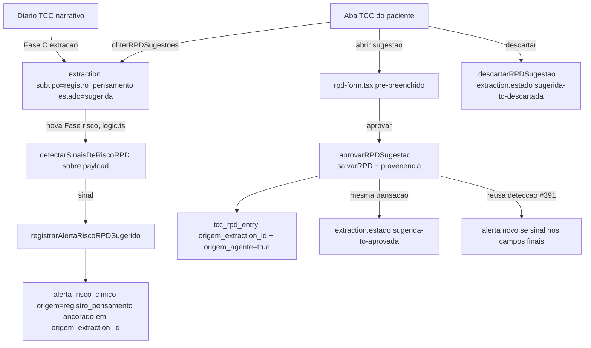

# #392 Ponte agente → RPD sugerido — Design

**Spec**: `.specs/features/392-ponte-agente-rpd-sugerido/spec.md`
**Status**: Approved (design inline, executado pelo mesmo orquestrador desta sessão)

---

## Arquitetura



RLS da leitura da fila **não é policy nova** — `extraction_select` (`0085:177`) já escopa por `clinic_id = app_clinic_id_exigido() AND app_session_clinica_visivel(session_id)`, genérico por linha, sem exceção por `subtipo`. `obterRPDSugestoes` filtra `subtipo`/`estado` em cima de um SELECT já isolado — confirmado por leitura direta da migração, não presumido.

---

## Reuso de código

| Componente | Local | Como usar |
| --- | --- | --- |
| `registrarAlertaRiscoInstrumento` | `src/lib/risco/registrar.ts` | Espelhar assinatura/retorno para `registrarAlertaRiscoRPDSugerido` (nunca lança, mesmo formato) |
| `detectarSinaisDeRiscoRPD` | `pacientes/[id]/tcc/deteccao-risco.ts` | Reusar direto se aceitar o shape de `payload` da extração (campos de texto livre); se não aceitar, criar adaptador fino que remapeia campos — **não duplicar lista de termos/sinais** |
| Padrão advisory-lock + `comEscrita` + `requireRole` | `src/app/(app)/validacao/logic.ts` | Copiar padrão (lock por paciente, transação única, `withTenant`) para `aprovarRPDSugestao`/`descartarRPDSugestao` — sem reusar as tabelas `evidence*` |
| `salvarRPD` | `pacientes/[id]/tcc/logic.ts:36` | `aprovarRPDSugestao` chama-o (ou compartilha o core) sem mudar sua assinatura de negócio — só adiciona 2 colunas de proveniência ao INSERT |
| Fase E (instrumento formal) | `diario/[sessionId]/logic.ts` (#391) | Mesmo padrão estrutural para a nova fase de risco de RPD sugerido — roda pós-persistência da extração, erro não derruba o save |

---

## Componentes

### 1. Migração `0112`
- **Onde**: `db/migrations/0112_rpd_sugerido_provenencia.sql` + `db:generate` para `tcc_rpd_entry` (schema.ts), CHECK de `alerta_risco_clinico` é DDL manual (não modelado no Drizzle, igual §CLAUDE.md regra 1).
- **O que**: `tcc_rpd_entry.origem_extraction_id uuid REFERENCES extraction(id)` + `origem_agente boolean NOT NULL DEFAULT false`; relaxa `alerta_risco_vinculo` para `registro_pensamento` aceitar `rpd_entry_id IS NOT NULL OR origem_extraction_id IS NOT NULL`. FK composta anti-IDOR intocada.
- **Verificação**: `information_schema.columns` + `pg_constraint` pós-apply (regra 3 CLAUDE.md), não `git log`.

### 2. `registrarAlertaRiscoRPDSugerido`
- **Onde**: `src/lib/risco/registrar.ts`
- **Interface**: `registrarAlertaRiscoRPDSugerido(ctx: TenantContext, args: { patientId: string; extractionId: string; sinal: SinalRisco }): Promise<RegistrarResultado>` (mesmo shape de retorno de `registrarAlertaRiscoInstrumento` — nunca lança)
- **Dependências**: `app_criar_alerta_risco` (definer, já existe) com novo parâmetro/overload aceitando `origem_extraction_id` para `origem='registro_pensamento'`.

### 3. Fase de risco em `diario/[sessionId]/logic.ts`
- **Onde**: nova fase após Fase E, mesmo arquivo.
- **O que**: para cada draft `subtipo === "registro_pensamento"` recém-persistido, roda detecção sobre `payload`, chama `registrarAlertaRiscoRPDSugerido` se houver sinal. Falha isolada (try/catch por item, não aborta a extração).

### 4. `obterRPDSugestoes` / `aprovarRPDSugestao` / `descartarRPDSugestao`
- **Onde**: `src/app/(app)/pacientes/[id]/tcc/sugestoes.ts` (novo arquivo — mantém `logic.ts` focado no caminho manual, evita um arquivo gigante)
- **Interfaces**:
  - `obterRPDSugestoes(ctx: TenantContext, patientId: string): Promise<RPDSugestao[]>` — SELECT `extraction` join `session` filtrando `subtipo='registro_pensamento' AND estado='sugerida' AND session.patient_id = patientId`, ordenado por `session.created_at`.
  - `aprovarRPDSugestao(ctx, input: { extractionId } & CamposSalvarRpd): Promise<ValidacaoResult>` — `comEscrita`, `requireRole`, advisory lock por paciente, INSERT em `tcc_rpd_entry` (`origem_extraction_id`, `origem_agente=true`) + UPDATE `extraction.estado='aprovada'` na mesma transação + roda deteccao de risco normal (#391) sobre os campos finais confirmados.
  - `descartarRPDSugestao(ctx, input: { extractionId }): Promise<ValidacaoResult>` — `comEscrita`, `requireRole`, UPDATE `extraction.estado='descartada'`. Um único UPDATE, sem lock necessário (não há corrida de dado clínico, só transição de estado).
- **Reusa**: `salvarRpdSchema` (validação Zod dos campos clínicos), padrão de `validacao/logic.ts` para a mecânica de escrita seed.

### 5. UI — fila de sugestões
- **Onde**: novo componente `pacientes/[id]/tcc/rpd-sugestoes.tsx`, montado em `page.tsx` acima ou ao lado do formulário manual existente.
- **Interações**: lista com trecho/preview; "Aprovar" abre `rpd-form.tsx` reaproveitado com `valoresIniciais` vindos do payload da extração (situação/emoção/intensidade em branco); "Descartar" é ação de um clique com confirmação leve (sem modal bloqueante).

---

## Modelos de dado

```typescript
// tcc_rpd_entry (colunas novas)
interface TccRpdEntryProvenance {
  origemExtractionId: string | null; // FK extraction.id
  origemAgente: boolean; // default false
}

// alerta_risco_clinico (CHECK relaxado, sem coluna nova)
// origem='registro_pensamento' agora aceita rpd_entry_id OU origem_extraction_id
```

**Relação**: `tcc_rpd_entry.origem_extraction_id` (proveniência da linha aprovada) é semanticamente distinta de `alerta_risco_clinico.origem_extraction_id` (âncora do alerta pré-aprovação) — mesmo nome, tabelas diferentes, sem FK cruzada entre si.

---

## Tratamento de erro

| Cenário | Tratamento | Impacto ao usuário |
| --- | --- | --- |
| Detecção de risco falha ao persistir extração de RPD | try/catch isolado, extração já persistida permanece | Extração salva normalmente; alerta pode faltar — mesmo padrão de #391 (falha não derruba save) |
| Aprovação concorrente da mesma sugestão (2 abas) | Advisory lock por paciente + re-check de `estado='sugerida'` antes do UPDATE | Segunda tentativa recebe erro de concorrência, não duplica `tcc_rpd_entry` |
| Payload da extração incompleto para pré-preencher form | Campos ausentes ficam em branco no form, terapeuta completa manualmente | Nenhum bloqueio — aprovação sempre passa pela validação `salvarRpdSchema` completa |

---

## Decisões técnicas (não óbvias)

| Decisão | Escolha | Racional |
| --- | --- | --- |
| Fila de sugestão: tabela nova vs. reusar `extraction.estado` | Reusar `extraction` + `estado` existente | Enum `sugerida\|pendente_reprocessamento\|aprovada\|editada\|descartada` já modela exatamente esse ciclo — tabela de staging nova duplicaria o conceito |
| Aprovação: toggle vs. formulário completo | Formulário completo pré-preenchido | `registroPensamentoSchema` do agente não cobre `situacao/emocao/intensidade` (NOT NULL em `tcc_rpd_entry`) — clique cego produziria INSERT inválido ou dado inventado, ambos proibidos |
| Alerta na sugestão vs. só na aprovação | Na criação da sugestão (não espera aprovação) | Invariante de #391/regra-alerta-risco.md: alerta nunca espera revisão humana; ideação em texto pendente de aprovação ainda é ideação |
| Migrar alerta da sugestão pro `rpd_entry_id` ao aprovar | Não migra — alerta fica ancorado na extração para sempre | Mesmo princípio de #391 generalizado: alerta é trilha imutável, não espelho do estado atual do RPD |

---

## Próxima fase

Tasks quebradas abaixo (`tasks.md`), 6 tasks, T2/T3 paralelos entre si (ambos dependem só de T1), T4/T5 paralelos entre si (ambos dependem de T2), T6 fecha depois de tudo.
