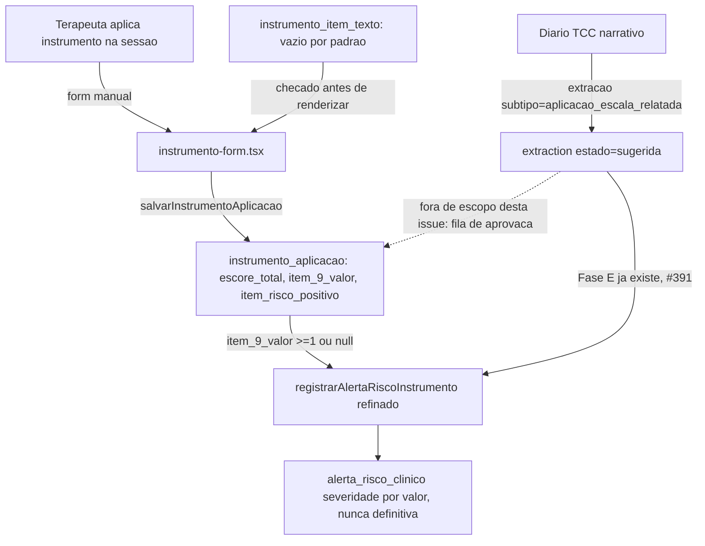

# #393 Escalas PHQ-9/GAD-7 — Design

**Spec**: `.specs/features/393-escalas-phq9-gad7/spec.md`
**Status**: Approved (design inline)

---

## Arquitetura



Duas superfícies de escrita para `instrumento_aplicacao`: manual (form, esta issue) é a única que grava a tabela oficial. A extração do agente (`aplicacao_escala_relatada`) já dispara alerta via Fase E (#391) sem depender de aprovação — isso NÃO muda; o que fica de fora é transformar a sugestão em linha oficial de `instrumento_aplicacao` (débito de follow-up, análogo a #392 mas não pedido pela issue).

---

## Reuso de código

| Componente                                          | Local                                                                          | Como usar                                                                                                                                                                                                                              |
| --------------------------------------------------- | ------------------------------------------------------------------------------ | -------------------------------------------------------------------------------------------------------------------------------------------------------------------------------------------------------------------------------------- |
| RLS 4-policy pattern                                | `db/migrations/0103_*.sql:37-60` (`tcc_rpd_entry`)                             | Copiar literal para `instrumento_aplicacao`, trocando nome de tabela                                                                                                                                                                   |
| `salvarRPD` / `comEscrita` / `requireRole`          | `pacientes/[id]/tcc/logic.ts`                                                  | Mesmo padrão para `salvarInstrumentoAplicacao`                                                                                                                                                                                         |
| `registrarAlertaRiscoInstrumento`                   | `src/lib/risco/registrar.ts:231`                                               | Estende (não recria) para aceitar `item9Valor` e mapear severidade — assinatura ganha parâmetro opcional, chamadores existentes (Fase E) continuam funcionando sem o valor (severidade fixa como fallback quando `item9Valor` ausente) |
| `has_column_privilege` guard pattern                | memória `postgres-column-grant-denies-table`, já usado em migrações anteriores | Verificar GRANT por coluna pós-apply                                                                                                                                                                                                   |
| `agentOutputSchema`/`aplicacaoEscalaRelatadaSchema` | `agent-output-schema.ts:146-159`                                               | Já correto (`item_risco_positivo: boolean\|null`), sem mudança — só a tabela oficial espelha a mesma semântica                                                                                                                         |

---

## Componentes

### 1. Migração `0113`

- **Onde**: `db/migrations/0113_instrumento_aplicacao.sql` + `db:generate` para a tabela (Drizzle), RLS é DDL manual (regra 1 CLAUDE.md).
- **Tabela `instrumento_aplicacao`**: `id`, `clinic_id`, `patient_id`, `session_id` nullable, `protocol_id` (referência ao catálogo do instrumento, não ao protocolo clínico ABA), `tipo_instrumento` enum (`phq9`|`gad7`), `escore_total` int nullable, `fonte_do_escore` enum (`paciente_informou`|`terapeuta_calculou_na_sessao`|`nao_informado`), `respostas_por_item` jsonb (`Array<{item: number, valor: 0|1|2|3}>`), `item_9_valor` int nullable 0-3 (só relevante PHQ-9), `item_risco_positivo` boolean nullable, `criado_por`, `criado_em`.
- **Tabela `instrumento_item_texto`**: `id`, `tipo_instrumento` enum, `numero_item` int, `texto` text nullable (vazio por padrão — sem seed com conteúdo PT-BR), `clinic_id` nullable (permite override por clínica no futuro, mas #393 só popula global/nulo). Tabela separada em vez de coluna JSONB em `clinic`: não é config por clínica no MVP (é conteúdo regulatório compartilhado, pendente de licença), então acoplar a `clinic` sugeriria erroneamente que cada clínica configura o próprio texto.
- **RLS**: `instrumento_aplicacao` copia `0103:37-60` literal. `instrumento_item_texto` é leitura global (sem `clinic_id` obrigatório) — policy mais simples, `SELECT` para qualquer `app_role` autenticado, sem `INSERT/UPDATE/DELETE` via `app_role` (conteúdo só entra por migração futura, quando a licença for confirmada).
- **Verificação**: `information_schema` + `pg_constraint` + `has_column_privilege` pós-apply.

### 2. `CanonicalProtocolo.tipo_coleta`

- **Onde**: `src/lib/extraction/context-assembler.ts:11-16` (tipo `CanonicalProtocolo`), + o mapeamento em `montarContextoCanonico` (linha ~86).
- **O que**: novo campo `tipo_coleta: "por_sessao" | "escala_padronizada_intervalar"`. Protocolos ABA existentes mapeiam para `"por_sessao"` (comportamento atual, default explícito — não silencioso). PHQ-9/GAD-7 mapeiam para `"escala_padronizada_intervalar"`.
- **Consumidor**: nenhum código consome esse campo ainda nesta issue (é sinal para o agente/prompt, não para lógica determinística) — `TCC_SYSTEM_PROMPT` cita a diferença em texto (RQ4).

### 3. Severidade por valor do item 9

- **Onde**: `src/lib/risco/registrar.ts` (`registrarAlertaRiscoInstrumento`), migração `0113` adiciona parâmetro `item_9_valor` a `app_criar_alerta_risco` OU a lógica de mapeamento fica só no TypeScript antes de chamar o definer (decisão: **mapeamento em TS**, não no SQL — mais fácil de testar sem round-trip de banco, e `app_criar_alerta_risco` já aceita severidade como parâmetro explícito desde `0049`, não precisa mudar).
- **Mapeamento** (confirmado contra `alertaRiscoSeveridade` real, `schema.ts:1591-1600`):
  - `item9Valor === 0`: não dispara (mantém regra atual — `item_risco_positivo` deveria já vir `false` do agente/form nesse caso; não é responsabilidade deste mapeamento re-derivar).
  - `item9Valor === 1`: `ideacao_passiva`.
  - `item9Valor === 2 || item9Valor === 3`: `ideacao_ativa_sem_plano` — **nunca `ideacao_ativa_com_plano`**: PHQ-9 item 9 mede frequência (0-3 dias/semana), não presença de plano; inferir "com plano" sem evidência textual violaria R2 (proveniência literal). `ideacao_ativa_com_plano` só é atingível pelo caminho de texto livre (RPD/diário), nunca só pelo valor numérico do item 9.
  - `item9Valor === null` (recusado): mantém `certeza='ambiguo_citado'` (já implementado #391), severidade default de #391 (`ideacao_ativa_sem_plano`) preservada — recusa não pode rebaixar (§1.4).
  - `item9Valor === undefined` (chamador antigo/extração sem o campo): fallback = comportamento atual de #391, sem quebrar Fase E.
  - Empate entre o valor do item 9 e outro sinal (ex.: texto livre no mesmo diário também sinaliza risco maior): resolve pelo mais grave (§1.3) — código já teria essa resolução em algum ponto de merge de sinais; confirmar em `registrar.ts` antes de assumir que precisa ser adicionada aqui ou já existe.

### 4. `instrumento-form.tsx` + `salvarInstrumentoAplicacao`

- **Onde**: `src/app/(app)/pacientes/[id]/tcc/instrumento-form.tsx` (novo), `instrumento-logic.ts` ou extensão de `logic.ts` (novo arquivo preferível — `logic.ts` já cresceu com RPD, manter instrumento separado).
- **Interface**: `salvarInstrumentoAplicacao(ctx, input: {patientId, sessionId?, tipoInstrumento, respostasPorItem, fonteDoEscore}): Promise<ValidacaoResult>` — calcula `escoreTotal` e `item9Valor`/`itemRiscoPositivo` a partir de `respostasPorItem` no SERVIDOR (nunca confia em total pré-calculado do cliente, mesmo padrão anti-forjamento de severidade de #391), `comEscrita` + `requireRole`, roda `registrarAlertaRiscoInstrumento` com o item 9 real ao final.
- **UI**: renderiza campos 1-9 (PHQ-9) ou 1-7 (GAD-7) SÓ se `instrumento_item_texto` tiver texto carregado para cada item — caso contrário, estado vazio explicando "conteúdo do instrumento pendente de configuração" (não formulário sem rótulo).

---

## Modelos de dado

```typescript
interface InstrumentoAplicacao {
  id: string;
  clinicId: string;
  patientId: string;
  sessionId: string | null;
  protocolId: string;
  tipoInstrumento: "phq9" | "gad7";
  escoreTotal: number | null;
  fonteDoEscore:
    "paciente_informou" | "terapeuta_calculou_na_sessao" | "nao_informado";
  respostasPorItem: Array<{ item: number; valor: 0 | 1 | 2 | 3 }>;
  item9Valor: number | null; // 0-3, só PHQ-9
  itemRiscoPositivo: boolean | null; // null !== false
  criadoPor: string;
  criadoEm: Date;
}

interface InstrumentoItemTexto {
  id: string;
  tipoInstrumento: "phq9" | "gad7";
  numeroItem: number;
  texto: string | null; // vazio por padrão, sem seed PT-BR
}
```

---

## Tratamento de erro

| Cenário                                                                   | Tratamento                                                               | Impacto ao usuário                                                                         |
| ------------------------------------------------------------------------- | ------------------------------------------------------------------------ | ------------------------------------------------------------------------------------------ |
| Item de texto não carregado                                               | UI não renderiza o campo, mostra estado vazio                            | Terapeuta não consegue aplicar o instrumento até config chegar — esperado, gate deliberado |
| `registrarAlertaRiscoInstrumento` falha ao gravar alerta pós-save do form | try/catch isolado, `instrumento_aplicacao` já persistido não é revertido | Escore salvo normalmente; alerta pode faltar — mesmo padrão de #391/#392                   |
| Correção de escore (UPDATE) após alerta já criado                         | UPDATE não toca `alerta_risco_clinico`; não recria/apaga                 | Alerta original preservado como trilha (RQ9)                                               |

---

## Decisões técnicas (não óbvias)

| Decisão                                                         | Escolha                                         | Racional                                                                                                                                                                  |
| --------------------------------------------------------------- | ----------------------------------------------- | ------------------------------------------------------------------------------------------------------------------------------------------------------------------------- |
| Tabela oficial vs. fila de aprovação de sugestão                | Só caminho manual nesta issue                   | Issue não pede fila; "dono do dado" é o terapeuta/paciente, não o agente. Fila fica como débito de follow-up se confirmado depois.                                        |
| `instrumento_item_texto`: tabela própria vs. coluna em `clinic` | Tabela própria, `clinic_id` nullable            | Conteúdo é regulatório/compartilhado (pendente de licença Pfizer), não config por clínica — acoplar a `clinic` sugeriria erroneamente customização por tenant             |
| Mapeamento severidade: SQL vs. TypeScript                       | TypeScript, antes de chamar o definer existente | `app_criar_alerta_risco` já aceita severidade explícita desde `0049` — não precisa mudar assinatura SQL; mapeamento é lógica de produto, testável sem round-trip de banco |
| `item9Valor >= 2` nunca vira `ideacao_ativa_com_plano`          | Correto por design, não simplificação           | PHQ-9 mede frequência, não plano — inferir plano do valor numérico violaria R2 (proveniência literal)                                                                     |

---

## Próxima fase

Tasks quebradas abaixo (`tasks.md`), 7 tasks: T1 (confirmar prompt R3 + enum severidade, sem código) sequencial → T2 (migração 0113+RLS) ∥ T3 (config texto vazio, mesma migração ou sibling) → T4 (form manual+queries) ∥ T5 (refinar severidade em registrar.ts) → T6 (UI lista texto, RQ8) → T7 (testes integração/RLS + gate de conteúdo).
