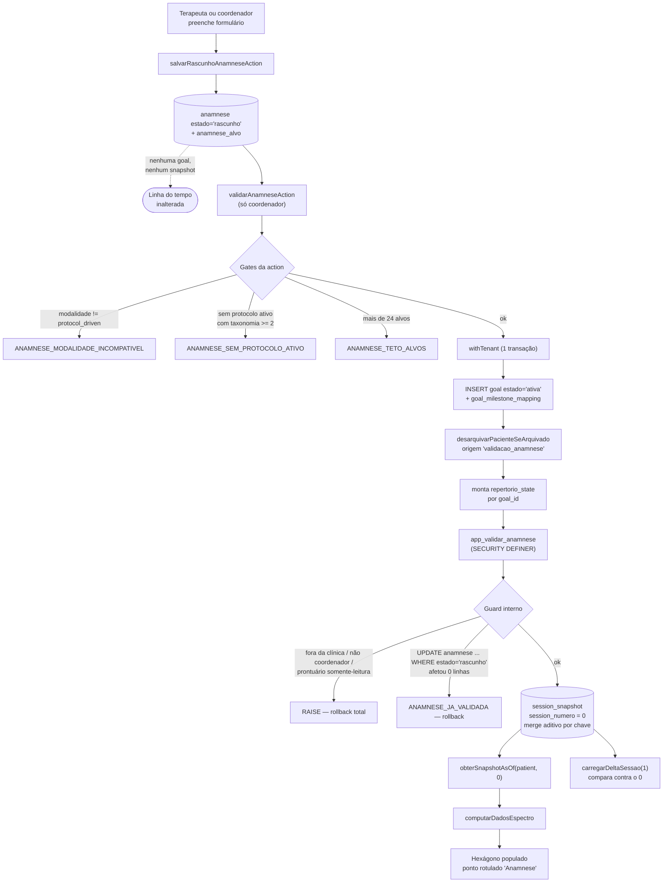

# Anamnese como marco 0 — Design

**Spec**: [`spec.md`](./spec.md) · **Contexto (11 decisões fechadas)**: [`context.md`](./context.md)
**Issue**: [#407](https://github.com/romulosutil/Iris/issues/407) · **Status**: Draft

> As decisões D-A a D-K do `context.md` estão **fechadas** e não são reabertas aqui. Este documento decide o **como**: DDL exata, corpo lógico do definer, shape do jsonb, contratos das Server Actions e os 4 consertos de UI. Objeções registradas no fim, sem alterar o que foi decidido.
>
> Medições reusadas do `context.md` (todas de 20/08/2026, `arquivo:linha` lá): shape de `session_snapshot`, `evidence`, `goal`, `instrumento_aplicacao`; lógica de `billing_apurar_ciclo`; predicado canônico de RLS `0113:27-69`; próxima migração `0115` / `when` `1787100343349`.

---

## Architecture Overview

O marco 0 é uma linha de `session_snapshot` com `session_numero = 0`, escrita **exclusivamente** por uma função `SECURITY DEFINER` nova (`app_validar_anamnese`), disparada por uma única Server Action de coordenador. Nada na anamnese toca `session` — é o que mantém o faturamento intacto (D-A).



**Invariante que o desenho preserva (D-A, medido):** `materializar.ts:493-498` só materializa números presentes em `evidence`, e nenhum caller passa `desdeNumero = 0`. O snapshot 0 nunca é reescrito por rematerialização. Vira teste (`ANAM-13`), não vira código.

---

## Code Reuse Analysis

### Existing Components to Leverage

| Componente                                                                                              | Local                                                 | Como usar                                                                                         |
| ------------------------------------------------------------------------------------------------------- | ----------------------------------------------------- | ------------------------------------------------------------------------------------------------- |
| Padrão canônico de policy RLS                                                                           | `db/migrations/0113_instrumento_aplicacao.sql:27-69`  | Copiar **literal** as 4 policies, trocando o nome da tabela. Citar a migração-fonte no comentário |
| `app_aplicar_snapshot`                                                                                  | `db/migrations/0094_...sql:41-71`                     | Modelo do definer: lock, guards, `search_path`. **Não** copiar o `ON CONFLICT DO UPDATE` (D-F)    |
| `app_clinic_id_exigido()`                                                                               | `db/migrations/0085_policies_tenant_helper.sql:78-88` | Único resolvedor de tenant em policy e em função                                                  |
| `app_patient_in_clinic` / `app_is_on_team` / `app_user_role_exigido` / `app_prontuario_somente_leitura` | funções existentes                                    | Guards do definer                                                                                 |
| `criarMetaCore`                                                                                         | `src/app/(app)/pacientes/[id]/metas/logic.ts:36-78`   | Shape do INSERT em `goal` (estado `ativa`, `proximaRevisaoISO`, mapping). **Não** chamar a função |
| `comEscrita` / `BloqueioConta`                                                                          | `src/lib/billing/guard-escrita.ts`                    | Envelopar os dois cores                                                                           |
| `withTenant` / `TenantContext` / `Tx`                                                                   | `src/db/rls.ts`                                       | Transação com RLS                                                                                 |
| `requireRole` / `RoleError`                                                                             | `src/auth/require-role.ts`                            | `("coordenador","terapeuta")` no rascunho; `("coordenador")` na validação                         |
| `desarquivarPacienteSeArquivado`                                                                        | `src/lib/patient/desarquivamento.ts:34-`              | Chamar com origem nova `"validacao_anamnese"`                                                     |
| `computarDadosEspectro` / `EstadoRepertorio`                                                            | `src/lib/evidence/espectro.ts:96-100,220-277`         | Consumidor do jsonb — o shape novo tem que caber nele sem mudança de lógica                       |
| `obterSnapshotAsOf`                                                                                     | `src/app/(app)/pacientes/[id]/timeline/queries.ts`    | Já lê qualquer `session_numero`; o 0 não precisa de query nova                                    |
| `schemas.ts` das metas                                                                                  | `src/app/(app)/pacientes/[id]/metas/schemas.ts`       | Padrão: Zod fora do módulo `"use server"`                                                         |

### Integration Points

| Sistema                           | Integração                                                                                   |
| --------------------------------- | -------------------------------------------------------------------------------------------- |
| `session_snapshot`                | Segundo produtor do `repertorio_state` (D-A), só no número 0, só por merge aditivo por chave |
| `goal` / `goal_milestone_mapping` | A validação insere direto no mesmo `tx`, com o shape de `criarMetaCore`                      |
| `billing_apurar_ciclo`            | **Nenhuma**. Nada é escrito em `session`. Guardado por teste de integração explícito         |
| `app_purgar_paciente`             | **Nenhuma edição**. `patient_id ON DELETE cascade` cobre o expurgo (D-K)                     |
| Aba Evolução (timeline)           | Consome o snapshot 0 pelas queries existentes; 4 consertos de UI (ANAM-14..17)               |

---

## Data Models

### Migração `0115_anamnese_marco_zero.sql`

Divisão obrigatória (CLAUDE.md, ponto 1):

| Sai de `pnpm db:generate` (schema.ts → `.sql` + `meta/0115_snapshot.json` + journal) | Escrito à mão no `.sql` gerado, **sem tocar o snapshot**                        |
| ------------------------------------------------------------------------------------ | ------------------------------------------------------------------------------- |
| `CREATE TYPE anamnese_estado`, `anamnese_procedencia`                                | `GRANT` (incl. UPDATE coluna a coluna)                                          |
| `CREATE TABLE anamnese`, `anamnese_alvo`                                             | `ENABLE`/`FORCE ROW LEVEL SECURITY`                                             |
| FKs, índices, CHECKs nomeados no padrão Drizzle (`_fk`/`_pk`/`_unique`)              | 8 policies (4 por tabela)                                                       |
|                                                                                      | `app_anamnese_em_rascunho(uuid)` (STABLE, definer)                              |
|                                                                                      | `app_validar_anamnese(uuid,jsonb,jsonb)` (definer)                              |
|                                                                                      | `REVOKE ALL ... FROM PUBLIC` + `GRANT EXECUTE ... TO app_role` das duas funções |

Se por qualquer motivo a entrada de journal virar manual: `when = 1787100343349` (anterior `1787099343349` + 1000). Abaixo disso o Drizzle pula o arquivo em silêncio.

#### `anamnese`

```sql
CREATE TYPE "public"."anamnese_estado" AS ENUM('rascunho', 'validada');
CREATE TYPE "public"."anamnese_procedencia" AS ENUM('relatado_responsavel', 'observado_avaliador', 'registro_anterior');

CREATE TABLE "anamnese" (
  "id" uuid PRIMARY KEY DEFAULT gen_random_uuid() NOT NULL,
  "clinic_id" uuid NOT NULL,
  "patient_id" uuid NOT NULL,
  "estado" "anamnese_estado" DEFAULT 'rascunho' NOT NULL,
  -- P3/ANAM-21: sugestão de protocolo e nível de entrada. Sempre editável
  -- antes da validação; `sugestao_aceita` registra que o valor veio de
  -- sugestão e não de escolha direta.
  "protocol_id" uuid,
  "nivel_entrada_sugerido" text,
  "sugestao_aceita" boolean,
  "observacoes" text,
  -- D-F: `complementa_anamnese_id` aponta para a anamnese validada que esta
  -- linha complementa. Nunca UPDATE na original.
  "complementa_anamnese_id" uuid,
  "criado_por" uuid NOT NULL,
  "criado_em" timestamp with time zone DEFAULT now() NOT NULL,
  "validada_por" uuid,
  "validada_em" timestamp with time zone,
  CONSTRAINT "anamnese_validada_coerente" CHECK (
    ("anamnese"."estado" = 'validada')
    = ("anamnese"."validada_em" IS NOT NULL AND "anamnese"."validada_por" IS NOT NULL)
  )
);
```

FKs (nomes no padrão Drizzle):

| Constraint                                        | Alvo           | `ON DELETE`   | Por quê                                                  |
| ------------------------------------------------- | -------------- | ------------- | -------------------------------------------------------- |
| `anamnese_clinic_id_clinic_id_fk`                 | `clinic(id)`   | `restrict`    | Igual a `instrumento_aplicacao`                          |
| `anamnese_patient_id_patient_id_fk`               | `patient(id)`  | **`cascade`** | D-K: expurgo LGPD cobre sem editar `app_purgar_paciente` |
| `anamnese_protocol_id_protocol_id_fk`             | `protocol(id)` | `restrict`    | Sugestão não pode apontar para protocolo apagado         |
| `anamnese_complementa_anamnese_id_anamnese_id_fk` | `anamnese(id)` | `set null`    | Cadeia quebrada não pode apagar histórico                |
| `anamnese_criado_por_app_user_id_fk`              | `app_user(id)` | `no action`   | Autoria                                                  |
| `anamnese_validada_por_app_user_id_fk`            | `app_user(id)` | `no action`   | Autoria da validação                                     |

Índices:

```sql
CREATE INDEX "idx_anamnese_patient" ON "anamnese" USING btree ("patient_id","criado_em" DESC NULLS LAST);
CREATE INDEX "idx_anamnese_clinic" ON "anamnese" USING btree ("clinic_id");
-- D-F: a vigente é a de maior `validada_em`, com `id` como desempate
-- secundário. Nunca `criado_em`. O índice espelha essa ordenação exata.
CREATE INDEX "idx_anamnese_vigente" ON "anamnese"
  USING btree ("patient_id","validada_em" DESC NULLS LAST,"id" DESC)
  WHERE "estado" = 'validada';
```

**Não existe UNIQUE por paciente.** Anamnese complementar é linha nova (D-F), e o paciente pode ter N validadas.

#### `anamnese_alvo` (tabela filha, um alvo por eixo)

`clinic_id` e `patient_id` são denormalizados de propósito: permitem copiar o predicado canônico de `0113:27-69` **literal**, sem inventar policy com join.

```sql
CREATE TABLE "anamnese_alvo" (
  "id" uuid PRIMARY KEY DEFAULT gen_random_uuid() NOT NULL,
  "anamnese_id" uuid NOT NULL,
  "clinic_id" uuid NOT NULL,
  "patient_id" uuid NOT NULL,
  -- Espelha ORDEM_EIXOS de `src/lib/evidence/espectro.ts`. Text + CHECK em vez
  -- de enum: o conjunto de eixos é derivado de domínio no código, e mudar um
  -- enum em produção é migração com dado. Mantidos em sincronia por teste.
  "eixo" text NOT NULL,
  "descricao" text NOT NULL,
  "disciplina" text,
  "milestone_id" uuid,
  -- D-E: NULL = eixo não medido nesta anamnese. Nunca 0. `null` != "apoio
  -- total" — mesmo raciocínio de `instrumento_aplicacao.item_risco_positivo`
  -- (schema.ts:2248-2251), que também é boolean SEM default.
  "nivel_ajuda_inicial" integer,
  -- D-D: enum por linha, copiando o shape de `fonte_do_escore` (0113:1).
  "procedencia" "anamnese_procedencia" NOT NULL,
  "criterio_n" integer DEFAULT 3 NOT NULL,
  "criterio_m" integer DEFAULT 4 NOT NULL,
  "ciclo_revisao_semanas" integer DEFAULT 8 NOT NULL,
  -- Preenchido na validação: liga o alvo à `goal` criada. `set null` porque
  -- meta excluída deixa chave órfã tolerada (D-I), não apaga o alvo.
  "goal_id" uuid,
  "criado_em" timestamp with time zone DEFAULT now() NOT NULL,
  CONSTRAINT "anamnese_alvo_eixo_valido" CHECK ("anamnese_alvo"."eixo" IN (
    'comunicacao_expressiva','comunicacao_receptiva','interacao_social',
    'autonomia','regulacao','cognicao_academico'
  )),
  CONSTRAINT "anamnese_alvo_disciplina_valida" CHECK (
    "anamnese_alvo"."disciplina" IS NULL OR "anamnese_alvo"."disciplina" IN ('ABA','Fono','TO')
  ),
  CONSTRAINT "anamnese_alvo_nivel_range" CHECK (
    "anamnese_alvo"."nivel_ajuda_inicial" IS NULL
    OR ("anamnese_alvo"."nivel_ajuda_inicial" BETWEEN 0 AND 20)
  ),
  CONSTRAINT "anamnese_alvo_criterio_range" CHECK (
    "anamnese_alvo"."criterio_n" BETWEEN 1 AND 99
    AND "anamnese_alvo"."criterio_m" BETWEEN 1 AND 99
  ),
  CONSTRAINT "anamnese_alvo_ciclo_range" CHECK (
    "anamnese_alvo"."ciclo_revisao_semanas" BETWEEN 8 AND 12
  ),
  CONSTRAINT "anamnese_alvo_goal_unique" UNIQUE ("goal_id")
);

CREATE INDEX "idx_anamnese_alvo_anamnese" ON "anamnese_alvo" USING btree ("anamnese_id");
CREATE INDEX "idx_anamnese_alvo_clinic" ON "anamnese_alvo" USING btree ("clinic_id");
```

> ⚠️ **Armadilha do CHECK (CLAUDE.md):** expressão que resulta em `NULL` **satisfaz** a constraint. Por isso todo CHECK acima é escrito na forma `col IS NULL OR <predicado>`, e `anamnese_validada_coerente` compara dois booleanos que nunca são `NULL` (`estado` é NOT NULL, e `IS NOT NULL` nunca retorna `NULL`).

FKs de `anamnese_alvo`: `anamnese_id` → `anamnese(id)` **`cascade`**; `clinic_id` → `clinic(id)` `restrict`; `patient_id` → `patient(id)` **`cascade`** (D-K, o expurgo alcança direto mesmo que a cadeia pela anamnese já cobrisse); `milestone_id` → `milestone(id)` `set null`; `goal_id` → `goal(id)` `set null`.

**O teto de 24 alvos NÃO é constraint de banco.** Não há CHECK que conte linhas irmãs sem trigger, e trigger nova em produção é custo desproporcional. O teto vive no Zod (`.max(24)`) e é reafirmado no `INSERT` em lote da action — decisão explícita, com teste (`ANAM-08`).

#### GRANTs (escritos à mão)

CLAUDE.md ponto 4: coluna nova quase sempre precisa de GRANT explícito. Aqui o GRANT **por coluna** é o mecanismo do append-only (D-F): `app_role` nunca recebe `UPDATE` em `estado`, `validada_em` ou `validada_por` — só o definer (owner) muda esses três.

```sql
-- `anamnese`: rascunho é editável por app_role sob RLS; a transição para
-- 'validada' NÃO é — ela só acontece dentro de `app_validar_anamnese`
-- (SECURITY DEFINER, roda como owner). Append-only no padrão `consent`
-- (schema.ts:456-470), e não no padrão `instrumento_aplicacao` (0113:35),
-- que concede UPDATE amplo.
GRANT SELECT, INSERT, DELETE ON "anamnese" TO app_role;
GRANT UPDATE ("protocol_id", "nivel_entrada_sugerido", "sugestao_aceita", "observacoes")
  ON "anamnese" TO app_role;

GRANT SELECT, INSERT, UPDATE, DELETE ON "anamnese_alvo" TO app_role;
```

#### Policies (copiadas literal de `0113:27-69`)

```sql
ALTER TABLE "anamnese" ENABLE ROW LEVEL SECURITY;
ALTER TABLE "anamnese" FORCE ROW LEVEL SECURITY;

-- Isolamento por tenant via `app_clinic_id_exigido()` (D16/#229). Predicado
-- copiado literal de `instrumento_aplicacao` (0113:37-69), que por sua vez
-- copiou de `tcc_rpd_entry` (0103:33-67): coordenador OU membro da equipe;
-- delete restrito a coordenador. Divergência deliberada: UPDATE e DELETE
-- exigem `estado = 'rascunho'` (D-F, append-only).
CREATE POLICY anamnese_select ON anamnese FOR SELECT TO app_role USING (
  (clinic_id = app_clinic_id_exigido()) AND app_patient_in_clinic(patient_id) AND (
    (current_setting('app.user_role', true) = 'coordenador') OR app_is_on_team(patient_id)
  )
);

CREATE POLICY anamnese_insert ON anamnese FOR INSERT TO app_role WITH CHECK (
  (clinic_id = app_clinic_id_exigido()) AND app_patient_in_clinic(patient_id) AND (
    (current_setting('app.user_role', true) = 'coordenador') OR app_is_on_team(patient_id)
  ) AND estado = 'rascunho'
);

CREATE POLICY anamnese_update ON anamnese FOR UPDATE TO app_role USING (
  (clinic_id = app_clinic_id_exigido()) AND app_patient_in_clinic(patient_id) AND (
    (current_setting('app.user_role', true) = 'coordenador') OR app_is_on_team(patient_id)
  ) AND estado = 'rascunho'
) WITH CHECK (
  (clinic_id = app_clinic_id_exigido()) AND app_patient_in_clinic(patient_id) AND (
    (current_setting('app.user_role', true) = 'coordenador') OR app_is_on_team(patient_id)
  ) AND estado = 'rascunho'
);

CREATE POLICY anamnese_delete ON anamnese FOR DELETE TO app_role USING (
  (clinic_id = app_clinic_id_exigido())
  AND (current_setting('app.user_role', true) = 'coordenador')
  AND estado = 'rascunho'
);
```

`anamnese_alvo` recebe as 4 policies com o mesmo predicado sobre as suas próprias colunas `clinic_id`/`patient_id`, mais `app_anamnese_em_rascunho(anamnese_id)` no `INSERT`/`UPDATE`/`DELETE` (não no `SELECT`: alvo de anamnese validada continua legível).

```sql
-- Delegar a leitura do estado da anamnese-pai a uma função evita subselect na
-- policy e mantém o predicado auditável em `pg_proc`. Tenant resolvido por
-- `app_clinic_id_exigido()` DENTRO da função (CLAUDE.md ponto 6) — o guard
-- `db/tests/clinic-id-helper-rls.int.test.ts` varre pg_policies + pg_proc +
-- pg_views e quebra o CI se aparecer cast cru.
CREATE OR REPLACE FUNCTION public.app_anamnese_em_rascunho(p_anamnese uuid)
 RETURNS boolean
 LANGUAGE sql
 STABLE
 SECURITY DEFINER
 SET search_path TO 'public'
AS $function$
  SELECT EXISTS (
    SELECT 1 FROM anamnese a
    WHERE a.id = p_anamnese
      AND a.clinic_id = app_clinic_id_exigido()
      AND a.estado = 'rascunho'
  );
$function$;

REVOKE ALL ON FUNCTION public.app_anamnese_em_rascunho(uuid) FROM PUBLIC;
GRANT EXECUTE ON FUNCTION public.app_anamnese_em_rascunho(uuid) TO app_role;
```

---

## Components

### `app_validar_anamnese` — função `SECURITY DEFINER`

- **Purpose**: única superfície que grava `session_snapshot` com `session_numero = 0` e que move a anamnese para `validada`.
- **Location**: `db/migrations/0115_anamnese_marco_zero.sql` (parte escrita à mão).
- **Assinatura**: `app_validar_anamnese(p_anamnese uuid, p_repertorio jsonb, p_segmentacao jsonb) RETURNS void`
- **Reusa**: shape de `app_aplicar_snapshot` (`0094:41-71`) — lock, `SET search_path`, ordem dos guards.
- **Diverge de propósito**: `ON CONFLICT DO UPDATE` vira **merge aditivo por chave**; UPDATE condicional da anamnese como reserva de reentrância.

**Corpo lógico, na ordem exata:**

```sql
CREATE OR REPLACE FUNCTION public.app_validar_anamnese(
  p_anamnese uuid, p_repertorio jsonb, p_segmentacao jsonb
) RETURNS void
 LANGUAGE plpgsql
 SECURITY DEFINER
 SET search_path TO 'public'
AS $function$
DECLARE
  v_patient uuid;
  v_clinic  uuid;
  v_estado  anamnese_estado;
  v_linhas  integer;
BEGIN
  -- 1. Resolve a anamnese como owner (BYPASSRLS). O isolamento é feito nos
  --    guards abaixo, NUNCA pela ausência de leitura.
  SELECT a.patient_id, a.clinic_id, a.estado
    INTO v_patient, v_clinic, v_estado
    FROM anamnese a WHERE a.id = p_anamnese;
  IF v_patient IS NULL THEN
    RAISE EXCEPTION 'app_validar_anamnese: anamnese % inexistente', p_anamnese;
  END IF;

  -- 2. Mesmo lock de `app_aplicar_snapshot` (0094:48): serializa contra
  --    materialização concorrente do mesmo paciente.
  PERFORM pg_advisory_xact_lock(hashtextextended(v_patient::text, 0));

  -- 3. Isolamento multi-tenant. Tenant resolvido por `app_clinic_id_exigido()`
  --    (D16/#229) — cast cru estoura 42704/22P02 sem nomear o tenant.
  IF v_clinic <> app_clinic_id_exigido() THEN
    RAISE EXCEPTION 'app_validar_anamnese: anamnese % fora da clínica do chamador (isolamento multi-tenant)', p_anamnese;
  END IF;
  IF NOT app_patient_in_clinic(v_patient) THEN
    RAISE EXCEPTION 'app_validar_anamnese: paciente % fora da clínica do chamador (isolamento multi-tenant)', v_patient;
  END IF;

  -- 4. Fronteira de autorização (CLAUDE.md ponto 5). O predicado da policy de
  --    leitura correspondente (`anamnese_select`, e o `session_snapshot_select`
  --    de 0016) é `coordenador OR app_is_on_team(paciente)`. Aqui a exigência é
  --    ESTRITAMENTE MAIS FORTE — só coordenador — porque D-B decidiu que validar
  --    é ato exclusivo do coordenador. Isso é restrição deliberada, não omissão
  --    do predicado copiado: terapeuta lê a anamnese, não a valida.
  IF app_user_role_exigido() <> 'coordenador' THEN
    RAISE EXCEPTION 'app_validar_anamnese: validar anamnese é exclusivo de coordenador (D-B)';
  END IF;

  -- 5. Consentimento (D-H). Mesmo guard de `app_aplicar_snapshot` (0094:60-62),
  --    porque esta função escreve na MESMA tabela.
  IF app_prontuario_somente_leitura(v_patient) THEN
    RAISE EXCEPTION 'Prontuário em somente-leitura: consentimento revogado (LGPD Art. 8º, §5º)';
  END IF;

  -- 6. Protocolo ativo com escala utilizável. Sem isto o hexágono fica `null`
  --    mesmo com anamnese perfeita: `queries.ts:172` faz
  --    `Math.max(0, taxonomia.length - 1)` e `espectro.ts:203-204` exige `> 0`
  --    — ou seja, a taxonomia precisa de PELO MENOS 2 níveis, não só "não vazia".
  IF NOT EXISTS (
    SELECT 1 FROM patient_protocol pp
      JOIN protocol pr ON pr.id = pp.protocol_id
     WHERE pp.patient_id = v_patient
       AND pp.desativado_em IS NULL
       AND jsonb_array_length(pr.taxonomia_ajuda) >= 2
  ) THEN
    RAISE EXCEPTION 'ANAMNESE_SEM_PROTOCOLO_ATIVO: paciente % não tem protocolo ativo com taxonomia de ajuda utilizável', v_patient;
  END IF;

  -- 7. RESERVA DE REENTRÂNCIA ANTES DO EFEITO. A mesma anamnese validada duas
  --    vezes tem que ser RECUSADA (D-F / ANAM-12). O `ON CONFLICT DO UPDATE` de
  --    `app_aplicar_snapshot` (0094:66-71) sobrescreveria em silêncio — é
  --    exatamente o risco que D-F fecha. Aqui o UPDATE condicional vem PRIMEIRO:
  --    se a linha já saiu de 'rascunho', 0 linhas afetadas e a função aborta
  --    antes de tocar o snapshot. Tudo na mesma transação, então RAISE = rollback.
  UPDATE anamnese
     SET estado = 'validada', validada_em = now(), validada_por = app_user_id_exigido()
   WHERE id = p_anamnese AND estado = 'rascunho';
  GET DIAGNOSTICS v_linhas = ROW_COUNT;
  IF v_linhas = 0 THEN
    RAISE EXCEPTION 'ANAMNESE_JA_VALIDADA: anamnese % já foi validada (append-only, D-F): correção é anamnese complementar, não revalidação', p_anamnese;
  END IF;

  -- 8. Marco 0. Merge ADITIVO por chave, nunca sobrescrita:
  --    `EXCLUDED.repertorio_state || session_snapshot.repertorio_state` mantém o
  --    valor JÁ GRAVADO quando a chave existe (o operando da direita vence) e
  --    aceita apenas chaves novas. É o que torna a anamnese complementar (P2)
  --    possível sem reescrever o passado — `espectro.ts:186-190` documenta a
  --    reescrita como proibida.
  INSERT INTO session_snapshot (patient_id, session_numero, repertorio_state, segmentacao, gerado_em)
  VALUES (v_patient, 0, p_repertorio, p_segmentacao, now())
  ON CONFLICT (patient_id, session_numero)
  DO UPDATE SET
    repertorio_state = EXCLUDED.repertorio_state || session_snapshot.repertorio_state,
    segmentacao      = EXCLUDED.segmentacao      || session_snapshot.segmentacao,
    gerado_em        = session_snapshot.gerado_em;
END; $function$;

REVOKE ALL ON FUNCTION public.app_validar_anamnese(uuid,jsonb,jsonb) FROM PUBLIC;
GRANT EXECUTE ON FUNCTION public.app_validar_anamnese(uuid,jsonb,jsonb) TO app_role;
```

**Comportamento exato nas três situações que D-F/ANAM-12 nomeiam:**

| Situação                                              | Resultado                                                                                                                 |
| ----------------------------------------------------- | ------------------------------------------------------------------------------------------------------------------------- |
| Mesma anamnese validada 2×                            | `ANAMNESE_JA_VALIDADA`, rollback total. Nenhuma chave tocada                                                              |
| Anamnese complementar validada, eixo **novo**         | Chave nova entra no `repertorio_state` do snapshot 0. `gerado_em` **não** muda                                            |
| Anamnese complementar validada, eixo **já existente** | Chave antiga **vence**. O nível de partida original é imutável (D-E). Sem erro — a UI informa que o eixo já tinha marco 0 |

### `repertorio_state` do snapshot 0 (shape exato — D-D)

`session_snapshot.repertorio_state` é jsonb **sem schema declarado** (`schema.ts:1370`). Chaveado por `goal_id`. O objeto por alvo do marco 0:

```jsonc
{
  "<goal_id>": {
    // Consumidos por computarDadosEspectro (espectro.ts:96-100):
    "nivel_ajuda_recente": 2, // ordinal na taxonomia do protocolo; null = eixo não medido (D-E)
    "contagem": 0, // ZERO evidências aprovadas — o marco 0 não é evidência
    "is_candidata": false, // nenhum critério de domínio foi avaliado ainda

    // Novos (D-D). `computarDadosEspectro` descarta o que não conhece, então
    // acrescentar chaves é seguro e não muda nenhum cálculo:
    "origem": "anamnese",
    "procedencia": "relatado_responsavel", // | observado_avaliador | registro_anterior
  },
}
```

Coexistência com `nivel_ajuda_recente` / `contagem` / `is_candidata`:

- Os três **continuam sendo os únicos campos que alimentam o gráfico**. `origem`/`procedencia` são metadados de proveniência lidos por uma consulta nova da UI (ANAM-19), não pelo cálculo.
- `contagem: 0` é literal e obrigatório: o eixo mostra "0 evidências" junto do nível de partida, que é a leitura honesta — há nível declarado, não há registro empírico.
- Alvo sem nível medido **entra assim mesmo**, com `nivel_ajuda_recente: null`. Consequência medida: `progressoDoAlvo` devolve `null`, o alvo entra em `alvos` mas não em `medidos`, e o eixo fica `valor: null` (`espectro.ts:264`). Isso é ANAM-18 satisfeito pelo código existente, sem `if` novo — e ainda assim a procedência fica visível.
- Chave órfã (meta excluída, `goal_milestone_mapping` cascade, `schema.ts:1173`): `computarDadosEspectro` ignora chave sem alvo correspondente. Teste, não código (D-I).

`segmentacao` do snapshot 0 segue o shape existente `{ goal_id: { protocol_id: { tipo_estrutura, metrica, rotulo } } }`, com `metrica: "nivel_ajuda"` e `rotulo` vindo do marco mapeado.

Tipagem em `src/lib/evidence/espectro.ts`:

```ts
export interface EstadoRepertorio {
  nivel_ajuda_recente?: number | null;
  contagem?: number;
  is_candidata?: boolean;
  /** D-D/#407: só o marco 0 escreve. Metadado de proveniência, não entra no cálculo. */
  origem?: "anamnese";
  procedencia?:
    "relatado_responsavel" | "observado_avaliador" | "registro_anterior";
}
```

### `src/app/(app)/pacientes/[id]/anamnese/schemas.ts`

- **Purpose**: schemas Zod e constantes, fora de qualquer módulo `"use server"`.
- **Reusa**: padrão de `metas/schemas.ts` (o docblock de lá explica por quê o arquivo existe).

```ts
export const PROCEDENCIAS = [
  "relatado_responsavel",
  "observado_avaliador",
  "registro_anterior",
] as const;
export const EIXOS_ANAMNESE = [
  "comunicacao_expressiva",
  "comunicacao_receptiva",
  "interacao_social",
  "autonomia",
  "regulacao",
  "cognicao_academico",
] as const;

const alvoSchema = z.object({
  eixo: z.enum(EIXOS_ANAMNESE),
  descricao: z.string().trim().min(1, "Descreva o alvo em linguagem simples."),
  disciplina: z.enum(DISCIPLINAS).optional(),
  milestoneId: z.string().uuid().optional(),
  // D-E: `null` explícito. `.optional()` sozinho deixaria o executor mandar 0.
  nivelAjudaInicial: z.number().int().min(0).max(20).nullable(),
  procedencia: z.enum(PROCEDENCIAS),
  criterioDominio: criterioDominioSchema, // reusa o shape de metas/schemas.ts
  cicloRevisaoSemanas: z.number().int().min(8).max(12),
});

export const salvarRascunhoSchema = z.object({
  patientId: z.string().uuid(),
  anamneseId: z.string().uuid().optional(), // ausente = cria; presente = edita rascunho
  complementaAnamneseId: z.string().uuid().optional(),
  protocolIdSugerido: z.string().uuid().optional(),
  nivelEntradaSugerido: z.string().trim().optional(),
  sugestaoAceita: z.boolean().optional(),
  observacoes: z.string().trim().optional(),
  alvos: z
    .array(alvoSchema)
    .min(1, "A anamnese precisa de pelo menos um alvo.")
    .max(24, "A anamnese aceita no máximo 24 alvos (4 por eixo × 6 eixos)."),
});

export const validarAnamneseSchema = z.object({
  patientId: z.string().uuid(),
  anamneseId: z.string().uuid(),
});
```

### `src/app/(app)/pacientes/[id]/anamnese/logic.ts`

- **Purpose**: cores que aceitam `ctx`. **Não é `"use server"`** — começa com `import "server-only"`.
- ⚠️ **Guard repo-wide**: exportar um core que aceita `ctx` de um módulo `"use server"` cria endpoint client-invocável com `ctx` forjável = bypass de RLS (#55). Os cores ficam aqui; `actions.ts` só exporta wrappers que resolvem o tenant sozinhos.

```ts
export type AnamneseState = {
  error?: string;
  codigo?: CodigoErroAnamnese;
  bloqueioConta?: BloqueioConta;
};

async function salvarRascunhoAnamneseCore(
  ctx: TenantContext,
  input,
): Promise<AnamneseState & { id?: string }>;
async function validarAnamneseCore(
  ctx: TenantContext,
  input,
): Promise<AnamneseState & { snapshotCriado?: boolean }>;

export const salvarRascunhoAnamnese = comEscrita(salvarRascunhoAnamneseCore);
export const validarAnamnese = comEscrita(validarAnamneseCore);
```

`salvarRascunhoAnamneseCore`, em ordem:

1. `requireRole(ctx, "coordenador", "terapeuta")`
2. `salvarRascunhoSchema.safeParse` → erro nomeado do Zod (teto de 24 sai daqui, ANAM-08)
3. `withTenant`: gate de modalidade (abaixo) → `insert`/`update` em `anamnese` (`estado` nunca é escrito: default `'rascunho'` no INSERT, e o GRANT por coluna barra no UPDATE) → `delete`+`insert` dos `anamnese_alvo` do rascunho
4. **Não** cria `goal`. **Não** chama definer nenhum. **Não** desarquiva. (ANAM-02, ANAM-10)

`validarAnamneseCore`, em ordem:

1. `requireRole(ctx, "coordenador")` — `RoleError` vira `ANAMNESE_PAPEL_INSUFICIENTE` (ANAM-03)
2. `validarAnamneseSchema.safeParse`
3. `withTenant`, tudo numa transação:
   1. Gate de modalidade: `if (p.clinicalModality !== "protocol_driven") return { codigo: "ANAMNESE_MODALIDADE_INCOMPATIVEL" }` — **igualdade explícita**, nunca `!== "conventional"`. Medido: `patient.clinical_modality` é NOT NULL com default `'protocol_driven'` (`schema.ts:408-410`) e `modalidade.ts:58-63` trata desconhecido como protocolo (ANAM-05)
   2. Lê `patient_protocol` ativo + `protocol.taxonomia_ajuda`; exige `length >= 2`, senão `ANAMNESE_SEM_PROTOCOLO_ATIVO` (ANAM-06)
   3. Lê os `anamnese_alvo` do rascunho; `length > 24` → `ANAMNESE_TETO_ALVOS` (ANAM-08, segunda barreira além do Zod)
   4. `INSERT` em lote na `goal` com `estado: "ativa"`, `criterioDominio`, `proximaRevisaoISO(ciclo)`, `criadoPor: ctx.userId` — **shape** de `criarMetaCore`, sem **chamar** `criarMeta` (que tem `requireRole` mais frouxo e desarquiva com origem errada). `INSERT` em `goal_milestone_mapping` quando há `milestoneId`. `UPDATE anamnese_alvo SET goal_id = …`
   5. `desarquivarPacienteSeArquivado(tx, ctx, patientId, "validacao_anamnese")` — **uma vez** (ANAM-11)
   6. Monta `repertorio_state` e `segmentacao` conforme o shape acima
   7. `tx.execute(sql\`SELECT app_validar_anamnese(${anamneseId}::uuid, ${repertorio}::jsonb, ${segmentacao}::jsonb)\`)`— qualquer`RAISE`aborta a transação inteira, então nem`goal` nem desarquivamento sobrevivem a uma validação recusada
4. `revalidatePath` fica no wrapper, não aqui

> ⚠️ Ao montar o `sql` template: `DrizzleQueryError.message` é o statement que nós emitimos, não a exceção do Postgres. O mapeamento código→mensagem lê a **causa** (`err.cause`), não a mensagem do wrapper.

### `src/app/(app)/pacientes/[id]/anamnese/actions.ts`

- **Purpose**: `"use server"`. Só funções async que resolvem o tenant. Nenhum export aceita `ctx`.

```ts
export type AnamneseActionState = { error?: string; ok?: boolean };
export async function salvarRascunhoAnamneseAction(
  patientId: string,
  _prev: AnamneseActionState,
  formData: FormData,
): Promise<AnamneseActionState>;
export async function validarAnamneseAction(
  patientId: string,
  _prev: AnamneseActionState,
  formData: FormData,
): Promise<AnamneseActionState>;
```

Ambas: `const ctx = await getTenantContext()` → parse do `FormData` → core → `revalidatePath(\`/pacientes/${patientId}\`)` e `/pacientes/${patientId}/timeline`no sucesso →`catch (RoleError)` com copy pt-BR.

### `src/app/(app)/pacientes/[id]/timeline/rotulos.ts` — helper único de rótulo (ANAM-14)

- **Purpose**: um único lugar sabe que o ponto 0 se chama "Anamnese". Sem `"use client"` (a diretiva é do **módulo**: um helper exportado de módulo cliente vira referência de cliente e derruba `page.tsx` com 500 em runtime, com typecheck e testes verdes).
- **Location**: `src/app/(app)/pacientes/[id]/timeline/rotulos.ts` — importável por server e client.

```ts
export const ROTULO_MARCO_ZERO = "Anamnese";
/** "Anamnese" | "Sessão 3" — substitui as 13 ocorrências de `Sessão {n}`. */
export function rotuloPonto(n: number): string;
/** "Anamnese" | "S3" — eixo do gráfico, onde o espaço é curto. */
export function rotuloPontoCurto(n: number): string;
/** "desde a Anamnese" | "desde a Sessão 3" — resolve a preposição junto. */
export function rotuloDesde(n: number): string;
/** "até a Anamnese" | "até a Sessão 3". */
export function rotuloAte(n: number): string;
```

Por que helper e não `if` nos 13 lugares: as frases do repo não são só `Sessão {n}` — são `Sessão {n}` isolado, `Visualizando histórico passado: Sessão {n}`, `Início (Sessão {n})`, `até a Sessão {n}`, `desde a Sessão {n}`, `Linha tracejada: Sessão {n}`. Um `if` por sítio é 13 chances de escrever "Sessão 0". As quatro funções cobrem as seis formas, e um teste unitário de tabela prova as duas colunas (`n = 0` e `n > 0`) de uma vez.

**As 13 ocorrências** (do `context.md` §D-I): `scrubber.tsx:110,130,173,174`; `timeline-client.tsx:505,507,543,717,734,769,771,783,853`; `grafico-espectro.tsx:152,277,284,299,355`.

### Consertos de UI (ANAM-15..17)

| ID      | Arquivo:linha               | Hoje                                                   | Passa a ser                                                                                                                                                                                                                                                                                                                         |
| ------- | --------------------------- | ------------------------------------------------------ | ----------------------------------------------------------------------------------------------------------------------------------------------------------------------------------------------------------------------------------------------------------------------------------------------------------------------------------- |
| ANAM-15 | `timeline-client.tsx:323`   | `if (!sessaoAtiva) return;`                            | `if (sessaoAtiva === null) return;` — e o estado passa a ser tipado `number \| null`, para que `0` deixe de ser indistinguível de "nada selecionado"                                                                                                                                                                                |
| ANAM-16 | `timeline-client.tsx:91-92` | `sessoesDisponiveis[len-1] ?? 1`                       | `sessoesDisponiveis[len-1] ?? null` — com só o marco 0 disponível, ele **é** o último, e o scrubber abre nele. `null` só quando não há ponto nenhum, e aí a aba mostra o empty state que já existe                                                                                                                                  |
| ANAM-17 | `queries.ts:313`            | `sessionNumero > 1 ? obterSnapshotAsOf(…, n-1) : null` | `sessionNumero > 0 ? obterSnapshotAsOf(…, n-1) : null` — a Sessão 1 passa a buscar o snapshot 0; sem anamnese, `obterSnapshotAsOf` já devolve `null` e o comportamento antigo é preservado. Para `n = 0`, `snapA` é `null` (o marco 0 não tem anterior), e `calcularDelta(null, state0)` é o caso de "primeiro ponto" que já existe |

### Painel de procedência (ANAM-19)

Componente novo, cliente, dentro da aba Evolução: ao inspecionar um alvo do ponto 0, mostra "Relatado pelo responsável" / "Observado pelo avaliador" / "Registro anterior", lido de `repertorio_state[goalId].procedencia`. **Sem consulta nova**: o dado já vem no snapshot que a página carrega (é a razão de D-D exigir a chave dentro do jsonb). `role="status"`, nunca `role="alert"` (D-J — `alert` é reservado a risco clínico). Estória no Storybook.

---

## Error Handling Strategy

Códigos nomeados, retornados no `AnamneseState.codigo` e traduzidos na UI em pt-BR (D-J):

| Cenário                                         | Código                                | Onde é barrado                                 | O que o usuário vê                                                                  |
| ----------------------------------------------- | ------------------------------------- | ---------------------------------------------- | ----------------------------------------------------------------------------------- |
| Terapeuta tenta validar (ANAM-03)               | `ANAMNESE_PAPEL_INSUFICIENTE`         | `requireRole` na action **e** guard do definer | "Só o coordenador valida a anamnese." Nada é criado                                 |
| Paciente não é `protocol_driven` (ANAM-05)      | `ANAMNESE_MODALIDADE_INCOMPATIVEL`    | Action, igualdade explícita                    | Aba de anamnese nem aparece; forja de POST recusada                                 |
| Sem protocolo ativo com taxonomia ≥ 2 (ANAM-06) | `ANAMNESE_SEM_PROTOCOLO_ATIVO`        | Action **e** definer                           | "Ative um protocolo com escala de ajuda antes de validar." Nenhum snapshot 0        |
| Mais de 24 alvos (ANAM-08)                      | `ANAMNESE_TETO_ALVOS`                 | Zod **e** action                               | "A anamnese aceita no máximo 24 alvos (4 por eixo × 6 eixos)."                      |
| Consentimento revogado (ANAM-07)                | `ANAMNESE_PRONTUARIO_SOMENTE_LEITURA` | `app_prontuario_somente_leitura` no definer    | "Prontuário em somente-leitura: consentimento revogado."                            |
| Segunda validação da mesma anamnese (ANAM-12)   | `ANAMNESE_JA_VALIDADA`                | UPDATE condicional no definer                  | "Esta anamnese já foi validada. Para corrigir, registre uma anamnese complementar." |
| Conta bloqueada                                 | `bloqueioConta`                       | `comEscrita`                                   | Copy existente do guard                                                             |

Toda falha do definer é `RAISE` dentro da transação da action → **rollback total**. Não existe estado parcial: ou existem as `goal` **e** o snapshot 0, ou não existe nada.

---

## Tech Decisions (só as não-óbvias)

| Decisão                           | Escolha                                                             | Razão                                                                                                                                                                         |
| --------------------------------- | ------------------------------------------------------------------- | ----------------------------------------------------------------------------------------------------------------------------------------------------------------------------- |
| Tabela filha por alvo             | `anamnese_alvo`, com `clinic_id`/`patient_id` denormalizados        | Permite copiar o predicado canônico de `0113:27-69` **literal**, sem policy com join — que é onde o D16 costuma voltar                                                        |
| Append-only mecânico              | GRANT de `UPDATE` **por coluna** + policy com `estado = 'rascunho'` | `app_role` fisicamente não consegue mudar `estado`/`validada_em`/`validada_por`. Só o definer. Não depende de disciplina do código                                            |
| Segunda validação                 | UPDATE condicional **antes** do INSERT no snapshot                  | A reserva de estado precede o efeito; `ROW_COUNT = 0` é o único sinal confiável de reentrância. Rollback cobre o resto                                                        |
| Complementar vs. imutabilidade    | `EXCLUDED.repertorio_state \|\| session_snapshot.repertorio_state`  | O operando da direita vence: chave nova entra, chave existente é preservada. Satisfaz P2 e D-E ao mesmo tempo, sem `ON CONFLICT DO UPDATE` cego                               |
| `gerado_em` no merge              | **Não** atualiza                                                    | `gerado_em` é a data do marco 0. Mexer nela deslocaria a linha do tempo — o mesmo dano que D-F fecha                                                                          |
| Teto de 24                        | Zod + action, sem trigger                                           | Não existe CHECK que conte linhas irmãs; trigger em produção é custo desproporcional para um limite de produto                                                                |
| Não chamar `criarMeta`            | INSERT direto em `goal` com o shape de `criarMetaCore`              | `criarMeta` faz `requireRole(…, "terapeuta")` e desarquiva com origem `"criacao_meta"` — os dois errados aqui (D-B, D-C/ANAM-11)                                              |
| `eixo` como `text` + CHECK        | Em vez de enum novo                                                 | O conjunto de eixos vive em `espectro.ts` e é derivado de domínio; enum em produção é migração com dado a cada mudança                                                        |
| Taxonomia `>= 2`, não "não vazia" | Refinamento do gate de ANAM-06                                      | `Math.max(0, length - 1)` (`queries.ts:172`) com `> 0` (`espectro.ts:203-204`): taxonomia de 1 nível também dá hexágono `null` — exatamente o que ANAM-06 existe para impedir |

---

## Verificação e higiene (D-K, AGENTS §7)

- Migração: `pnpm db:generate` primeiro (gera `.sql` + `meta/0115_snapshot.json` + journal), **depois** editar o `.sql` acrescentando GRANT/RLS/policies/funções — **sem tocar o snapshot**. Commitar `.sql` + snapshot juntos.
- Verificar **medindo**, não lendo: após `pnpm db:migrate`, conferir `information_schema.role_column_grants` (o GRANT por coluna), `pg_proc` com `prosecdef` (as duas funções), `pg_policies` (as 8 policies).
- ⚠️ Todo `*.int.test.ts` **exige** `--config vitest.integration.config.ts`. `vitest run` normal **coleta zero e sai verde**. Conferir a **contagem** de arquivos e testes, nunca a cor.
- `pnpm format` reformata o repositório inteiro. Formatar só os arquivos tocados: `npx prettier --write <arquivo>`.
- DoD: `pnpm typecheck`, `pnpm lint`, `pnpm test`, `pnpm test:rls`, `npx vitest run src/db/migrations.test.ts`, Storybook para componente novo.

---

## Objeções ao contexto

Registradas conforme instruído. **Nenhuma altera o que foi decidido** — o design implementa D-A a D-K como estão.

1. **D-C (a anamnese gera `goal` em `ativa`) atribui autoria clínica de até 24 metas a um ato de validação.** `goal.criado_por` vai receber o `user_id` do coordenador que validou, e as 24 metas nascem com o mesmo timestamp, sem que ninguém tenha escrito uma a uma. A trilha passa a dizer que o coordenador "criou 24 metas" num instante. A medição que força D-C é sólida (`espectro.ts:207-209,232` não plota sem meta ativa), então sigo — mas o design mitiga registrando `anamnese_alvo.goal_id`, que dá a proveniência real de cada meta, e usando origem de desarquivamento própria (`"validacao_anamnese"`) para que a trilha não minta duas vezes.

2. **D-D contradiz um comentário vivo do `schema.ts`.** `repertorio_state` está documentado como "ESTRITAMENTE numérico/enum — nunca texto livre nem narrativa" (`schema.ts:1367-1370`). `origem` e `procedencia` são enums, então cabem na **letra** da regra; mas o espírito do comentário é "aqui não entra metadado". Sigo D-D — a alternativa (segunda consulta) foi medida e não existe. **Mitigação obrigatória no mesmo PR**: atualizar o comentário de `schema.ts:1367-1370` para nomear as duas chaves e a issue #407. Sem isso, a próxima sessão lê a regra, conclui que o marco 0 a viola, e abre um débito improcedente — foi exatamente o que aconteceu na #216.

3. **D-B torna o coordenador gargalo do onboarding, e o produto não tem fila para isso.** Só coordenador valida, e a validação é o único ato que faz o paciente novo existir na linha do tempo. Clínica com um coordenador só passa a ter o onboarding inteiro bloqueado na agenda de uma pessoa, sem nenhuma superfície que mostre "3 anamneses aguardando validação". Isso não é motivo para reabrir D-B (a exclusividade é defensável), mas é lacuna de produto que a issue não cobre e que aparecerá no primeiro cliente real. Sugiro registrar como issue própria, não como escopo da #407.

4. **O gate D-H segue aberto e é bloqueante por escrito na própria spec.** Não é objeção ao que foi decidido — é lembrete de que este design é implementável mas **não é liberável para dado real** enquanto o termo de `docs/legal/` não for verificado com o Rômulo. O design não tem como fechá-lo: `docs/legal/` exige confirmação antes de qualquer leitura.
