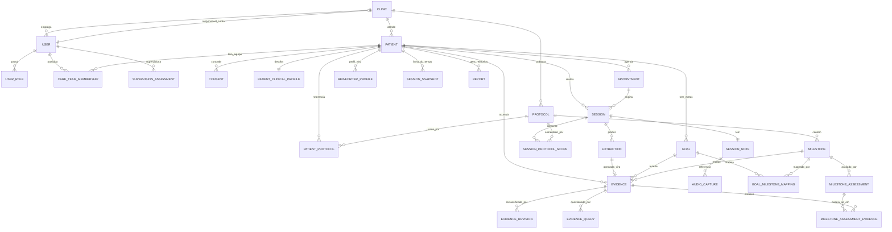
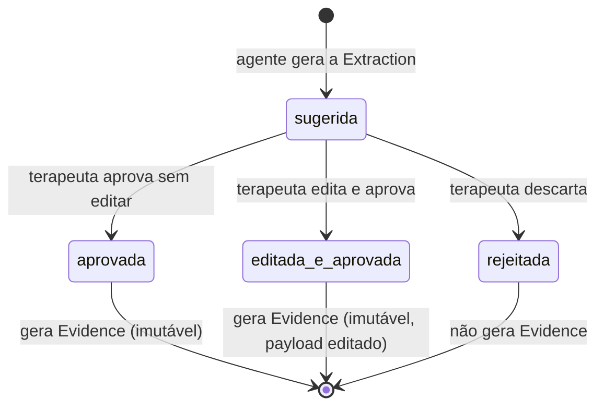

# Modelo de Domínio e Arquitetura de Dados — Iris (Prompt 1)

Resultado da execução do Prompt 1 (`docs/prompts/serie-de-prompts.md`). Cobre:
modelo de domínio com justificativa por entidade, os 6 problemas de lógica
pedidos (a, b, b2, b3, b4, c, d, e), DDL PostgreSQL das tabelas mais críticas,
e a estratégia de multi-tenancy/RLS. Sem código de aplicação, sem microsserviços
(conforme o "não fazer" do prompt).

**Nota de consistência:** o texto original do Prompt 1 fala em Extraction com
"DOIS tipos". O agente evoluiu no Prompt 2 (`casos-de-teste.md`) e o
`output-schema.json` real tem **5 subtipos**: `evidencia`, `registro_abc`,
`ausencia_comportamento`, `cadeia`, `preferencia_reforcador`. Este modelo de
dados segue o schema real do agente, não o rascunho original do prompt —
critica e refina, como o próprio README pede.

---

## 1. Modelo de domínio

### 1.1 Núcleo organizacional (grafo M:N com vigência)

- **Clinic** — tenant raiz; todo dado pertence a exatamente uma Clinic. Base do
  isolamento multi-tenant via RLS. `responsavel_conta_id` (nullable, FK User)
  identifica o responsável comercial/pela conta (contrato, cobrança) — conceito
  ortogonal a `UserRole` e a `responsavel_tecnico_id` (ver decisão 2.11);
  cobre o cenário de clínica pequena/freelancer em que a mesma pessoa acumula
  papel clínico e responsabilidade pela conta.
- **User** — pessoa com login. Papéis acumuláveis via `UserRole`
  (`terapeuta` | `coordenador` | `admin_recepcao`) — mesma pessoa pode ser
  terapeuta E coordenador (persona Diego, clínica pequena). `admin_recepcao` é
  o papel novo identificado no mapa de jornadas (recepção mantém agenda/check-in
  sem acessar dado clínico) — minimização LGPD garantida separando Patient de
  PatientClinicalProfile (ver RLS, seção 4).
- **UserRole** — associativa User↔papel. Sem vigência própria (o papel é
  atributo relativamente estável do usuário; o que TEM vigência é o vínculo a
  paciente/equipe, modelado abaixo).
- **SupervisionAssignment** — vínculo coordenador↔terapeuta M:N com vigência
  (início/fim). Define o escopo de supervisão do coordenador.
- **CareTeamMembership** — vínculo paciente↔profissional M:N, com
  `disciplina` (ABA|Fono|TO|Psicologia...), `papel_na_equipe`
  (`terapeuta_referencia`|`coordenador_referencia`|`substituto`) e vigência.
  É a fonte de verdade do acesso ao prontuário (RLS lê daqui). O papel
  `substituto` com vigência de 1 dia modela a SESSÃO SUBSTITUTA (gap
  identificado no mapa de jornadas): acesso temporário de leitura ao briefing +
  capacidade de registrar sessão, sem virar vínculo oficial.

### 1.2 Paciente e admissão

- **Patient** — dados administrativos (nome, nascimento, contato do
  responsável, escola, convênio). Visível a `admin_recepcao`.
- **PatientClinicalProfile** — dados clínicos sensíveis 1:1 com Patient
  (diagnóstico/hipótese, medicações, alergias, convulsões, contatos de
  emergência). NUNCA visível a `admin_recepcao` (RLS, seção 4).
- **Consent** — consentimento LGPD da admissão, VERSIONADO (histórico completo,
  nunca sobrescrito): tipo (`tratamento_dados_menor` |
  `uso_ia_processamento` | `exportacao_relatorios`), responsável signatário,
  timestamp, referência à versão do termo aceito.

### 1.3 Agenda e sessão (esqueleto mínimo, princípio "agenda não é módulo completo")

- **Appointment** — agenda mínima: paciente, profissional, recorrência
  (ex.: semanal + dia/horário). Dá contexto ao diário; não é agendamento completo.
- **Session** — ocorrência realizada (ou falta/cancelada) de um Appointment
  (ou avulsa, no caso de substituição). Carrega `numero_sequencial_paciente`
  — a base numérica da linha do tempo ("sessão 45").
- **SessionNote** — o texto livre da sessão, fonte da verdade (princípio #1).
  Duas entradas possíveis por sessão (Tema 4 da pesquisa): `captura_rapida`
  (texto curto ou referência a áudio, logo após a sessão) e
  `nota_consolidada` (texto final revisado no fim do dia — é sobre ela que a
  extração roda).
- **AudioCapture** — referência ao arquivo de áudio da captura rápida, com
  `status_upload` (`pendente`|`confirmado`|`falhou`) e fila de reenvio —
  existe especificamente para a NFR "nunca perder um áudio" (persona Aline,
  já registrada no BACKLOG).
- **SessionProtocolScope** (novo, decisão 2.10, 09/07/2026) — associativa
  Session↔Protocol M:N: "quais protocolos ESTA sessão especificamente
  alimenta" (um paciente pode ter 1-4 protocolos vigentes por
  `PatientProtocol`, mas uma sessão de Fono não deve virar candidata a marco
  de VB-MAPP). `origem` (`inferido_disciplina`|`ajustado_manualmente`) —
  pré-preenchido a partir da `disciplina`/`familia` do profissional da
  sessão, editável pelo terapeuta na consolidação só quando necessário. É o
  filtro que o backend aplica em `protocolos_ativos` antes de montar o
  contexto do agente (R19 do agente já é agnóstico — o filtro é
  responsabilidade de quem monta o contexto, não do agente).

### 1.4 Metas, protocolos e reforçadores

- **Goal** — meta individualizada (PEI), unidade central (princípio #4).
  `estado` (`rascunho`|`ativa`|`dominada`|`pausada`|`descontinuada`),
  `criterio_dominio` estruturado (JSONB), `ciclo_revisao_semanas` (8-12,
  estilo ESDM), `proxima_revisao_em`.
- **GoalMilestoneMapping** — associativa Goal↔Milestone M:N (uma meta pode
  mapear marcos de protocolos/disciplinas diferentes simultaneamente — resolve
  o caso TO+Fono+ABA na mesma meta, Tema 2 da pesquisa).
- **ReinforcerProfile** — perfil vivo de preferências por paciente, alimentado
  pelas extrações `preferencia_reforcador` (R17). Insumo do briefing pré-sessão.
- **Protocol** — catálogo de instrumentos (VB-MAPP, ABLLS-R, Denver...). Dado,
  não código (princípio #5). `familia` (novo, decisão 2.10, 09/07/2026):
  `aba_marcos_desenvolvimento` (VB-MAPP, ABLLS-R, AFLS) |
  `intervencao_naturalista` (Denver/ESDM) | `fonoaudiologia` (PROC, ABFW,
  MBGR) | `terapia_ocupacional` (PEDI, DCDQ, Perfil Sensorial 2) — categoria
  de Rômulo, DISTINTA de `disciplina`: Denver/ESDM é entregue por profissional
  ABA mas é família própria (aborda de forma naturalista, não estruturada) —
  ver decisão 2.10.
- **Milestone** — marco/domínio dentro de um Protocol, estrutura heterogênea
  via JSONB (decisão "c", seção 2.3).
- **PatientProtocol** — associativa Patient↔Protocol M:N com vigência
  (`ativado_em`/`desativado_em`), configurada pelo COORDENADOR (ou psicólogo
  responsável técnico) no cadastro clínico do paciente — nunca pelo
  `admin_recepcao`. Registra "quais protocolos são referência ATIVA para este
  paciente agora" (ex.: criança C sob PROC + VB-MAPP simultâneos desde a
  admissão). Resolve um gap real: `GoalMilestoneMapping` (abaixo) já permite
  uma Goal combinar marcos de protocolos diferentes, mas só depois que a Goal
  existe — `PatientProtocol` é o passo ANTERIOR, que alimenta o gráfico do
  protocolo, os marcos candidatos a avaliação e o agendamento de bateria de
  avaliação formal mesmo antes de qualquer meta ter sido criada (decisão
  detalhada na seção 2.7).

### 1.5 Extração, evidência e avaliação formal (o núcleo do produto)

- **Extraction** — sugestão da IA, nunca aprovada por padrão. 5 subtipos
  fiéis ao schema real do agente (ver nota de consistência acima).
- **Evidence** — a versão APROVADA e imutável de uma Extraction. Evento de
  log, nunca sobrescrito (decisão "b").
- **EvidenceRevision** — cada ação do coordenador sobre uma Evidence
  (confirmar | reclassificar | invalidar) gera uma linha aqui, nunca edita a
  Evidence original. É o dataset de divergência (governança V5).
- **EvidenceQuery** — quando o coordenador "devolve com dúvida" (governança
  V2), a Evidence não é alterada; abre-se uma pergunta ao terapeuta aqui. Se a
  resposta do terapeuta mudar a classificação, ISSO gera uma nova
  EvidenceRevision, de autoria do terapeuta (rastreável).
- **MilestoneAssessment** — pontuação FORMAL do marco, ato do terapeuta em
  janela de avaliação. Forma SÉRIE por paciente (1º, 2º, 3º teste...). NUNCA
  alterada por reclassificação (governança V3) — se o dossiê mudou depois,
  agenda-se nova avaliação (nova linha na série, não edição da anterior).
- **MilestoneAssessmentEvidence** — associativa N:N entre MilestoneAssessment
  e as Evidences que a embasaram (o "dossiê pronto").
- **SessionSnapshot** — materialização do estado do repertório do paciente ao
  fim de cada sessão (decisão "b4").

### 1.6 Comunicação externa e auditoria

- **Report** — `tipo` (`familia` | `convenio_bruto` | `convenio_narrativo` |
  `avaliativo_interdisciplinar` — os 2 últimos fast-follow; `convenio_bruto` é
  MVP, Fase 5, decisão 09/07/2026, ver seção 5). **Correção 09/07/2026**:
  originalmente havia só um valor `convenio`, mas a decisão de separar dossiê
  BRUTO (sem síntese de IA, MVP) de relatório NARRATIVO (com IA, fast-follow)
  tornaria os dois artefatos indistinguíveis sob o mesmo valor — split
  necessário porque `payload`, pipeline de geração e fase de entrega são
  diferentes entre eles. Conteúdo gerado a partir de Evidence/
  MilestoneAssessment/Session do período, `status`
  (`rascunho`|`revisado`|`exportado` — `convenio_bruto` pula direto para
  `exportado`, sem etapa de rascunho/edição), revisor, timestamp de exportação.
- **AuditLog** — log imutável de eventos sensíveis: reclassificação, mudança
  de vínculo, e — obrigatório para LGPD — toda EXPORTAÇÃO de Report (dado de
  menor saindo do sistema).
- **CarePlan** (hook, não implementado) — horas semanais por disciplina,
  resultado da avaliação. Só FK preparada a partir de Patient, sem tabela real
  ainda (fora do MVP).

### 1.7 Diagrama ER (visão condensada)



---

## 2. Problemas de lógica resolvidos

### 2.1 (a) Um trecho gerando evidência para múltiplos alvos

R8 pede "uma extração por alvo, mesmo `trecho_fonte`" — não um array de alvos
dentro de uma única extração. Modelado como MÚLTIPLAS linhas de `Extraction`
(e depois `Evidence`) compartilhando o mesmo `trecho_fonte`, cada uma com seu
próprio `payload.alvos` primário, estado de revisão e confiança independentes
(o terapeuta pode concordar que é mando mas discordar que também é social —
precisa poder aprovar/rejeitar cada alvo separadamente). O campo `alvos` dentro
do payload permanece como array só para mapeamentos SECUNDÁRIOS dentro do MESMO
alvo primário (ex.: o mesmo mando mapeia a um Goal E a um Milestone de
protocolo simultaneamente) — não para domínios semanticamente diferentes.

### 2.2 (b) Versionamento sem sobrescrita

`Evidence` é append-only: sem `UPDATE`/`DELETE` (revogado a nível de privilégio
de banco, não só convenção — ver DDL). Reclassificação, confirmação e
invalidação do coordenador geram linhas em `EvidenceRevision`. A "classificação
atual" nunca é armazenada diretamente — é resolvida por uma view
(`evidence_current`, seção 3) que pega a última `EvidenceRevision` ou, na
ausência dela, a classificação original. Isso dá histórico completo E leitura
simples do estado atual, sem duplicar a máquina de aprovação da Extraction.

### 2.3 (b2) Acúmulo de Evidences → "candidato a avaliação"

Regra determinística, calculada por job assíncrono (não trigger síncrono no
insert — evita travar o caminho quente de aprovação): um Milestone vira
candidato a avaliação para um paciente quando há **N evidências
independentes/positivas em M sessões distintas** (default configurável por
Protocol: N=3, M=2). Materializado em `milestone_candidacy`
(patient_id, milestone_id, is_candidate, candidacy_since, evidence_count,
distinct_sessions) — recalculado a cada nova Evidence aprovada para aquele
milestone. A UI de linha do tempo lê esse flag; nunca reconstrói o cálculo
no cliente.

### 2.4 (b3) Critério de domínio da meta → "candidata a dominada"

`Goal.criterio_dominio` é JSONB, ex.: `{"tipo": "sessoes_consecutivas_independente", "valor": 3}`.
Avaliação determinística: pega as últimas N Evidences que tocaram aquele
`goal_id`, ordenadas por `session_numero`; TODAS precisam satisfazer o critério
(ex.: `resultado='acerto'` e `nivel_ajuda='independente'`), SEM interrupção por
uma evidência negativa no meio — ou seja, "as últimas N vezes que a meta foi
tocada", não "N sucessos em qualquer momento da vida da meta" (evita
cherry-picking). Resultado materializado em `goal_candidacy`
(goal_id, is_candidate_dominada, since). A transição real de `Goal.estado` para
`dominada` continua manual, na revisão de ciclo do coordenador — o sistema só
sinaliza a candidatura, nunca decide sozinho (mesmo princípio de R3 aplicado à
meta).

### 2.5 (b4) Linha do tempo reconstruível (event-sourcing leve)

**Trade-off avaliado:** recomputar o fold de eventos sob demanda vs.
materializar um snapshot por sessão.

| Alternativa                                      | Prós                                                                                                  | Contras                                                                                                                                                                                     |
| ------------------------------------------------ | ----------------------------------------------------------------------------------------------------- | ------------------------------------------------------------------------------------------------------------------------------------------------------------------------------------------- |
| Recomputar sob demanda                           | Sem tabela extra, sempre consistente                                                                  | Lento para pacientes com centenas de sessões; briefing pré-sessão e scrubber da linha do tempo são acessados com alta frequência — não pode ter latência de recomputar 500 eventos toda vez |
| **Materializar `SessionSnapshot` (recomendado)** | Leitura O(1) para "estado na sessão N"; barato de invalidar (só recomputa do ponto editado em diante) | Precisa de job de materialização após cada aprovação de Evidence; leve risco de estar "um evento atrasado" entre aprovação e materialização (aceitável — UI mostra "processando")           |

**Recomendação:** materializar. `SessionSnapshot(patient_id, session_numero)`
guarda `repertorio_state` (JSONB, por goal/milestone: nível de ajuda mais
recente, contagem de evidências, flags de candidatura) computado incrementalmente
a partir do snapshot anterior + as Evidences daquela sessão.

- **Snapshot as-of** ("estado na sessão 45 estando na 500"): leitura direta de
  `session_snapshot` na linha `session_numero=45`.
- **Delta por sessão**: calculado ON READ como diff entre `SessionSnapshot(n)` e
  `SessionSnapshot(n-1)` — não armazenado (dois JSONBs pequenos, comparação
  barata; armazenar dobraria a escrita sem ganho real).
- **Edição retroativa** (reclassificação de uma Evidence de sessão antiga):
  invalida e recomputa snapshots **apenas do `session_numero` afetado em
  diante** — nunca a história completa. O log de eventos (`Evidence` +
  `EvidenceRevision`) nunca é tocado; só a materialização é refeita.
- **Segmentação evolução/estagnação/regressão** — regra determinística em
  código/SQL, nunca julgamento de IA:
  - **Correção 09/07/2026 (era um achado aberto no `BACKLOG.md`, seção A):**
    `nivel_ajuda` **não tem uma escala ordinal global única**. Cada `Evidence`
    carrega o `protocol_id` do alvo que a originou (`alvos[].protocol_id`), e o
    ordinal usado para comparar dois níveis é sempre o `protocol.taxonomia_ajuda`
    **daquele protocolo específico** (JSONB já modelado na tabela `protocol`,
    seção 3, e já presente em `contexto-exemplo.json` por protocolo ativo — R19
    do agente, AGNOSTICISMO, já exigia isso do lado da extração; esta correção
    alinha o cálculo determinístico da linha do tempo à mesma regra). Exemplo:
    ABA/VB-MAPP usa `independente(0) < dica_verbal/dica_entonacao(1) <
dica_gestual/dica_ecoica(2) < modelacao(3) < dica_fisica(4)`; PEDI (TO) usa
    sua própria escala de assistência do cuidador,
    `independente(0) < supervisao(1) < assistencia_minima(2) <
assistencia_moderada(3) < assistencia_maxima(4)`; Fono e demais famílias
    definem a sua ao cadastrar o protocolo. **Nunca comparar ordinals de
    protocolos/famílias diferentes na mesma conta de evolução/estagnação/
    regressão** — as 4 famílias reais confirmadas (decisão 2.10) e o
    `SessionProtocolScope` (que já garante que cada sessão alimenta só a
    família certa) só fazem sentido se o cálculo respeitar o mesmo isolamento
    depois da aprovação.
  - Se uma `Goal` combina protocolos/famílias diferentes via
    `GoalMilestoneMapping` (>1 `protocol_id` mapeado à mesma meta), a
    segmentação roda **uma vez por família presente nas Evidences daquele
    goal**, e `SessionSnapshot.segmentacao` guarda o resultado por
    `protocol_id` (`{goal_id: {protocol_id: 'evolucao'|'estagnacao'|
'regressao'}}`), nunca uma leitura única fundida — a linha do tempo exibe
    a leitura de cada família lado a lado quando aplicável, em vez de uma
    média ou "pior caso" que esconderia de qual protocolo veio a evolução ou a
    regressão. Caso de teste que exercita isso: `casos-de-teste.md`, Caso 9
    (VB-MAPP + PEDI simultâneos, `SessionProtocolScope` escopando a sessão de
    TO só ao PEDI).
  - **A métrica-alvo da segmentação despacha por `Milestone.tipo_estrutura`
    (correção 13/07/2026 — Fase 4).** O ordinal de `nivel_ajuda` é a métrica
    correta **apenas** para `marco_simples`. Para os demais tipos a função de
    segmentação lê `Milestone.estrutura` (JSONB) e usa a métrica e a direção
    corretas — usar o ordinal de ajuda para todos produziria gráfico
    clinicamente errado em 3 dos 4 tipos:
    - `marco_simples` → ordinal de `nivel_ajuda` (regra abaixo, como está).
    - `marco_com_barreira` (VB-MAPP Barreiras 0-4) → **escore de barreira, com
      direção INVERTIDA** (menor = melhor; cair de 4→1 é EVOLUÇÃO). Não há
      `nivel_ajuda` aqui.
    - `escore_composto` (marco com sub-escores, ex. 0/0,5/1) → o **escore
      composto** sobe = EVOLUÇÃO, independentemente do `nivel_ajuda`.
    - `faixa_normativa` (Denver/ESDM idade-equivalente; Perfil Sensorial) →
      **delta de idade-equivalente relativo à idade cronológica**; ESTAGNAÇÃO =
      ganho equivalente < passagem de tempo; abertura de gap = REGRESSÃO
      relativa. Muitas vezes `nivel_ajuda` nem é coletado.
    As três definições abaixo usam "melhora/piora na **métrica-alvo do tipo**"
    onde antes liam "ordinal de `nivel_ajuda`".
  - **EVOLUÇÃO**: nova Evidence positiva para um goal/domínio que representa
    primeira ocorrência OU melhora na **métrica-alvo do tipo** (ver acima) —
    sempre dentro da taxonomia/estrutura do PRÓPRIO protocolo de origem daquela
    Evidence — em relação ao snapshot anterior NAQUELE protocolo.
  - **ESTAGNAÇÃO**: janela deslizante de W sessões (default W=5) tocando aquele
    goal/domínio, dentro da MESMA família de protocolo, sem NENHUMA evidência
    nova (nem melhora na métrica-alvo, nem novo domínio) — repetir o mesmo nível
    não conta como evolução nem regressão. (`faixa_normativa`: ganho de
    idade-equivalente abaixo da passagem de tempo cronológico conta como
    estagnação, não platô neutro.)
  - **REGRESSÃO**: piora sustentada (≥2 sessões consecutivas, não 1 evento
    isolado) na **métrica-alvo do tipo** — dentro da taxonomia/estrutura do
    mesmo protocolo — para um goal/domínio que já havia atingido um valor melhor
    NAQUELE protocolo, OU evidência negativa em habilidade antes independente.
  - **A segmentação NÃO é o mesmo sinal que `inconsistente_com_historico`
    (R14) — correção 13/07/2026.** R14 é bidirecional (regressão **e**
    "bom demais": independência súbita nunca antes exibida) e dispara em
    **evento único**; a REGRESSÃO da segmentação exige ≥2 sessões e só cobre a
    direção de piora. O agente consome como `historico_relevante` a **linha de
    base as-of** (`SessionSnapshot.repertorio_state`: nível mais recente + o que
    já foi dominado por goal/milestone), **não** o rótulo de `segmentacao`. A
    segmentação é o cálculo definitivo de trajetória sobre dado já aprovado; R14
    é o alerta em tempo real na revisão. São sinais distintos que se alimentam
    do mesmo `repertorio_state`, não o mesmo cálculo.

### 2.6 (c) Protocol/Milestone heterogêneo sem tabela por protocolo

**Trade-off avaliado:** JSONB flexível vs. tabelas normalizadas por protocolo.

| Alternativa                                      | Prós                                                                                                                                                                                              | Contras                                                                                                                                                                                                                                                                              |
| ------------------------------------------------ | ------------------------------------------------------------------------------------------------------------------------------------------------------------------------------------------------- | ------------------------------------------------------------------------------------------------------------------------------------------------------------------------------------------------------------------------------------------------------------------------------------ |
| Tabelas normalizadas por protocolo               | Constraints fortes, queries simples por instrumento                                                                                                                                               | Explode em N tabelas conforme cresce o catálogo (VB-MAPP com Barreiras 0-4 ≠ ABLLS-R domínios+tarefas ≠ PEDI escore bruto/normativo/contínuo ≠ Perfil Sensorial 2 faixas normativas); quebra o princípio "protocolo é dado, não código" — cadastrar o 2º protocolo exigiria migração |
| **JSONB com "descritor de forma" (recomendado)** | Um novo protocolo é um INSERT, não uma migração; UI/Prompt 3 renderiza genericamente a partir de `tipo_estrutura`; agente nunca lê a estrutura diretamente (R19 — só os rótulos vêm via contexto) | Constraints de integridade complexas ficam na camada de aplicação, não no banco; queries por atributo interno exigem operadores `jsonb ->>` + índice GIN                                                                                                                             |

**Recomendação:** JSONB. `Milestone.estrutura` + `Milestone.tipo_estrutura`
(`marco_simples` | `marco_com_barreira` | `escore_composto` | `faixa_normativa`)
cobrem os 4 casos citados no prompt sem tabela extra. Índice GIN em `estrutura`
para consultas pontuais; validação de forma (`tipo_estrutura` bate com as chaves
esperadas do JSON) feita na camada de aplicação no momento do cadastro do
protocolo, não como CHECK constraint no banco.

### 2.7 (d) Diagrama de estados da Extraction



Estado é terminal em 3 saídas (`aprovada`, `editada_e_aprovada`, `rejeitada`) —
uma Extraction nunca é reaberta. Qualquer ação POSTERIOR (reclassificação,
dúvida) acontece na `Evidence` gerada, com sua PRÓPRIA linha do tempo:

```mermaid
stateDiagram-v2
    [*] --> ativa: Evidence criada a partir de Extraction aprovada
    ativa --> ativa: coordenador CONFIRMA (EvidenceRevision acao=confirmar)
    ativa --> ativa: coordenador RECLASSIFICA (EvidenceRevision acao=reclassificar; classificação atual muda via view)
    ativa --> invalidada: coordenador INVALIDA (EvidenceRevision acao=invalidar)
    ativa --> aguardando_terapeuta: coordenador DEVOLVE com dúvida (EvidenceQuery aberta, Evidence intocada)
    aguardando_terapeuta --> ativa: terapeuta responde (pode gerar nova EvidenceRevision, autoria do terapeuta)
```



### 2.8 (e) Dois (cinco) subtipos sem duplicar a máquina de aprovação

Um único par `estado` (enum `extraction_estado`) + `payload` (JSONB) na tabela
`Extraction`. `subtipo` é só um discriminador de qual forma o `payload` assume
(`evidencia` | `registro_abc` | `ausencia_comportamento` | `cadeia` |
`preferencia_reforcador` — fiel ao `output-schema.json`). A máquina de estados
(seção 2.7) vive inteiramente na tabela base, independente do subtipo — não há
5 tabelas de aprovação, há 1 tabela com 1 coluna de forma variável. Positivo/
negativo (`polaridade`) é um VALOR dentro do payload de `evidencia`; ausência de
comportamento é seu próprio subtipo (não uma polaridade) — consistente com o
schema real, que já resolveu essa distinção no Prompt 2.

### 2.9 (f) `PatientProtocol` — protocolo é escolha por paciente, não por clínica

**Gap identificado em revisão (09/07/2026, com Rômulo):** o catálogo `Protocol`
é por Clinic, mas nada modelava explicitamente QUAL(IS) protocolo(s) valem para
CADA paciente. Cenário real: numa mesma clínica, a criança A está só em Denver,
a criança B só em PROC, a criança C em PROC + VB-MAPP ao mesmo tempo.

**Por que não bastava `GoalMilestoneMapping`:** essa associativa já permite uma
Goal mapear marcos de protocolos diferentes — mas ela só existe DEPOIS que uma
meta foi criada. Três telas dependem de saber o protocolo do paciente ANTES de
qualquer meta existir: o gráfico do protocolo (o que exibir de "vazio" pro
paciente?), a lista de marcos candidatos a avaliação formal (candidatos de
QUAL protocolo?), e o agendamento de bateria de avaliação inicial.

**Decisão:** `PatientProtocol(patient_id, protocol_id, ativado_em,
desativado_em, ativado_por)` — M:N com vigência, mesmo padrão de
`CareTeamMembership`/`SupervisionAssignment`. `ativado_por` referencia o
`User` que configurou (constraint de aplicação: papel `coordenador`, nunca
`admin_recepcao` — mesma linha de minimização LGPD da seção 4). Ativar/
desativar um protocolo NÃO apaga metas/evidências já ligadas a marcos daquele
protocolo (o vínculo histórico via `GoalMilestoneMapping`/`Evidence` é
independente e imutável); só controla o que aparece como "protocolo ativo
atual" nas telas de configuração e sugestão.

**Consequência de produto (Prompt 3):** a jornada de CADASTRO do paciente —
já sinalizada como gap em `mapa-jornadas-gaps.md` (item 1, Admissão) — precisa
ser desenhada com dois atos distintos: cadastro ADMINISTRATIVO
(`admin_recepcao`: contato, convênio, consentimento LGPD) e cadastro CLÍNICO
(coordenador: perfil clínico + `PatientProtocol` + equipe de cuidado + metas
iniciais). Isso deve entrar como tarefa explícita do Prompt 3, que hoje começa
direto na grade do dia do terapeuta sem cobrir quem cadastra o paciente.

### 2.10 (g) `SessionProtocolScope` — qual protocolo esta sessão alimenta

**Gap identificado em revisão (09/07/2026, com Rômulo):** o catálogo real de
protocolos se organiza em 4 FAMÍLIAS — `aba_marcos_desenvolvimento` (VB-MAPP,
ABLLS-R, AFLS), `intervencao_naturalista` (Denver/ESDM), `fonoaudiologia`
(PROC, ABFW, MBGR), `terapia_ocupacional` (PEDI, DCDQ, Perfil Sensorial 2). Um
paciente pode ter 1 a 4 protocolos vigentes ao mesmo tempo (`PatientProtocol`
já suporta isso), mas cada SESSÃO normalmente serve só uma família (uma
sessão de Fono não deveria virar candidata a marco de VB-MAPP). Faltava
modelar "para qual(is) protocolo(s) esta sessão específica contribui".

**Por que família ≠ disciplina:** `CareTeamMembership.disciplina` (ABA | Fono
| TO | Psicologia) quase resolve sozinho — a disciplina do profissional já
indica a família na maioria dos casos, sem precisar de nenhuma tela nova. Mas
Denver/ESDM (`intervencao_naturalista`) costuma ser entregue por um
profissional de formação ABA, então a MESMA disciplina pode gerar sessões de
DUAS famílias diferentes (estruturada vs. naturalista) para o mesmo par
terapeuta↔paciente. Por isso `familia` é um campo do `Protocol`, e não uma
inferência direta da `disciplina` do vínculo.

**Correção 09/07/2026 (a pedido de Rômulo — extensibilidade para protocolos
futuros):** `familia` nasceu como Postgres ENUM nesta decisão, mas isso
significava que uma família nova (ex.: se o Iris um dia cobrir Fisioterapia,
Nutrição ou Psicomotricidade) exigiria `ALTER TYPE ... ADD VALUE` — uma
migração de schema, contradizendo bem aqui o princípio #5 ("protocolo é dado,
não código") que a decisão 2.6 já garantia para a ESTRUTURA do Milestone
(JSONB) mas não para a CATEGORIZAÇÃO do Protocol. Convertido para catálogo
(`protocol_familia_catalogo`, seção 3) — nova família passa a ser 1 INSERT, os
4 valores atuais viram dado seed, não enum fixo. Ver DDL corrigida na seção 3.

**Por que não fixar o protocolo no terapeuta (opção descartada):** um vínculo
rígido terapeuta↔protocolo quebra em dois cenários reais — (1) o caso
ABA-estruturada/Denver acima, e (2) `PatientProtocol` tem vigência própria
(protocolos são ativados/desativados por paciente ao longo do tempo,
independente de quem atende), então um vínculo fixo no terapeuta ficaria
desatualizado toda vez que a configuração do paciente mudasse.

**Decisão:** `SessionProtocolScope(session_id, protocol_id, origem)` —
associativa M:N, PRÉ-PREENCHIDA automaticamente a partir da `familia` dos
protocolos ativos do paciente que casam com a `disciplina` do profissional
daquela sessão (`origem='inferido_disciplina'`), com TODOS os protocolos da
mesma família ativos inclusos (ex.: sessão ABA de paciente com VB-MAPP +
ABLLS-R ativos alimenta os dois — dentro da família não há ambiguidade,
`GoalMilestoneMapping` já cobre a combinação). Editável pelo terapeuta na
consolidação (`origem='ajustado_manualmente'`) só quando o default não serve
— sem isso virar uma pergunta obrigatória em toda sessão (mantém o princípio
de registro em <5min). O backend usa este escopo para FILTRAR
`protocolos_ativos` antes de montar o contexto do agente — o agente
(R19, já agnóstico de protocolo) só vê os protocolos relevantes daquela
sessão, nunca os 4 de uma vez.

### 2.11 (h) `Clinic.responsavel_conta_id` — quem é "o responsável" em clínica pequena/freelancer

**Gap identificado em revisão (09/07/2026, com Rômulo):** o modelo já resolve
"responsável" em dois sentidos — papel clínico via `UserRole` (acumulável,
já cobre o terapeuta-coordenador da persona Diego) e responsabilidade técnica
legal via `responsavel_tecnico_id` pendente em `care_team_membership` (seção
5, ainda não implementado — depende de parecer jurídico). Faltava um terceiro
sentido: em clínica pequena/freelancer, quando o terapeuta faz tudo sozinho
incluindo o financeiro, quem é o responsável pela CONTA/CONTRATO (cobrança,
titularidade da assinatura, interlocução comercial com o Iris)? Nenhuma das
duas noções acima cobre isso — `UserRole` é sobre acesso a dado clínico,
`responsavel_tecnico_id` é sobre responsabilidade clínica perante conselho
profissional. Nenhum dos dois é "quem assina o contrato e recebe a fatura".

**Por que não reaproveitar `admin_recepcao`:** esse papel foi desenhado
deliberadamente de baixo privilégio — recepção mantém agenda/check-in sem
acessar dado clínico (seção 1.1). Forçar o dono/responsável comercial nesse
papel inverteria a intenção original (ele precisaria também de um papel
clínico para operar a clínica, então o `admin_recepcao` não agregaria nada) e
misturaria dois conceitos que devem ficar separados: nível de acesso a dado
clínico (`UserRole`) vs. titularidade comercial da conta.

**Por que não criar um `UserRole` novo:** um papel novo (`admin_conta`, por
exemplo) sugeriria uma tela de gestão de acesso e implicaria RLS própria, mas
não há hoje nenhuma feature de billing/faturamento no produto (o Bloco 0
explicitamente corta financeiro/faturamento do escopo — `modelo-de-negocio.md`
já lista isso como território dos concorrentes). Modelar um papel para uma
capacidade que não existe ainda é over-engineering.

**Decisão:** `Clinic.responsavel_conta_id` — campo simples (FK nullable para
`User`), ORTOGONAL a `UserRole` e a `responsavel_tecnico_id`. Representa só
"para quem falamos sobre contrato/cobrança/conta", sem nenhuma UI de billing
associada nesta rodada e sem exigir que a pessoa tenha um `UserRole`
específico (embora na prática ela normalmente já tenha `terapeuta` e/ou
`coordenador` — no caso do freelancer/persona Diego, é a mesma pessoa que já
acumula os dois papéis clínicos). Nullable porque nem toda clínica precisa
preencher isso no MVP; quando ausente, a interlocução comercial é feita com
quem assinou o contrato fora do sistema (processo manual do onboarding
feito à mão, `modelo-de-negocio.md` seção 6).

---

## 3. DDL PostgreSQL — 5 tabelas mais críticas

Escolhidas por concentrarem as decisões mais difíceis do modelo: `extraction`
(2.8), `evidence` + `evidence_revision` (2.2), `goal` (2.4), `milestone`+`protocol`
(2.6) e `session_snapshot` (2.5). DDL de apoio (`care_team_membership`,
`supervision_assignment`, `patient`/`patient_clinical_profile`) incluído de
forma mais enxuta na seção 4, por serem pré-requisito das políticas de RLS ali
pedidas.

```sql
CREATE EXTENSION IF NOT EXISTS "uuid-ossp";

CREATE TYPE user_role AS ENUM ('terapeuta', 'coordenador', 'admin_recepcao');
CREATE TYPE goal_estado AS ENUM ('rascunho', 'ativa', 'dominada', 'pausada', 'descontinuada');
CREATE TYPE extraction_subtipo AS ENUM ('evidencia', 'registro_abc', 'ausencia_comportamento', 'cadeia', 'preferencia_reforcador');
CREATE TYPE extraction_estado AS ENUM ('sugerida', 'aprovada', 'editada_e_aprovada', 'rejeitada');
CREATE TYPE confianca_nivel AS ENUM ('alta', 'media', 'baixa');
CREATE TYPE evidence_revision_acao AS ENUM ('confirmar', 'reclassificar', 'invalidar');
CREATE TYPE session_protocol_scope_origem AS ENUM ('inferido_disciplina', 'ajustado_manualmente');

-- ============================================================
-- Protocol + Milestone (heterogêneo via JSONB — decisão 2.6)
-- ============================================================

-- Correção 09/07/2026 (a pedido de Rômulo — "o modelo deve prever a
-- possibilidade de novos protocolos"): `familia` NÃO é mais um Postgres ENUM.
-- Um ENUM exigiria `ALTER TYPE ... ADD VALUE` (migração) toda vez que o Iris
-- expandisse para uma disciplina nova (ex.: Fisioterapia, Psicomotricidade,
-- Nutrição) que não coubesse nas 4 famílias atuais — contradizendo o próprio
-- princípio #5 ("protocolo é dado, não código") bem no ponto que a decisão
-- 2.6 já tinha resolvido para a ESTRUTURA do Milestone (JSONB), mas não
-- tinha resolvido para a CATEGORIZAÇÃO do Protocol. Vira catálogo: nova
-- família = 1 INSERT, não uma migração de schema.
CREATE TABLE protocol_familia_catalogo (
  id TEXT PRIMARY KEY,                       -- 'aba_marcos_desenvolvimento', 'intervencao_naturalista', ...
  nome TEXT NOT NULL,
  descricao TEXT
);
INSERT INTO protocol_familia_catalogo (id, nome, descricao) VALUES
  ('aba_marcos_desenvolvimento', 'ABA — Marcos de Desenvolvimento', 'VB-MAPP, ABLLS-R, AFLS'),
  ('intervencao_naturalista', 'Intervenção Naturalista', 'Denver/ESDM — família própria mesmo quando entregue por profissional de formação ABA'),
  ('fonoaudiologia', 'Fonoaudiologia', 'PROC, ABFW, MBGR'),
  ('terapia_ocupacional', 'Terapia Ocupacional', 'PEDI, DCDQ, Perfil Sensorial 2');

CREATE TABLE protocol (
  id UUID PRIMARY KEY DEFAULT uuid_generate_v4(),
  clinic_id UUID NOT NULL REFERENCES clinic(id),
  nome TEXT NOT NULL,                        -- 'VB-MAPP', 'ABLLS-R', ...
  versao TEXT,
  disciplina TEXT NOT NULL,                  -- 'ABA' | 'Fono' | 'TO' | ... (já era TEXT livre, sem mudança)
  familia TEXT NOT NULL REFERENCES protocol_familia_catalogo(id),  -- decisão 2.10, catálogo desde 09/07/2026
  taxonomia_ajuda JSONB NOT NULL DEFAULT
    '["independente","dica_verbal","dica_ecoica","dica_gestual","dica_entonacao","modelacao","dica_fisica"]',
  criado_em TIMESTAMPTZ NOT NULL DEFAULT now()
);
CREATE INDEX idx_protocol_familia ON protocol (familia);

-- `tipo_estrutura` FICA como CHECK de lista fechada (não vira catálogo como
-- `familia` acima) — exceção deliberada, não descuido: diferente de `familia`
-- (rótulo puro, sem lógica própria), cada `tipo_estrutura` exige um RENDERER
-- genérico dedicado no frontend (Prompt 3 — "UI renderiza genericamente a
-- partir de tipo_estrutura"). Um 5º tipo sempre vai exigir código novo de UI
-- de qualquer forma, migração de banco ou não — então manter como CHECK (mais
-- barato de alterar que um ENUM, ainda assim uma migração pequena) é
-- aceitável; os 4 tipos já cobrem a heterogeneidade observada nos 10
-- instrumentos do catálogo (decisão 2.6).
CREATE TABLE milestone (
  id UUID PRIMARY KEY DEFAULT uuid_generate_v4(),
  protocol_id UUID NOT NULL REFERENCES protocol(id) ON DELETE CASCADE,
  dominio_id TEXT NOT NULL,                  -- 'mando','tato','ouvinte'... chave estável usada pelo agente
  nome TEXT NOT NULL,
  nivel TEXT,                                -- ex.: 'nível 1' do VB-MAPP, quando aplicável
  tipo_estrutura TEXT NOT NULL CHECK (tipo_estrutura IN
    ('marco_simples','marco_com_barreira','escore_composto','faixa_normativa')),
  estrutura JSONB NOT NULL,                  -- escala, critério formal de pontuação, componentes extra
  ordem INTEGER,
  UNIQUE (protocol_id, dominio_id, nivel)
);
CREATE INDEX idx_milestone_protocol_dominio ON milestone (protocol_id, dominio_id);
CREATE INDEX idx_milestone_estrutura_gin ON milestone USING GIN (estrutura);

-- ============================================================
-- PatientProtocol — protocolo(s) de referência ativa por paciente (decisão 2.9)
-- ============================================================
CREATE TABLE patient_protocol (
  id UUID PRIMARY KEY DEFAULT uuid_generate_v4(),
  patient_id UUID NOT NULL REFERENCES patient(id),
  protocol_id UUID NOT NULL REFERENCES protocol(id),
  ativado_em DATE NOT NULL DEFAULT CURRENT_DATE,
  desativado_em DATE,                        -- NULL = protocolo ainda ativo para o paciente
  ativado_por UUID NOT NULL REFERENCES app_user(id),  -- aplicação garante papel='coordenador'
  CHECK (desativado_em IS NULL OR desativado_em >= ativado_em)
);
CREATE INDEX idx_patient_protocol_ativo ON patient_protocol (patient_id) WHERE desativado_em IS NULL;
-- RLS: ver política admin_no_protocol_access, seção 4.2 — admin_recepcao NUNCA lê esta tabela.

-- ============================================================
-- SessionProtocolScope — qual protocolo esta sessão alimenta (decisão 2.10)
-- Nota: `session` em si (como `appointment`/`session_note`) ainda não tem DDL
-- própria neste documento — não estava entre as "5 tabelas mais críticas" do
-- Prompt 1, só é referenciada (ex.: política RLS de session_note, seção 4.2).
-- Precisa nascer junto quando a Fase 2/3 for construída.
-- ============================================================
CREATE TABLE session_protocol_scope (
  id UUID PRIMARY KEY DEFAULT uuid_generate_v4(),
  session_id UUID NOT NULL REFERENCES session(id),
  protocol_id UUID NOT NULL REFERENCES protocol(id),
  origem session_protocol_scope_origem NOT NULL DEFAULT 'inferido_disciplina',
  ajustado_por UUID REFERENCES app_user(id),  -- preenchido só quando origem='ajustado_manualmente'
  UNIQUE (session_id, protocol_id)
);
CREATE INDEX idx_session_protocol_scope_session ON session_protocol_scope (session_id);

-- ============================================================
-- Goal — unidade central (princípio #4, decisão 2.4)
-- ============================================================
CREATE TABLE goal (
  id UUID PRIMARY KEY DEFAULT uuid_generate_v4(),
  patient_id UUID NOT NULL REFERENCES patient(id),
  clinic_id UUID NOT NULL REFERENCES clinic(id),
  descricao TEXT NOT NULL,                   -- linguagem simples (a família também vê)
  estado goal_estado NOT NULL DEFAULT 'rascunho',
  criterio_dominio JSONB NOT NULL,           -- {"tipo":"sessoes_consecutivas_independente","valor":3}
  ciclo_revisao_semanas INTEGER NOT NULL DEFAULT 10,
  proxima_revisao_em DATE,
  criado_por UUID NOT NULL REFERENCES app_user(id),
  criado_em TIMESTAMPTZ NOT NULL DEFAULT now(),
  atualizado_em TIMESTAMPTZ NOT NULL DEFAULT now()
);
CREATE INDEX idx_goal_patient_estado ON goal (patient_id, estado);

CREATE TABLE goal_milestone_mapping (
  goal_id UUID NOT NULL REFERENCES goal(id) ON DELETE CASCADE,
  milestone_id UUID NOT NULL REFERENCES milestone(id),
  PRIMARY KEY (goal_id, milestone_id)
);

CREATE TABLE goal_candidacy (                -- materialização da decisão 2.4
  goal_id UUID PRIMARY KEY REFERENCES goal(id) ON DELETE CASCADE,
  is_candidate_dominada BOOLEAN NOT NULL DEFAULT false,
  since TIMESTAMPTZ
);

-- ============================================================
-- Extraction — sugestão da IA (decisão 2.8)
-- ============================================================
CREATE TABLE extraction (
  id UUID PRIMARY KEY DEFAULT uuid_generate_v4(),
  session_id UUID NOT NULL REFERENCES session(id),
  clinic_id UUID NOT NULL REFERENCES clinic(id),
  subtipo extraction_subtipo NOT NULL,
  estado extraction_estado NOT NULL DEFAULT 'sugerida',
  trecho_fonte TEXT NOT NULL,
  confianca confianca_nivel NOT NULL,
  justificativa_confianca TEXT,
  inconsistente_com_historico BOOLEAN NOT NULL DEFAULT false,
  par_contraste_id TEXT,
  payload JSONB NOT NULL,                    -- forma do subtipo (evidencia{} | registro_abc{} | ...)
  modelo_versao TEXT NOT NULL,               -- rastreabilidade: qual versão do agente gerou
  revisado_por UUID REFERENCES app_user(id),
  revisado_em TIMESTAMPTZ,
  criado_em TIMESTAMPTZ NOT NULL DEFAULT now(),
  CONSTRAINT chk_revisao CHECK (
    (estado = 'sugerida' AND revisado_por IS NULL) OR
    (estado != 'sugerida' AND revisado_por IS NOT NULL)
  )
);
CREATE INDEX idx_extraction_session ON extraction (session_id);
CREATE INDEX idx_extraction_pendentes ON extraction (clinic_id) WHERE estado = 'sugerida';
CREATE INDEX idx_extraction_payload_gin ON extraction USING GIN (payload);

-- ============================================================
-- Evidence — evento imutável + revisão versionada (decisão 2.2)
-- ============================================================
-- GRÃO: uma linha de `evidence` = UM alvo (`alvos[]`) de uma extração aprovada,
-- identificado pela sua POSIÇÃO no array (`alvo_ordinal`, base 0). Uma extração
-- com N alvos (possivelmente em protocolos diferentes) gera N linhas.
-- O agente emite refs CRUS de catálogo (`protocol_slug`, `dominio_id`,
-- `goal_ref`) — texto livre, não garantidamente UUID. Preservamos esses refs
-- crus como o agente os emitiu; os UUIDs resolvidos (`protocol_id`, `goal_id`,
-- `milestone_id`) são preenchidos best-effort agora e pela futura camada de
-- resolução slug→UUID depois — por isso são NULLABLE. (Reconciliação
-- 13/07/2026 + revisão tech lead: chave de idempotência por ordinal, não por
-- FKs que podem não resolver ainda.)
CREATE TABLE evidence (
  id UUID PRIMARY KEY DEFAULT uuid_generate_v4(),
  extraction_id UUID NOT NULL REFERENCES extraction(id),
  patient_id UUID NOT NULL REFERENCES patient(id),
  session_id UUID NOT NULL REFERENCES session(id),
  session_numero INTEGER NOT NULL,           -- número sequencial do paciente; base da linha do tempo
  alvo_ordinal INTEGER NOT NULL,             -- posição do alvo em alvos[] (base 0); discriminador de idempotência
  -- Refs CRUS do agente (o que ele realmente emitiu; texto livre, preservado
  -- para a futura camada de resolução slug→UUID):
  protocol_slug TEXT,                        -- ex.: "vbmapp", "pedi" (slug de catálogo, não UUID)
  dominio_id TEXT,                           -- domínio do alvo, como o agente emitiu
  goal_ref TEXT,                             -- referência de meta bruta do agente
  -- UUIDs RESOLVIDOS (best-effort agora, resolução completa depois; NULLABLE):
  protocol_id UUID REFERENCES protocol(id),  -- protocolo do alvo; base do isolamento de ordinal (G5)
  goal_id UUID REFERENCES goal(id),
  milestone_id UUID REFERENCES milestone(id),
  classificacao_original JSONB NOT NULL,     -- cópia congelada do alvo aprovado (payloadEditado ?? payload)
  aprovado_por UUID NOT NULL REFERENCES app_user(id),
  aprovado_em TIMESTAMPTZ NOT NULL DEFAULT now()
  -- Sem coluna de UPDATE prevista: a linha nunca muda após o insert.
);
CREATE INDEX idx_evidence_patient_session ON evidence (patient_id, session_numero);
CREATE INDEX idx_evidence_goal ON evidence (goal_id) WHERE goal_id IS NOT NULL;
CREATE INDEX idx_evidence_milestone ON evidence (milestone_id) WHERE milestone_id IS NOT NULL;
-- Idempotência do backfill e do insert por alvo: o DISCRIMINADOR é o ORDINAL do
-- alvo dentro da extração, NÃO os FKs (que podem estar nulos até a resolução
-- slug→UUID rodar). Antes, `(extraction_id, goal_id, milestone_id)` com NULLS
-- NOT DISTINCT colapsava todos os alvos de refs não-resolvidos em `(id, null,
-- null)` → só um sobrevivia. `(extraction_id, alvo_ordinal)` é estável e único.
ALTER TABLE evidence
  ADD CONSTRAINT uq_evidence_alvo
  UNIQUE (extraction_id, alvo_ordinal);
-- Imutabilidade aplicada em nível de PRIVILÉGIO, não só de convenção:
REVOKE UPDATE, DELETE ON evidence FROM app_role;

CREATE TABLE evidence_revision (
  id UUID PRIMARY KEY DEFAULT uuid_generate_v4(),
  evidence_id UUID NOT NULL REFERENCES evidence(id),
  acao evidence_revision_acao NOT NULL,
  classificacao_anterior JSONB NOT NULL,
  classificacao_nova JSONB,                  -- NULL quando acao = 'invalidar'
  justificativa TEXT NOT NULL,
  autor_id UUID NOT NULL REFERENCES app_user(id),   -- sempre coordenador (aplicação garante)
  criado_em TIMESTAMPTZ NOT NULL DEFAULT now()
);
CREATE INDEX idx_evidence_revision_evidence ON evidence_revision (evidence_id, criado_em DESC);

CREATE TABLE evidence_query (                -- "devolver com dúvida" (governança V2)
  id UUID PRIMARY KEY DEFAULT uuid_generate_v4(),
  evidence_id UUID NOT NULL REFERENCES evidence(id),
  coordenador_id UUID NOT NULL REFERENCES app_user(id),
  pergunta TEXT NOT NULL,
  resposta_texto TEXT,
  resultante_evidence_revision_id UUID REFERENCES evidence_revision(id),
  criado_em TIMESTAMPTZ NOT NULL DEFAULT now(),
  respondido_em TIMESTAMPTZ
);

-- "Classificação atual" = última reclassificação, ou a original se nunca reclassificada.
-- security_invoker=true é OBRIGATÓRIO: sem ele a view roda com os direitos do
-- dono e IGNORA o RLS de `evidence`, vazando entre clínicas (reconciliação
-- 13/07/2026, Fase 4). security_barrier impede vazamento por predicado.
CREATE VIEW evidence_current WITH (security_invoker = true, security_barrier = true) AS
SELECT e.*,
  COALESCE(
    (SELECT er.classificacao_nova FROM evidence_revision er
     WHERE er.evidence_id = e.id AND er.acao = 'reclassificar'
     ORDER BY er.criado_em DESC LIMIT 1),
    e.classificacao_original
  ) AS classificacao_atual,
  EXISTS (
    SELECT 1 FROM evidence_revision er
    WHERE er.evidence_id = e.id AND er.acao = 'invalidar'
  ) AS invalidada
FROM evidence e;

-- ============================================================
-- SessionSnapshot — materialização da linha do tempo (decisão 2.5)
-- ============================================================
CREATE TABLE session_snapshot (
  patient_id UUID NOT NULL REFERENCES patient(id),
  session_numero INTEGER NOT NULL,
  -- ESTRITAMENTE numérico/enum — nunca texto livre nem narrativa ABC (LGPD:
  -- tabela de alto tráfego lida em todo briefing/scrubber). A narrativa ABC é
  -- lida de `evidence` no render, não materializada aqui.
  repertorio_state JSONB NOT NULL,   -- {goal_id/milestone_id: {metrica_recente, contagem, is_candidata}}
  -- Chaveado por (goal_id, protocol_id) e carregando a métrica-por-tipo — nunca
  -- eixo único de nivel_ajuda (reconciliação 13/07/2026, Fase 4):
  segmentacao JSONB NOT NULL,        -- {goal_id: {protocol_id: {tipo_estrutura, metrica, rotulo}}}
  gerado_em TIMESTAMPTZ NOT NULL DEFAULT now(),
  PRIMARY KEY (patient_id, session_numero)
);
CREATE INDEX idx_session_snapshot_patient ON session_snapshot (patient_id, session_numero DESC);

-- ============================================================
-- Report — DDL própria (resolvido 09/07/2026; ver nota de baixa urgência
-- que ficava aberta na seção A do BACKLOG — Report nunca tinha ganho DDL
-- por não estar entre as "5 tabelas mais críticas" do Prompt 1). `tipo` já
-- nasce com o enum correto (convenio_bruto ≠ convenio_narrativo, seção 1.6),
-- em vez de reinventar na hora de construir a Fase 5.
-- ============================================================
CREATE TYPE report_tipo AS ENUM ('familia', 'convenio_bruto', 'convenio_narrativo', 'avaliativo_interdisciplinar');
CREATE TYPE report_status AS ENUM ('rascunho', 'revisado', 'exportado');

CREATE TABLE report (
  id UUID PRIMARY KEY DEFAULT uuid_generate_v4(),
  clinic_id UUID NOT NULL REFERENCES clinic(id),
  patient_id UUID NOT NULL REFERENCES patient(id),
  tipo report_tipo NOT NULL,
  periodo_inicio DATE NOT NULL,
  periodo_fim DATE NOT NULL,
  status report_status NOT NULL DEFAULT 'rascunho',
  payload JSONB NOT NULL,              -- narrativo: texto gerado+editado; bruto: listagem estruturada (sessões/evidences/presença)
  payload_versao INTEGER NOT NULL DEFAULT 1,  -- incrementada a cada edição do payload; export faz FOR UPDATE + recheck desta versão (seção Fase 5 F0) — aborta se mudou entre render e commit, nunca congela payload obsoleto
  gerado_por_ia BOOLEAN NOT NULL DEFAULT false,  -- false para convenio_bruto (sem síntese de IA — seção 5)
  pdf_hash TEXT,                       -- hash do PDF congelado em report_pdf.bytes; espelhado aqui para conferência sem tocar a tabela-filha
  deletado_em TIMESTAMPTZ,             -- soft-delete (caminho normal); purga física é retenção/erasure via app_purgar_report (seção 4.4)
  revisado_por UUID REFERENCES app_user(id),
  exportado_por UUID REFERENCES app_user(id),
  exportado_em TIMESTAMPTZ,
  criado_em TIMESTAMPTZ NOT NULL DEFAULT now(),
  CHECK (periodo_fim >= periodo_inicio),
  CHECK (status != 'exportado' OR (exportado_por IS NOT NULL AND exportado_em IS NOT NULL AND pdf_hash IS NOT NULL)),
  -- convenio_bruto pula direto para 'exportado' sem etapa de rascunho/edição (seção 5) —
  -- constraint de aplicação, não de banco: quando tipo='convenio_bruto', o backend nunca
  -- grava status='rascunho'/'revisado' para esta linha.
  CHECK (tipo != 'convenio_bruto' OR gerado_por_ia = false)
);
CREATE INDEX idx_report_patient ON report (patient_id, criado_em DESC);
CREATE INDEX idx_report_clinic_tipo ON report (clinic_id, tipo);

ALTER TABLE report ENABLE ROW LEVEL SECURITY;
CREATE POLICY report_scope ON report
  USING (EXISTS (SELECT 1 FROM patient p WHERE p.id = report.patient_id) AND deletado_em IS NULL);
-- admin_recepcao: sem policy própria de bloqueio aqui porque Report é sempre dado
-- clínico (nasce de Evidence/Session/MilestoneAssessment) — já fora do alcance de
-- admin_recepcao via ausência de vínculo em care_team_membership com acesso clínico.

-- Toda exportação de Report grava em audit_log (seção 4.4) ANTES de liberar o
-- download — aplicado na camada de aplicação; trigger abaixo é rede de segurança
-- (alerta, não bloqueio) para detectar exportado_em preenchido sem log correspondente.

-- **Correção 19/07/2026 (Fase 5, F0 — fundação de relatórios, migração 0038):**
-- o blob do PDF NÃO fica em `report` (nunca existiu coluna `pdf_bytes` aqui) — vive
-- isolado na tabela-filha 1:1 `report_pdf`, para manter `report` leve para listagem
-- (a UI lista relatórios com frequência; não precisa arrastar bytea a cada SELECT) e
-- para permitir uma política de escrita mais restrita só no blob (write-once).
CREATE TABLE report_pdf (
  report_id UUID PRIMARY KEY REFERENCES report(id) ON DELETE CASCADE,
  bytes BYTEA NOT NULL,
  hash TEXT NOT NULL,
  criado_em TIMESTAMPTZ NOT NULL DEFAULT now()
);
-- Write-once: nenhum app_role pode UPDATE/DELETE — um relatório exportado não é
-- re-renderizado; re-download serve este snapshot congelado (getReportPdf, src/lib/report/).
REVOKE UPDATE, DELETE ON report_pdf FROM app_role;

ALTER TABLE report_pdf ENABLE ROW LEVEL SECURITY;
CREATE POLICY report_pdf_scope ON report_pdf
  USING (app_report_visivel(report_id));
-- `app_report_visivel(uuid)` (SECURITY DEFINER, migração 0039) encapsula tenant +
-- equipe + soft-delete do `report` pai num único helper — evita duplicar a lógica de
-- visibilidade de `report_scope` dentro de `report_pdf_scope` (mesma regra, uma fonte).
```

---

## 4. Multi-tenancy, RLS e auditoria

**Estratégia recomendada:** Row-Level Security nativo do Postgres, ativado em
toda tabela com dado de paciente. A aplicação seta duas variáveis de sessão no
início de cada transação: `app.clinic_id`, `app.user_id` (e opcionalmente
`app.user_role` para atalhos de policy). Alternativa descartada: filtro
`WHERE clinic_id = ?` só na camada de aplicação — funciona, mas uma query
esquecida em qualquer endpoint vaza dado entre clínicas; RLS torna o
isolamento **impossível de esquecer**, o custo é performance marginal (índice
em `clinic_id` mitiga) e a necessidade de setar as variáveis de sessão em todo
pool de conexão.

### 4.1 DDL de apoio (pré-requisito das policies)

```sql
CREATE TABLE care_team_membership (
  id UUID PRIMARY KEY DEFAULT uuid_generate_v4(),
  patient_id UUID NOT NULL REFERENCES patient(id),
  user_id UUID NOT NULL REFERENCES app_user(id),
  disciplina TEXT NOT NULL,
  papel_na_equipe TEXT NOT NULL CHECK (papel_na_equipe IN
    ('terapeuta_referencia','coordenador_referencia','substituto')),
  vigencia_inicio DATE NOT NULL DEFAULT current_date,
  vigencia_fim DATE,     -- NULL = vínculo vigente; substituto tipicamente vigencia_fim = vigencia_inicio
  -- Desenho fechado 09/07/2026 (seção 5) — responsável TÉCNICO legal quando
  -- disciplina='ABA' e o profissional do vínculo não tem CRP próprio (achado da
  -- validação legal: ABA não é profissão regulamentada no Brasil hoje, o
  -- psicólogo supervisor responde tecnicamente). Nullable: só preenchido nesse
  -- cenário específico; granularidade é POR VÍNCULO (paciente↔profissional↔
  -- disciplina), não por clínica nem por sessão, porque supervisão técnica é
  -- propriedade do vínculo, com sua própria vigência (mesmo padrão do resto do
  -- grafo M:N). Pendente: confirmação jurídica formal de que a granularidade
  -- "por vínculo" é a correta perante o conselho — o SCHEMA está fechado, falta
  -- só o parecer (ver `docs/legal/validacao-legal-prontuario.md`).
  responsavel_tecnico_id UUID REFERENCES app_user(id),  -- aplicação garante papel do referenciado = psicólogo com CRP
  CHECK (responsavel_tecnico_id IS NULL OR responsavel_tecnico_id != user_id)  -- não se auto-supervisiona
);
CREATE INDEX idx_ctm_patient_vigente ON care_team_membership (patient_id) WHERE vigencia_fim IS NULL;
CREATE INDEX idx_ctm_user_vigente ON care_team_membership (user_id) WHERE vigencia_fim IS NULL;
CREATE INDEX idx_ctm_responsavel_tecnico ON care_team_membership (responsavel_tecnico_id) WHERE responsavel_tecnico_id IS NOT NULL;

CREATE TABLE supervision_assignment (
  id UUID PRIMARY KEY DEFAULT uuid_generate_v4(),
  coordenador_id UUID NOT NULL REFERENCES app_user(id),
  terapeuta_id UUID NOT NULL REFERENCES app_user(id),
  vigencia_inicio DATE NOT NULL DEFAULT current_date,
  vigencia_fim DATE
);
CREATE INDEX idx_supervision_coordenador_vigente ON supervision_assignment (coordenador_id) WHERE vigencia_fim IS NULL;
```

### 4.2 Políticas RLS

```sql
ALTER TABLE patient ENABLE ROW LEVEL SECURITY;
ALTER TABLE patient_clinical_profile ENABLE ROW LEVEL SECURITY;
ALTER TABLE patient_protocol ENABLE ROW LEVEL SECURITY;
ALTER TABLE evidence ENABLE ROW LEVEL SECURITY;
ALTER TABLE session_note ENABLE ROW LEVEL SECURITY;

-- Isolamento por tenant, base de tudo
CREATE POLICY tenant_isolation ON patient
  USING (clinic_id = current_setting('app.clinic_id')::uuid);

-- Terapeuta: prontuário integral dos pacientes da própria equipe de cuidado vigente
CREATE POLICY therapist_sees_own_team_patients ON patient
  FOR SELECT
  USING (
    EXISTS (
      SELECT 1 FROM care_team_membership ctm
      WHERE ctm.patient_id = patient.id
        AND ctm.user_id = current_setting('app.user_id')::uuid
        AND ctm.vigencia_fim IS NULL
    )
  );

-- Coordenador: pacientes que acompanha diretamente OU dos terapeutas que supervisiona (vigente)
CREATE POLICY coordinator_sees_supervised_scope ON patient
  FOR SELECT
  USING (
    EXISTS (
      SELECT 1 FROM care_team_membership ctm
      WHERE ctm.patient_id = patient.id
        AND ctm.vigencia_fim IS NULL
        AND (
          ctm.user_id = current_setting('app.user_id')::uuid
          OR ctm.user_id IN (
            SELECT sa.terapeuta_id FROM supervision_assignment sa
            WHERE sa.coordenador_id = current_setting('app.user_id')::uuid
              AND sa.vigencia_fim IS NULL
          )
        )
    )
  );

-- admin_recepcao NUNCA acessa dado clínico sensível (minimização LGPD)
CREATE POLICY admin_no_clinical_access ON patient_clinical_profile
  USING (current_setting('app.user_role') != 'admin_recepcao');

-- Mesma regra para PatientProtocol (decisão 2.9) — corrigido 09/07/2026: a
-- DDL da tabela (seção 3) só tinha o comentário de intenção, faltava a
-- policy de fato.
CREATE POLICY admin_no_protocol_access ON patient_protocol
  USING (current_setting('app.user_role') != 'admin_recepcao');

-- Evidence herda o escopo de Patient (RLS de patient já filtra a subquery)
CREATE POLICY evidence_scope ON evidence
  USING (EXISTS (SELECT 1 FROM patient p WHERE p.id = evidence.patient_id));

-- SessionProtocolScope (decisão 2.10) herda o escopo de Session/Patient — mesmo
-- padrão de evidence_scope, sem policy própria de admin_recepcao porque
-- session/session_note já são dado clínico (fora do alcance desse papel a
-- partir da RLS de patient/session_note).
ALTER TABLE session_protocol_scope ENABLE ROW LEVEL SECURITY;
CREATE POLICY session_protocol_scope_scope ON session_protocol_scope
  USING (EXISTS (SELECT 1 FROM session s WHERE s.id = session_protocol_scope.session_id));

-- Terapeuta só EDITA as próprias sessões (lê o prontuário integral, mas não escreve nas notas de outro)
CREATE POLICY therapist_edits_own_sessions ON session_note
  FOR UPDATE
  USING (
    EXISTS (
      SELECT 1 FROM session s
      WHERE s.id = session_note.session_id
        AND s.profissional_id = current_setting('app.user_id')::uuid
    )
  );
```

### 4.3 Encerramento de vínculo

Quando `care_team_membership.vigencia_fim` é preenchida, as policies acima
(`WHERE ctm.vigencia_fim IS NULL`) excluem automaticamente o profissional do
acesso **dali em diante** — sem job de limpeza, sem flag adicional. A
integridade histórica é preservada porque `Evidence`/`Extraction` nunca
referenciam `care_team_membership` diretamente — referenciam `patient_id` e
`aprovado_por`/`revisado_por` (o usuário), que continuam intactos mesmo após o
vínculo encerrar. A autoria de tudo que o profissional produziu permanece
atribuída e visível no relatório de supervisão, mesmo sem ele ter mais acesso
de leitura ao paciente.

### 4.4 Trilha de auditoria (LGPD)

```sql
CREATE TABLE audit_log (
  id UUID PRIMARY KEY DEFAULT uuid_generate_v4(),
  clinic_id UUID NOT NULL REFERENCES clinic(id),
  ator_id UUID NOT NULL REFERENCES app_user(id),
  acao TEXT NOT NULL,              -- 'reclassificacao' | 'vinculo_encerrado' | 'relatorio_exportado' | 'consentimento_atualizado' | ...
  entidade TEXT NOT NULL,          -- 'evidence' | 'care_team_membership' | 'report' | 'consent' | ...
  entidade_id UUID NOT NULL,
  patient_id UUID REFERENCES patient(id),   -- obrigatório quando a ação envolve dado de menor saindo do sistema
  detalhe JSONB,
  criado_em TIMESTAMPTZ NOT NULL DEFAULT now()
);
CREATE INDEX idx_audit_log_patient ON audit_log (patient_id, criado_em DESC);
```

Toda exportação de `Report` grava aqui (`acao='relatorio_exportado'`) ANTES de
liberar o download — aplicado na camada de aplicação, com um trigger em
`report.exportado_em` como rede de segurança para detectar exportação sem log
correspondente (alerta, não bloqueio, para não travar o fluxo do coordenador).

**Correção 19/07/2026 (Fase 5, F0, migração 0039):** `audit_log` é append-only
a nível de privilégio (`REVOKE UPDATE, DELETE`), não só convenção — mesmo padrão
de `Evidence` (seção 2.2). A policy de INSERT (`audit_insert`) amarra o autor à
própria sessão: exige `ator_id = app.user_id` além de `clinic_id = app.clinic_id`
— um app_role não pode gravar um evento em nome de outro usuário (ator forjado é
rejeitado pela RLS, não só validado na aplicação). SELECT (`audit_select`) é
role-gated: só coordenador e admin_recepcao da própria clínica leem a trilha
(leitor definitivo — DPO como papel à parte — segue em aberto, ver `BACKLOG.md`).

**Purga (retenção/erasure) — `app_purgar_report` (SECURITY DEFINER, migração
0040):** soft-delete via `report.deletado_em` é o caminho normal (esconde da
UI/RLS sem apagar); a purga física existe só para retenção/erasure de fato.
`app_purgar_report(p_report uuid, p_motivo text)` faz o gate (só coordenador,
isolamento via `app_patient_in_clinic`), grava `audit_log(acao='relatorio_purgado')`
ANTES do `DELETE` — log-antes-de-delete, para o evento sobreviver mesmo que a
purga falhe no meio — e então deleta `report`, o que cascateia para `report_pdf`
via `ON DELETE CASCADE`.

---

## 5. Ajustes identificados pela validação legal (`docs/legal/validacao-legal-prontuario.md`)

A pesquisa jurídica (grupo B do backlog) encontrou um gap real neste modelo,
não só uma confirmação: **ABA não é profissão autônoma regulamentada no
Brasil — o responsável técnico legal por evidência de domínio ABA produzida
por um AT/técnico sem CRP é o psicólogo que o supervisiona**, não o próprio AT.
O modelo atual (`care_team_membership` + `evidence.aprovado_por`) registra
QUEM aprovou a extração, mas não QUEM é o responsável técnico legal quando são
pessoas diferentes.

**Ajuste IMPLEMENTADO em DDL (09/07/2026, fechando o que ficava pendente):**
`responsavel_tecnico_id` nullable em `care_team_membership` (seção 4.1, FK para
`User` com papel psicólogo/CRP — aplicação garante o papel do referenciado),
preenchido quando `disciplina='ABA'` e o profissional vinculado não tem CRP
próprio. Granularidade decidida: **por vínculo** (paciente↔profissional↔
disciplina), não por clínica nem por sessão — porque a supervisão técnica é
uma propriedade do VÍNCULO, com sua própria vigência, igual ao resto do grafo
M:N (se o vínculo muda de terapeuta, a supervisão técnica pode mudar junto,
sem exigir uma tabela nova). `Evidence` e `Report` herdam esse responsável
técnico via JOIN com `care_team_membership` no momento da consulta — não
precisa duplicar a coluna em `evidence`. Constraint `responsavel_tecnico_id !=
user_id` impede auto-supervisão. **O que ainda fica pendente é só a
confirmação jurídica formal** de que "por vínculo" é a granularidade correta
perante o conselho (CRP) — o schema não muda se a resposta vier diferente,
porque a granularidade já é a mais fina possível (um parecer que exigisse algo
mais grosso, tipo "por clínica", seria só uma AGREGAÇÃO desta mesma coluna, não
uma migração).

**Não confundir com `Clinic.responsavel_conta_id` (decisão 2.11, CONFIRMADA):**
este é o responsável TÉCNICO/clínico perante o conselho profissional (pendente
de parecer jurídico); `responsavel_conta_id` é o responsável COMERCIAL/pela
conta (contrato, cobrança) — já implementado, sem dependência jurídica, campo
simples na Clinic.

**Retenção — atualizado após a seção 6 da validação legal:** Iris não é
estabelecimento de saúde (CNES/Lei 13.787/2018 vinculam a clínica-cliente, não
o Iris), então não faz sentido embutir UM prazo hardcoded no produto. Ajuste
proposto: `clinic.politica_retencao_meses` (INTEGER, nullable — NULL usa o
default do produto) + `clinic.politica_retencao_config` (JSONB, para regras
mais finas por disciplina, se a clínica precisar). Default sugerido pelo
produto quando a clínica não configura: `MAX(paciente completa 18 anos, data
da alta + 10 anos)` — piso de segurança entre os prazos dos 3 conselhos
pesquisados, calculado em job assíncrono (mesmo padrão dos outros campos
materializados deste modelo), não regra jurídica definitiva (ver seção 2 do
documento de validação legal). O termo de responsabilidade da clínica (parte
do Prompt 3/4 — onboarding) precisa deixar claro que a clínica é quem escolhe
e assume essa configuração, não o Iris.

**Exportação bruta para auditoria de convênio — decisão CONFIRMADA por Rômulo
(09/07/2026):** entra no MVP, Fase 5, dentro do tier Clínica (não fica preso ao
fast-follow do tier Convênio, ver `modelo-de-negocio.md` seção 4). Racional:
quando a operadora audita, a clínica precisa produzir documentação bruta
(sessões, evidências, presença) de um paciente/período sob demanda — mesmo
clínicas do tier Diário/Clínica com pacientes de convênio podem ser auditadas
a qualquer momento, não só as do tier Convênio. Reaproveita dado que o modelo
JÁ tem (`Session`, `SessionNote`, `Evidence`, `Appointment`) e o mesmo pipeline
de export/`audit_log` do relatório da família — é bem mais barato que o
relatório narrativo (sem etapa de geração/edição de texto) e ataca a mesma dor
analgésica já validada em `modelo-de-negocio.md`. Especificação:
`Report.tipo='convenio_bruto'` (valor próprio, ver correção na seção 1.6 —
distinto de `convenio_narrativo`) com `payload` estruturado por listagem
(não narrativa) — sessões do período com nota consolidada,
Evidences aprovadas com autor/timestamp, registro de presença/falta; exportado
em PDF, mesma trilha de `audit_log` do relatório da família (seção 4.4).
Detalhamento de UX em `docs/ux/fluxos-e-wireframes.md` seção 4.6. O relatório
de convênio NARRATIVO (síntese com IA) segue como fast-follow do tier
Convênio, sem mudança.

## 6. O que fica para os próximos prompts

- Prompt 3 (UX): tela de revisão do terapeuta operando sobre `extraction`
  (estado `sugerida`), fluxo de criação de `Goal`, jornada da sessão
  substituta (`care_team_membership.papel_na_equipe='substituto'`), como a
  UI comunica o responsável técnico (seção 5 acima) sem parecer burocracia
  extra para o AT, o fluxo de CADASTRO do paciente (administrativo vs. clínico,
  incluindo configuração de `PatientProtocol` pelo coordenador — decisão 2.9) e
  o fluxo de exportação bruta para auditoria de convênio (confirmado, acima) —
  os três já desenhados em `docs/ux/fluxos-e-wireframes.md`.
- Prompt 4 (fases): alocar o dossiê bruto de auditoria de convênio à Fase 5
  (confirmado no MVP, tier Clínica — ver `modelo-de-negocio.md` seção 4).
- Prompt 4 (stack): escolha de banco gerenciado com RLS nativo (Postgres),
  estratégia de job assíncrono para `milestone_candidacy` / `goal_candidacy` /
  `session_snapshot` (fila? cron? trigger + outbox?), região de hospedagem
  (recomendação: região Brasil de um provedor cloud grande — elimina a
  complexidade de transferência internacional de dados, ver validação legal
  seção 5) e o DPA com o provedor de LLM usado na extração (a chamada de API
  processa dado sensível de saúde de menor, é transferência internacional se o
  provedor não tiver região BR).
