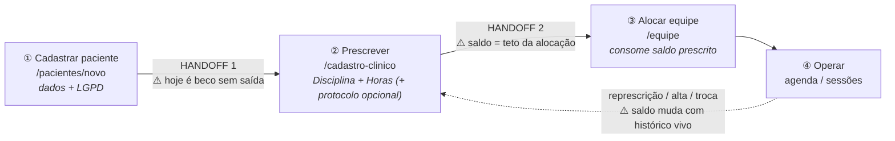

# Implementation Plan: Prescrição de Disciplinas, Horas & Encaixe de Protocolos

> **Issue:** [#203](https://github.com/romulosutil/Iris/issues/203) · Fatia 1
> implementada e verificada por medição em 06/08/2026.

> **Refino Design Lead (jornada) — 06/08/2026.** Esta revisão reorganiza o plano
> em torno da **jornada do coordenador**, não em torno das telas. Motivo: o
> plano anterior descrevia bem _o que cada tela faz_ e mal _o que acontece entre
> elas_ — e é exatamente entre as telas que esta feature quebra (paciente criado
> sem prescrição, membro legado com disciplina fora da prescrição, vínculo
> encerrado que devolve saldo, substituto que ninguém sabe se consome hora).
>
> **Decisões clínicas fechadas com o Rômulo em 06/08/2026** — as quatro que
> estavam abertas (D-A a D-D) foram respondidas e estão travadas na seção 7.
> Nenhuma fatia depende mais de confirmação.

---

## 1. A jornada, ponta a ponta

A feature não é "um campo de horas". É uma cadeia de três atos com dois
handoffs, e cada handoff é um lugar onde o coordenador pode ficar preso.



**Princípio mestre (mantido do plano original):** a dupla **Disciplina + Horas
semanais** é soberana e vale para qualquer paciente, independente da abordagem.
O protocolo estruturado (VB-MAPP, Denver, ABA) é **sub-encaixe opcional por
disciplina** — nunca pré-requisito. Quem faz Psicologia generalista ou Terapia
Convencional prescreve horas do mesmo jeito, sem protocolo nenhum.

**Princípio novo (refino):** _nenhuma etapa da jornada pode terminar sem dizer
qual é a próxima._ Cada estado vazio desta feature carrega um CTA que empurra
para o passo seguinte. Sem isso, remover os campos de disciplina/horas do
cadastro (item 4 do plano original) troca um formulário confuso por um
beco sem saída — regressão, não melhoria.

---

## 2. Os quatro momentos de verdade

### MV1 — Paciente recém-criado, sem prescrição (Handoff 1)

O plano original remove disciplina e carga horária de `/pacientes/novo`. Correto
— cadastro deve ser cadastral + consentimento. Mas isso cria um paciente em
estado **incompleto e silencioso**. O refino exige:

- **Redirect pós-cadastro** vai para `/pacientes/[id]/cadastro-clinico`
  ancorado na seção de prescrição, não para a lista de pacientes.
- **Banner de continuidade** no topo da ficha clínica enquanto não houver
  nenhuma disciplina vigente:
  `Paciente cadastrado. Prescreva as disciplinas e a carga horária semanal para
poder montar a equipe.`
- **Selo na lista de pacientes** (`Sem prescrição`) para que um paciente
  incompleto não some da vista de quem cadastrou e saiu.
- **Sem prescrição, a tela de equipe não mostra formulário** — mostra estado
  vazio direcionado (ver MV2).

### MV2 — Equipe sem saldo para alocar (Handoff 2)

Estado vazio de `/equipe` quando o paciente **não tem nenhuma disciplina
prescrita vigente**:

> **Nenhuma disciplina prescrita ainda.**
> A equipe é montada dentro da carga horária prescrita para cada disciplina.
> `[ Ir para a prescrição → ]`

O formulário de adicionar membro fica **oculto**, não desabilitado. Formulário
desabilitado sem explicação é o pior dos dois mundos: ocupa espaço e não diz o
que fazer.

### MV3 — Cobertura em progresso (o coração da tela de equipe)

Uma linha por disciplina prescrita, sempre visível — inclusive as com 0h
alocadas. A barra é o **objeto de leitura primária** da tela; a lista de membros
é secundária.

| Estado         | Leitura | Copy                                                                                                      |
| -------------- | ------- | --------------------------------------------------------------------------------------------------------- |
| **0% alocado** | neutro  | `0h de 20h alocadas — nenhum terapeuta vinculado`                                                         |
| **1–99%**      | atenção | `12h de 20h alocadas (60%) — restam 8h`                                                                   |
| **100%**       | sucesso | `20h de 20h alocadas — cobertura completa`                                                                |
| **>100%**      | erro    | `25h de 20h alocadas (125%) — sobrealocação de 5h. Reduza as horas de um membro ou aumente a prescrição.` |

Regras de execução da barra:

- **Usar o design system.** `Progress` (`src/components/ui/progress.tsx`) +
  `StatusBadge` (`status-badge.tsx`). Nada de div com classe de cor inline nem
  emoji-bolinha como semântica de estado — a bolinha colorida pode ficar como
  reforço visual, nunca como o único portador da informação.
- **Acessibilidade é requisito, não polimento** (princípio do produto). A barra
  precisa de `role="progressbar"` com `aria-valuenow/min/max` e de um texto
  associado que já diz o estado por extenso — a frase da tabela acima **é** esse
  texto. Cor nunca sozinha: o estado aparece no rótulo textual também.
- **>100% não bloqueia a tela.** Sobrealocação é um estado legítimo e
  transitório (a prescrição caiu antes de a equipe ser ajustada). Ela grita,
  mas não trava a operação clínica.

#### Formato de exibição das horas (decidido em 06/08/2026)

Hora é unidade de tempo, não número decimal. `2,0h` é notação de planilha e
força o leitor a converter `0,5` para "meia hora" de cabeça. A carga sempre
aparece na forma que o coordenador fala:

| Valor armazenado | Exibição |
| ---------------- | -------- |
| `0.5`            | `30min`  |
| `1.0`            | `1h`     |
| `1.5`            | `1h30`   |
| `2.0`            | `2h`     |
| `8.5`            | `8h30`   |
| `20.0`           | `20h`    |
| `0`              | `0h`     |

Regra: sem casa decimal, sem vírgula, sem zero à direita. Só há minutos quando
existem — e, pelo passo de 0,5h, os únicos minutos possíveis são `30`.

**Um único formatador**, `formatarHoras()` em `src/lib/horas.ts`, usado por
barra, badge, tabela, toast, e-mail e relatório. Formatação de hora espalhada
por componente diverge em uma semana. O decimal continua sendo a representação
de **armazenamento e cálculo** (`numeric(4,1)`) — a conversão acontece só na
borda de exibição.

### MV4 — Represcrição com equipe já montada

O caso mais caro de errar. O coordenador reduz 15h → 10h numa disciplina que já
tem 15h alocadas. O plano original acerta ao **permitir salvar** — travar aqui
obrigaria o coordenador a desmontar a equipe para depois corrigir a prescrição,
uma ordem que a clínica não segue na vida real.

Refino da interação — **confirmação antes, não aviso depois**:

1. Ao detectar, no submit, que a nova carga é menor que o alocado vigente, a
   ação **não salva direto**: devolve estado de confirmação.
2. Diálogo (`Dialog` do design system):
   > **Esta redução deixa a disciplina sobrealocada.**
   > Fonoaudiologia passa de 15h para 10h, mas a equipe tem 15h alocadas.
   > A prescrição será salva e a disciplina ficará marcada como sobrealocada
   > até você ajustar as horas dos membros.
   > `[ Cancelar ]` `[ Salvar mesmo assim ]`
3. Ao confirmar, salva e leva o coordenador **para a tela de equipe**, com a
   disciplina afetada em foco. O trabalho não termina no salvar — termina no
   ajuste.

> **Sobrealocação é estado derivado, nunca coluna.** Não criar flag persistida:
> é `SUM(horas alocadas vigentes) > horas prescritas vigentes`, calculado na
> leitura. Flag persistida diverge do fato assim que alguém encerra um vínculo
> por outro caminho, e passa a mentir em silêncio.

---

## 3. Regras clínicas que a jornada expõe

Estas não estavam no plano original e são **bloqueantes de UX**: sem resposta,
a tela não sabe o que desenhar.

### 3.1 Disciplina fora da prescrição (legado e escape hatch)

O formulário atual (`adicionar-membro-form.tsx`) já recebe `disciplinasPrescritas`
mas a lógica de servidor (`equipe/logic.ts`) aceita **qualquer texto**, inclusive
a opção `"Outra"` com campo livre. Restringir o dropdown às disciplinas
prescritas, como o plano pede, cria dois problemas de jornada:

- **Membros já existentes** com disciplina fora da prescrição viram órfãos —
  aparecem na lista, não aparecem em nenhuma barra, e o coordenador não entende
  por quê.
- **A saída "Outra"** deixa de existir sem substituto. Hoje ela é o caminho de
  quem prescreve algo que a lista padrão não cobre.

**Desenho proposto:** o dropdown lista apenas disciplinas prescritas, e a opção
"Outra" é substituída por um link `Prescrever outra disciplina →` que leva à
ficha clínica. A prescrição vira o único ponto de entrada de disciplina nova —
consistente com o princípio de pilar mestre.

Membros legado fora da prescrição ganham um agrupamento próprio na lista:

> **Fora da prescrição atual (2)** — estes vínculos não consomem carga
> prescrita e não dão acesso a nada que a prescrição cubra. Prescreva a
> disciplina para incluí-los no cálculo, ou encerre o vínculo.

**✅ D-A decidido: quem sai do time perde o acesso, sem carência.** Não existe
"ex-membro que ainda enxerga o prontuário". O vínculo é a credencial: encerrou,
acabou.

Verificado no banco — este comportamento **já é o que acontece hoje**:
`app_is_on_team` (`db/migrations/0001_rls.sql:37-46`) filtra
`m.vigencia_fim IS NULL`, e é essa função que governa a leitura de `patient`,
`session`, `goal`, `evidence` e das demais tabelas clínicas. Marcar
`vigenciaFim` corta o acesso na consulta seguinte, em todas as tabelas de uma
vez. **Nada a implementar nesta frente; o que falta é tornar o efeito visível**
— daí a segunda frase do toast em 3.3.

Consequência de UI: como o corte é imediato e total, a ação de encerrar precisa
dizer o que faz _antes_ de fazer. O botão `Encerrar vínculo` abre confirmação:

> **Encerrar o vínculo de Ana Souza (Fonoaudiologia)?**
> Ela perde o acesso ao prontuário deste paciente imediatamente, e as 8h
> voltam para o saldo da disciplina. O histórico de atendimentos permanece.
> `[ Cancelar ]` `[ Encerrar vínculo ]`

### 3.2 Que papéis consomem saldo

`careTeamMembership.papelNaEquipe` aceita `terapeuta_referencia`,
`coordenador_referencia` e `substituto`.

**✅ D-B decidido: `substituto` CONSOME saldo.** A hora entregue por substituto é
hora entregue — a família recebeu e o convênio conta. A barra responde "a
prescrição está sendo entregue?", não "quem é o titular". Consequência aceita:
durante uma cobertura, titular e substituto **coexistem no mesmo período apenas
se as horas couberem no alvo** — na prática o coordenador reduz as horas do
titular afastado ou encerra o vínculo, que é exatamente o registro correto do
que aconteceu na semana.

**✅ D-C decidido: `coordenador_referencia` NÃO consome — é gestão.** Supervisão
não é carga clínica prescrita. Modelagem: o papel é que define o consumo, nunca
a pessoa. **Coordenador que também atende recebe um segundo vínculo** com papel
`terapeuta_referencia` na disciplina em que atende, e é esse segundo vínculo que
consome saldo.

Consequências diretas dessa modelagem:

- O índice único parcial precisa incluir `papel_na_equipe`, senão a mesma pessoa
  não consegue ser gestora **e** terapeuta na mesma disciplina — ver 4.3.
- `coordenador_referencia` **não tem campo de horas**: o formulário oculta o
  input ao escolher esse papel, e o banco recusa horas nesse papel (CHECK em
  4.2). Sem isso, sobra hora fantasma que ninguém soma e ninguém explica.
- Na lista, o coordenador de referência aparece em bloco próprio,
  `Gestão do caso`, fora da conta de cobertura — nunca misturado aos terapeutas
  com uma linha "0h" que parece erro.

### 3.3 Encerrar vínculo devolve saldo e corta acesso

`encerrarVinculoEquipe` marca `vigenciaFim` (append-only, nunca deleta). A barra
soma só vínculos vigentes, então **encerrar devolve horas na hora** — e, pelo
que 3.1 verificou, corta o acesso ao prontuário no mesmo ato. As duas coisas
acontecem juntas e o toast diz as duas:

> `Vínculo encerrado. Fonoaudiologia voltou para 8h de 20h alocadas. O acesso
deste profissional ao prontuário foi cortado.`

Sem essa frase, o coordenador não relaciona a ação ao número que mudou na tela.

### 3.4 Data de vigência e "hoje"

`vigenciaInicio` e `vigenciaFim` são `date`, e o encerramento já usa
`America/Sao_Paulo` para evitar off-by-one noturno. A prescrição
(`patientAlvoDisciplina`) precisa do **mesmo tratamento de fuso** ao abrir e
fechar vigência — senão uma represcrição feita às 22h cria dois registros
vigentes no mesmo dia, e a soma dobra.

---

## 4. Guardrails de engenharia (o que o desenho exige do banco)

Escritos aqui porque cada um deles, se faltar, **aparece como bug de jornada**,
não como bug técnico.

### 4.1 O teto e o consumo precisam de constraints simétricas

`patientAlvoDisciplina.horasAlvoSemana` já é `numeric(4,1)` — mas **não tem
CHECK de positividade nem de múltiplo de 0,5h**. Adicionar `horasSemana` a
`careTeamMembership` com essas constraints e deixar o alvo sem elas produz o
absurdo de prescrever `0,3h` e não conseguir alocar contra isso.

Ambas as colunas recebem:

```sql
CHECK (horas IS NULL OR (horas > 0 AND horas <= 60 AND (horas * 10)::int % 5 = 0))
```

O passo de 0,5h existe porque a agenda é marcada de 30 em 30 minutos; o teto de
60h/semana não é regra clínica, é rede contra erro de digitação — pega o `200`
que era `20` antes de ele virar uma barra em 1000%.

> ⚠️ **Expressão NULL em CHECK satisfaz a constraint** (precedente registrado no
> projeto). Por isso o `IS NULL OR` é explícito e a nulidade é uma decisão, não
> um acidente — ver 4.2.

E `care_team_membership` recebe também a constraint que materializa D-C
(gestão não tem carga):

```sql
CHECK (papel_na_equipe <> 'coordenador_referencia' OR horas_semana IS NULL)
```

Isso não é só higiene: mesmo que alguém esqueça o filtro de papel na soma, o
coordenador de referência não tem como injetar hora fantasma no total. Defesa em
profundidade para a única conta que a tela inteira exibe.

### 4.2 `careTeamMembership.horasSemana` nasce nullable

Existem vínculos em produção. Coluna `NOT NULL` sem default derruba a migração;
com default arbitrário, inventa carga clínica que ninguém prescreveu. Então:

- Coluna **nullable**, sem default.
- Soma usa `COALESCE(SUM(horas_semana), 0)`.
- **Membro sem horas não é invisível.** Aparece na lista com chip
  `Horas não definidas` e ação `Definir horas`. Vínculo legado sem horas é dívida
  visível, não linha silenciosa — senão a barra mostra 8h/20h enquanto cinco
  terapeutas atendem, e o número mente.
- **✅ D-D decidido: horas são obrigatórias.** Todo vínculo **novo** em papel que
  consome (`terapeuta_referencia`, `substituto`) exige `horasSemana`. Validação
  de **aplicação**, não `NOT NULL` de banco — a coluna precisa aceitar NULL
  pelos vínculos legado e pelo `coordenador_referencia`, que por 3.2 não tem
  horas. Sem essa obrigatoriedade a barra nasce mentindo e nunca se recupera.
- **Regra de consumo, num lugar só** — a mesma constante alimenta a soma SQL, a
  validação e a UI:

```ts
// src/lib/horas.ts
export const PAPEIS_QUE_CONSOMEM_SALDO = [
  "terapeuta_referencia",
  "substituto",
] as const;
```

### 4.3 Nada impede vincular o mesmo terapeuta duas vezes

Não há unique para vínculos vigentes. Com horas, um duplo-clique no submit vira
**dupla contagem de carga** — e o coordenador vê a barra estourar sem entender.
Adicionar índice único parcial, **com `papel_na_equipe` na chave** para que a
modelagem de D-C funcione (o mesmo coordenador precisa poder ser gestor **e**
terapeuta na mesma disciplina):

```sql
CREATE UNIQUE INDEX ctm_unico_vigente
  ON care_team_membership (patient_id, user_id, disciplina, papel_na_equipe)
  WHERE vigencia_fim IS NULL;
```

Violação vira erro amigável, não 500: `Este profissional já está na equipe
nesta disciplina e neste papel.`

Como o índice é **parcial**, encerrar um vínculo libera a combinação — recontratar
a mesma pessoa na mesma disciplina depois de uma saída continua possível, e o
histórico das duas passagens fica preservado. É o comportamento certo.

### 4.4 Concorrência real: dois coordenadores alocando ao mesmo tempo

Validar saldo lendo e depois inserindo é TOCTOU — duas alocações simultâneas de
6h contra 8h restantes passam as duas. A checagem e o insert vão na **mesma
transação**, sob lock da disciplina.

> ⚠️ **Corrigido na implementação (fatias 2 e 4): o lock é advisory, não
> `SELECT … FOR UPDATE`.** O row lock do Postgres exige privilégio de UPDATE em
> **nível de tabela**, e a `0044` (equipe) e a `0077` (prescrição) revogaram
> UPDATE de tabela e concedem coluna a coluna — o `FOR UPDATE` falha com
> `permission denied for table …`. O advisory lock não toca em privilégio
> nenhum e morre com a transação.

```sql
-- MESMA chave em prescricao-logic.ts e equipe/logic.ts, de propósito:
-- represcrever e alocar a mesma disciplina ao mesmo tempo também é corrida.
SELECT pg_advisory_xact_lock(hashtextextended($1 || ':' || $2, 203));
```

Edição que troca de disciplina trava **as duas**, em ordem alfabética — sem
ordem determinística, uma transação pegando Fono→TO e outra TO→Fono deadlockam.

O perdedor da corrida recebe rollback gracioso com a mensagem de saldo real —
nunca erro genérico:

> `Não foi possível alocar 6h: restam 2h em Fonoaudiologia. Outra alteração foi
salva enquanto você preenchia.`

### 4.5 Toda query de saldo filtra vigência

Sem exceção, tanto no alvo quanto na alocação:

```ts
.where(and(eq(tabela.patientId, id), isNull(tabela.vigenciaFim)))
```

Esquecer o filtro em **um** dos dois lados soma histórico encerrado e a barra
passa a mostrar sobrealocação fantasma de paciente antigo. É o bug mais provável
desta feature e o mais difícil de ver, porque só aparece em paciente com
histórico — nunca em dado de teste novo.

### 4.6 A validação de edição é a mesma da inserção

Alterar disciplina/horas/papel de membro existente muda o saldo de **duas**
disciplinas (sai de uma, entra na outra). Tratar edição como caso próprio duplica
a regra e as duas versões divergem. Extrair um único `validarSaldoDisciplina`
usado por inserção e edição.

### 4.7 Itens de rotina do repo que este plano não pode esquecer

- **`GRANT` explícito da coluna nova.** Várias tabelas têm `UPDATE` revogado no
  nível de tabela e privilégio concedido coluna a coluna. Faltando o grant, o
  sintoma é `permission denied for table care_team_membership`, que não diz qual
  coluna — diagnóstico caro. Incluir o `GRANT (horas_semana)` na própria 0076.
- **Migração escrita à mão**, nunca `pnpm db:generate` (snapshot dessincronizado
  recria objetos de produção).
- **Entrada manual no `_journal.json`** com `when` = anterior **+ 1000**. `when`
  menor ou igual ao último aplicado faz o Drizzle **pular o arquivo em silêncio**.
- **Verificar medindo, não lendo o `git log`.** Depois de `pnpm db:migrate`,
  confirmar em `information_schema` a coluna e o grant, e exercitar o CHECK e o
  índice único num `BEGIN … ROLLBACK`.
- **`pnpm test:rls`** depois da migração: `care_team_membership` é a tabela que
  concede acesso ao prontuário; qualquer mexida nela toca isolamento multi-tenant.

---

## 5. Fatiamento (ordem de construção)

Cada fatia entrega jornada utilizável de ponta a ponta. Não construir 2 antes de
1 — a barra sem prescrição não tem o que mostrar.

| #        | Fatia                                                                                | Entrega verificável                                                                                               |
| -------- | ------------------------------------------------------------------------------------ | ----------------------------------------------------------------------------------------------------------------- |
| **1**    | Migração 0076 + constraints simétricas + unique parcial + grants + `formatarHoras()` | `test:rls` verde; CHECK, unique e GRANT provados contra Postgres; `30min`/`1h`/`1h30` cobertos por teste unitário |
| **2**    | Prescrição na ficha clínica (SCD2, fuso BR) + handoff 1 (redirect, banner, selo)     | Criar paciente → cair na prescrição → salvar 20h Fono                                                             |
| **3**    | Encaixe opcional de protocolo por disciplina                                         | Prescrever Psicologia sem protocolo continua funcionando                                                          |
| **4** ✅ | Equipe: horas, validação transacional, edição, estado vazio MV2                      | ✅ Entregue 06/08/2026 — 17 testes de integração + 15 unitários de cobertura                                      |
| **5** ✅ | Barra de cobertura nos 4 estados + a11y + copy                                       | ✅ Entregue 06/08/2026 — 5 stories + `progressbar` com `aria-valuetext` = a frase de MV3                          |
| **6** ✅ | Represcrição com confirmação (MV4) + toast de devolução de saldo (3.3)               | ✅ Entregue 06/08/2026 — confirmação lê `textoCobertura`; toast diz saldo devolvido **e** corte de acesso         |

### O que a fatia 6 herda da 5 (não reconstruir)

- **`textoCobertura(c)` e `ROTULO_ESTADO`** (`equipe/cobertura.ts`) são a copy
  de MV3 como função pura. O diálogo de confirmação da represcrição (§MV4) deve
  usar a MESMA frase do estado sobrealocado — duas paráfrases da mesma
  consequência divergem, e a que o coordenador lê ao confirmar deixa de ser a
  que ele encontra na tela de destino.
- **`BarraCobertura`** (`equipe/barra-cobertura.tsx`) já renderiza os quatro
  estados com `role="progressbar"`, `aria-valuetext` e selo textual. A fatia 6
  só precisa **navegar até ela** com a disciplina afetada em foco.
- **`Progress` aceita `variante`** (`acao` | `neutro` | `atencao` | `sucesso` |
  `erro`) e **`StatusBadge` aceita `error`** — variantes novas do design system,
  criadas nesta fatia. Não criar cor inline.
- **Sobrealocação continua derivada** (`estado === "sobrealocada"`): a
  confirmação da fatia 6 lê o resultado de `calcularCobertura`, não persiste
  flag nem replica a regra.

### O que as fatias 5 e 6 herdam da 4 (não reconstruir)

- **`equipe/cobertura.ts` — `calcularCobertura(prescrições, vínculos)`** já
  devolve, por disciplina prescrita vigente e em ordem alfabética:
  `horasAlvo`, `horasAlocadas`, `horasRestantes`, `horasExcedentes`,
  `percentual`, `vinculosSemHoras` e `estado` (`vazio` | `parcial` | `completa`
  | `sobrealocada` — os quatro de MV3, com teste unitário cada). É módulo puro:
  o filtro de vigência é responsabilidade de quem chama, nos dois lados.
  **A fatia 5 renderiza esta saída; recalcular faria a barra e a validação
  discordarem sobre o mesmo número.**
- **`encerrarVinculoEquipe` já devolve `{ disciplina, horasDevolvidas }`** —
  é o que o toast da fatia 6 precisa para nomear o número que mudou na tela
  (§3.3). `horasDevolvidas` é `0` em papel de gestão, por D-C.
- **A tela já imprime o estado por extenso** (cor nunca sozinha). A fatia 5
  troca o cartão por `Progress` + `StatusBadge` com `role="progressbar"` e
  `aria-valuenow/min/max` — a frase permanece como texto associado.
- **`validarSaldoDisciplina` já é compartilhada** por inserção e edição, com
  `ignorarMembershipId`. A represcrição para baixo (fatia 6) precisa **ler** a
  sobrealocação resultante, não replicar a regra.

---

## 6. Arquivos

### Banco

1. **[NEW]** `db/migrations/0076_care_team_horas_semana.sql` — coluna
   `horas_semana numeric(4,1)` nullable em `care_team_membership`; CHECK de
   positividade/teto/múltiplo de 0,5h **nas duas tabelas**
   (`care_team_membership` e `patient_alvo_disciplina`); CHECK
   `ctm_gestao_sem_horas` (D-C); índice único parcial `ctm_unico_vigente`
   incluindo `papel_na_equipe`; `GRANT UPDATE (horas_semana)` — a 0044 revogou
   `UPDATE` de tabela nesta tabela e concede coluna a coluna. Escrita à mão.
2. **[MODIFY]** `db/migrations/meta/_journal.json` — entrada manual,
   `when` = anterior + 1000.
3. **[MODIFY]** `src/db/schema.ts` — `horasSemana` em `careTeamMembership`;
   novos `check()`/`uniqueIndex()` espelhando exatamente a migração.

### Domínio compartilhado

3b. **[NEW]** `src/lib/horas.ts` — `formatarHoras()` (D-E), `HORAS_PASSO`,
`ehMultiploDePasso()`, `HORAS_MAX_SEMANA` e `PAPEIS_QUE_CONSOMEM_SALDO`
(D-B/D-C). Fonte única de verdade de formato, passo e regra de consumo.
3c. **[NEW]** `src/lib/horas.test.ts` — tabela de casos de D-E ponta a ponta,
incluindo `0.5 → 30min`, `1.5 → 1h30`, `2 → 2h` (nunca `2,0h`).

### Criar paciente (`/pacientes/novo`)

4. **[MODIFY]** `novo-paciente-form.tsx` — remove disciplina e carga inicial.
5. **[MODIFY]** `logic.ts` — cadastro 100% cadastral + consentimento LGPD;
   **redirect para a ficha clínica ancorado na prescrição** (handoff 1).

### Ficha clínica (`/pacientes/[id]/cadastro-clinico`)

6. **[NEW]** `prescricao-disciplinas-secao.tsx` — prescrição dinâmica
   (Disciplina → Horas → encaixe opcional de protocolo); banner de continuidade
   quando não há disciplina vigente; diálogo de confirmação de sobrealocação (MV4).
7. **[NEW]** `prescricao-actions.ts` — Server Actions SCD2 (fecha vigência
   anterior e abre nova, ambas em `America/Sao_Paulo`, na mesma transação);
   detecção de sobrealocação para o passo de confirmação.
8. **[MODIFY]** `page.tsx` — integra a seção; âncora do redirect.
9. **[MODIFY]** `protocolos-secao.tsx` — protocolo passa a ser sub-encaixe **por
   disciplina prescrita**, opcional; sem prescrição, não oferece encaixe.

### Equipe (`/pacientes/[id]/equipe`)

10. **[MODIFY]** `adicionar-membro-form.tsx` — dropdown restrito às disciplinas
    prescritas; `"Outra"` vira link `Prescrever outra disciplina →`; input de
    horas em passos de 30min com saldo restante inline, **oculto quando o papel
    é `coordenador_referencia`** (D-C) e **obrigatório nos demais** (D-D);
    bloqueio de auto-supervisão (já espelha o CHECK); erro em `Alert`/toast do
    design system.
11. **[MODIFY]** `logic.ts` / `actions.ts` — `validarSaldoDisciplina`
    compartilhado por inserção **e** edição; soma filtrando
    `papel_na_equipe IN (PAPEIS_QUE_CONSOMEM_SALDO)`; `SELECT … FOR UPDATE` do
    alvo vigente + insert na mesma transação; `COALESCE(SUM(horas_semana), 0)`;
    tradução da violação do unique parcial em erro amigável; confirmação de
    encerramento (corte de acesso, D-A) e toast de devolução de saldo.
12. **[MODIFY]** `page.tsx` — barra de cobertura por disciplina prescrita usando
    `Progress` + `StatusBadge` e `formatarHoras()`; estado vazio MV2; blocos
    `Gestão do caso` e `Fora da prescrição atual`; chip `Horas não definidas`;
    chip `Substituto` (consome saldo, sinalizado — D-B).
13. **[MODIFY]** `actions.int.test.ts` (equipe e cadastro clínico) — casos:
    saldo exato, estouro, substituto consumindo, coordenador de referência **não**
    consumindo, mesma pessoa em dois papéis na mesma disciplina, edição que troca
    de disciplina, corrida concorrente, represcrição para baixo, vínculo
    encerrado devolvendo saldo **e** perdendo acesso, membro sem horas.

### Lista de pacientes

14. **[MODIFY]** lista de pacientes — selo `Sem prescrição`.

> **Sobre os testes:** cada caso acima só vale se **falhar contra o código
> anterior**. Teste que passa antes e depois do fix não testa nada — é o padrão
> de falha mais recorrente deste repo. Rodar a mutação antes de considerar a
> fatia pronta.

---

## 7. Decisões travadas (06/08/2026)

| ID      | Pergunta                                | Decisão                                                                                                                                                                      | Onde vive        |
| ------- | --------------------------------------- | ---------------------------------------------------------------------------------------------------------------------------------------------------------------------------- | ---------------- |
| **D-A** | Quem sai do time mantém acesso?         | **Não. Corte imediato, sem carência.** Já é o comportamento do banco (`app_is_on_team` filtra `vigencia_fim IS NULL`); falta só tornar visível e confirmar antes de encerrar | §3.1, §3.3       |
| **D-B** | `substituto` consome saldo?             | **Sim.** Hora entregue é hora entregue — família recebeu, convênio conta                                                                                                     | §3.2, §4.2       |
| **D-C** | `coordenador_referencia` consome saldo? | **Não — é gestão.** Coordenador que atende ganha um **segundo vínculo** como `terapeuta_referencia`; o papel define o consumo, nunca a pessoa                                | §3.2, §4.1, §4.3 |
| **D-D** | Horas obrigatórias em vínculo novo?     | **Sim**, em papel que consome. Validação de aplicação — a coluna segue nullable pelo legado e pela gestão                                                                    | §4.2             |
| **D-E** | Como exibir horas?                      | **`30min` / `1h` / `1h30`** — nunca `2,0h`. Formatador único em `src/lib/horas.ts`                                                                                           | §MV3             |

Consequências de modelagem que caíram dessas decisões e valem repetir, porque
são fáceis de perder na implementação:

1. O índice único parcial inclui `papel_na_equipe` (senão D-C não é
   representável).
2. `coordenador_referencia` tem `horas_semana` proibido por CHECK, e o
   formulário oculta o campo nesse papel.
3. `PAPEIS_QUE_CONSOMEM_SALDO` é uma constante única compartilhada por soma SQL,
   validação e UI.
4. O decimal é representação de armazenamento; `formatarHoras()` é a única
   fronteira de exibição.

---

## 8. O que este refino mudou em relação ao plano anterior

- Reorganizou o plano por **jornada**, expondo dois handoffs que não existiam no
  documento (paciente sem prescrição; prescrição como teto da equipe).
- Cobriu o **beco sem saída** criado ao remover disciplina/horas do cadastro.
- Trocou "aviso depois de salvar" por **confirmação antes de salvar** na
  represcrição para baixo, com continuidade para a tela de equipe.
- Estabeleceu que **sobrealocação é derivada**, não coluna persistida.
- Levantou quatro **regras clínicas não decididas** que mudam o desenho da barra
  — todas fechadas na mesma sessão (seção 7), mais a decisão de formato de hora.
- Trocou o decimal de planilha (`2,0h`) por notação de tempo (`30min`, `1h`,
  `1h30`) com **formatador único**, e separou representação de armazenamento
  (decimal) de representação de exibição.
- Verificou no banco que **encerrar vínculo já corta acesso** — o trabalho de
  D-A é de UI (confirmação + toast), não de RLS.
- Apontou que `patient_alvo_disciplina` já existe e está **sem CHECK**, criando
  assimetria com a coluna nova.
- Adicionou **unique parcial** (dupla contagem por duplo-clique) e **`FOR UPDATE`**
  (TOCTOU entre dois coordenadores) — o plano anterior citava concorrência sem
  mecanismo.
- Tratou **legado** explicitamente: membro sem horas e membro fora da prescrição
  são estados visíveis de UI, não linhas silenciosas.
- Amarrou barra e badges ao **design system existente** e tornou a11y requisito
  da fatia, não polimento posterior.
