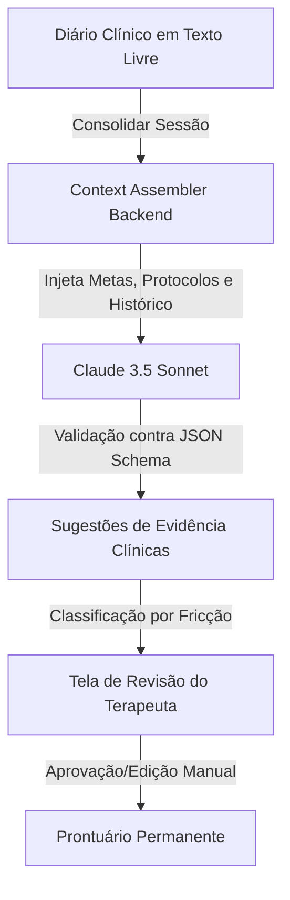

# Visão de Produto & Product Design — Evolução do Iris

**Status do Projeto: Fases 0.5 a 3 Concluídas**

Este documento detalha o estado atual do **Iris** sob as lentes de **Gestão de Produto (Product Management)** e **Design de Produto (Product Design / UX-UI)**. Ele explica _o que_ foi feito até o momento (até o fechamento da Fase 3 de Extração e Revisão com IA), _por que_ foi desenhado dessa maneira e como as escolhas de interface e arquitetura de dados sustentam as premissas de negócio e os guardrails operacionais do sistema.

---

## 1. O Propósito do Produto & Proposta de Valor

O **Iris** é um SaaS B2B desenvolvido para clínicas de terapia infantil, com foco inicial na intervenção para Transtorno do Espectro Autista (TEA) no Brasil.

### O Problema do Mercado

Hoje, terapeutas infantis passam horas após seus expedientes preenchendo planilhas analógicas ou prontuários complexos para registrar a evolução clínica de seus pacientes (usando protocolos como VB-MAPP, Denver, PROC, etc.). Isso gera:

1. **Burnout clínico:** Terapeutas sobrecarregados com burocracia de dados.
2. **Dados imprecisos:** Registros feitos de memória, dias após a sessão, gerando perda de rastreabilidade.
3. **Glosa de convênios:** Dificuldade em auditar se a evolução clínica de fato ocorreu, gerando perdas financeiras para a clínica.

### A Solução Iris: _"Chegue na avaliação com o dossiê pronto"_

O Iris substitui as grades de planilhas por um **diário de sessão em texto livre (linguagem natural)**. A partir deste diário, uma Inteligência Artificial especializada extrai evidências clínicas estruturadas e propõe candidatos a marcos de desenvolvimento conquistados.

- **Invariante de Camada 1:** A IA **nunca** pontua nem decide sozinha. Ela atua puramente como assistente de extração; o julgamento e a assinatura do prontuário são 100% humanos.
- **Separabilidade Estrita:** Há uma separação rígida entre a _evidência_ (um fato observado na sessão) e a _pontuação formal_ (marcos consolidados em janelas de avaliação pelo coordenador).

---

## 2. Personas e Cenários de Uso (Contexto sob Pressão)

O Iris foi projetado para acomodar dois públicos profissionais com rotinas e pressões drasticamente diferentes. Nenhum deles é o paciente final (a criança em intervenção).

### A. O Terapeuta (Mobile-First)

- **Contexto:** Opera o sistema no corredor da clínica, com apenas uma mão livre, sob luz ambiente incontrolável (reflexo em telas de celular), sofrendo interrupções constantes entre 7 a 8 sessões diárias.
- **Necessidade:** O menor atrito possível para registrar a sessão. O fluxo principal consiste em redigir o diário clínico (por texto livre) e, posteriormente, revisar as evidências sugeridas pela IA com toques rápidos, mas conscientes.
- **Design Response:** Botões de ação grandes (alvos de toque $\ge 44 \times 44\text{px}$), fontes com alta legibilidade, contraste robusto e feedback de estado claro.

### B. O Coordenador Clínico (Desktop-First)

- **Contexto:** Trabalho pausado, focado em monitoramento clínico, desenho de metas (PEI) e auditoria de prontuários.
- **Necessidade:** Alta densidade de informação para gerenciar múltiplos terapeutas e pacientes. O coordenador opera na validação por exceção, revisando justificativas e reclassificando dados clínicos.
- **Design Response:** Layouts em grid densos (Bento Cards), visualização rápida de histórico e relatórios, navegação clara por abas e ferramentas de monitoramento de exceções.

---

## 3. Identidade Visual: O Conceito "Espectro Brutal"

Rejeitamos ativamente a estética genérica de "startups de IA" (gradientes roxos brilhantes, glassmorphism, dashboards futuristas que vendem uma falsa ilusão de certeza absoluta) e o visual lúdico infantil (que infantiliza a ferramenta de trabalho do profissional clínico).

O Iris adota a linguagem de design **Espectro Brutal**:

- **Honestidade Visual = Honestidade Epistêmica:** A interface nunca esconde a incerteza da IA. Estados "sugeridos pela IA" possuem um tratamento de profundidade, borda e cor visualmente distintos de dados confirmados. Uma sugestão "afunda" na tela (sombra interna), enquanto um dado aprovado "levanta" (sombra projetada robusta).
- **Estrutura Utilitária:** Grade rígida, tipografia de alta legibilidade, forte contraste visual e ausência de elementos puramente decorativos.
- **Acessibilidade WCAG 2.1 AA:**
  - Contraste mínimo de 4.5:1 para textos e 3:1 para elementos de interface/bordas.
  - Paleta funcional específica: Vermelho (rejeição), Verde (conquistado/aprovado), Gold (média/baixa confiança) e Violeta (`--color-suggested` - estado sugerido pela IA).
  - O violeta foi exaustivamente testado contra daltonismos (protanopia e deuteranopia), garantindo uma distância de cor mínima (Delta E > 39) em relação ao verde e vermelho, evitando qualquer colisão visual.

---

## 4. Evolução Funcional: O que foi Entregue até Agora

### 🚀 Fase 0.5 — Fundação Visual (Design System)

Construímos a biblioteca base de componentes de UI sob o conceito Espectro Brutal no Storybook, acoplada a testes de acessibilidade automatizados (`addon-a11y` limpando erros no build).

- **Componentes Base:** `Button`, `Card`, `Alert`, enriquecidos posteriormente com mais 12 componentes (`StatusBadge`, `Chip`, `Accordion`, `Checkbox`, `Select`, `Tabs`, `Dialog`, `Slider`, `Progress`, `Avatar`, `Stat`).
- **Comportamento Headless:** Integração com primitivos Radix para garantir acessibilidade nativa de teclado, fechamento de escopo e foco de diálogos de forma automática.

### 🔐 Fases 1a & 1b — Segurança de Dados & Isolamento Multi-Tenant

Desenhamos o alicerce mais importante do Iris: o isolamento absoluto dos dados de menores (LGPD).

- **Multi-Tenancy por Conexão de Banco:** O sistema usa duas conexões Postgres separadas:
  1. `iris_auth`: Processa o bootstrap de sessão e autenticação via Better-Auth.
  2. `iris_app`: Acesso da aplicação principal, rigidamente travado por Row Level Security (RLS). Nenhum dado do paciente escapa do ID da clínica correspondente.
- **Papel Ativo Determinístico:** O acesso de um usuário a determinadas telas e ações é computado em tempo de execução no servidor (`papelAtivo`). Um cookie apenas _indica_ qual clínica/papel o usuário escolheu, mas quem de fato _autoriza_ a ação é a verificação estrita do banco contra a tabela `user_role` a cada requisição.

### 📋 Fase 1c — Cadastro Clínico & Equipe de Cuidado

- **Separação Administrativo vs. Clínico:** A recepção da clínica pode preencher os dados administrativos e coletar o **Consentimento LGPD** do responsável legal. O perfil clínico do paciente (diagnósticos, medicações, protocolos ativos) fica acessível apenas para a coordenação clínica.
- **Consentimento Atômico:** O banco bloqueia qualquer escrita clínica de um paciente que não possua um registro de consentimento prévio associado na mesma transação.
- **Equipe de Cuidado com Vigência:** Terapeutas são vinculados ao paciente com uma data de início e fim. O encerramento do vínculo não deleta o registro; ele o arquiva com `vigencia_fim` para garantir o histórico de auditoria clínica.

### 📅 Fase 1d — Agenda Mínima & Check-In de Sessões

- **Design de Ocorrências:** Criamos o fluxo de agenda do dia. O terapeuta visualiza a fila de sessões e executa o check-in (com controle de timezone `America/Sao_Paulo` para evitar distorções de data em sessões noturnas).
- **RLS Aplicado:** O terapeuta só visualiza a agenda de pacientes dos quais ele faz parte da Equipe de Cuidado (`app_is_on_team`). A coordenação e a recepção visualizam a grade completa da clínica.

### 🎯 Fase 2 — Gestão de Metas & Diário Clínico

- **CRUD de Metas Clínicas:** O coordenador pode desenhar metas de evolução. A unidade de domínio é estrutural e previsível (ex.: "N acertos em M sessões" em vez de campo de texto livre). O sistema monitora a data do ciclo de revisão clínica (`proxima_revisao_em`).
- **Abertura do Diário:** A partir da agenda, o terapeuta é direcionado para a tela de preenchimento do diário clínico em texto livre.

### 🧠 Fase 3 — Pipeline de Extração com IA & Fricção de Revisão

Nesta fase, integramos a inteligência clínica ao Iris através da API da Anthropic (Claude 3.5 Sonnet).

#### 1. Context Assembler & Proteção contra Injeção de Prompt

Antes de enviar o diário ao Claude, o backend monta um pacote de contexto (`ExtractionContext`) contendo: a idade do paciente, seu resumo de repertório clínico, as metas ativas daquele protocolo e o histórico de extrações aprovadas anteriormente.

- **Hardening contra Prompt Injections:** O texto livre digitado pelo terapeuta é sanitizado e envelopado como dado isolado no prompt da API. As 19 regras clínicas e o JSON Schema de saída (`output-schema.json`) são injetados no nível do `system_instructions`, prevenindo que inputs maliciosos subvertam o comportamento do modelo.

#### 2. Tela de Revisão Baseada em Fricção e Lastro

Aqui tomamos a maior decisão de design de produto da Fase 3: **abolimos a aprovação em lote automática**.

- **O Perigo do Rubber-Stamping:** Em clínicas com alto volume de atendimentos, o botão "Aprovar tudo" gera um comportamento no qual o terapeuta clica sem ler, invalidando a auditoria clínica.
- **A Solução por Lastro:** Para aprovar uma evidência sugerida pela IA, o terapeuta **deve abrir o cartão**. O botão de aprovação só é revelado no estado expandido. Isso garante um lastro de que o conteúdo foi exibido por inteiro.
- **Classificação Visual por Nível de Fricção (Confiança da IA):**
  - **Alta Confiança (Verde Mint):** Layout compacto. A sugestão da IA coincide perfeitamente com os parâmetros históricos e regras clínicas.
  - **Média/Baixa Confiança (Gold):** Exige expansão obrigatória com caixa de seleção de confirmação antes de aprovar.
  - **Inconsistente (Terracotta):** O sistema detecta uma contradição clínica ou desvio estatístico. O card se expande exibindo o histórico de evoluções anteriores lado a lado para contextualizar a tomada de decisão do terapeuta.

#### 3. Painel de Exceções & Reprocessamento Resiliente

- **Painel do Coordenador (`/excecoes`):** Permite visualizar sessões cujos diários não foram revisados ou extrações que falharam por indisponibilidade de rede.
- **Idempotência no Reprocessamento:** Se uma extração falhar, o terapeuta pode reprocessar manualmente. O sistema é inteligente: ele limpa as sugestões pendentes de reprocessamento, mas **preserva as evidências que o terapeuta já havia revisado manualmente** na sessão, reduzindo o custo de tokens de API e respeitando a decisão humana prévia.

---

## 5. Próximos Passos (Roadmap MVP)

O Iris possui suas fundações de dados, segurança, UX clínica e inteligência de extração 100% integradas. Os próximos passos focam na expansão da jornada e na entrega de valor analítico:

1. **Fase 4 — Evidências Acumuladas & Linha do Tempo:** Transformar as evidências aprovadas pelos terapeutas em visualizações analíticas de progresso, com gráficos de evolução de marcos e comparadores temporais para reuniões clínicas.
2. **Fase 5 — Relatórios de Convênio & Supervisão:** Permitir que o coordenador revise e gere dossiês de auditoria para justificar a evolução do paciente perante convênios de saúde e emita relatórios narrativos calibrados para a família.
3. **Fase 6 — Ditado de Voz & Hardening LGPD:** Implementar ASR (transcrição de áudio para texto livre) diretamente no app mobile para que o terapeuta possa narrar o diário no corredor da clínica, com backups locais de áudio para segurança jurídica extrema.
