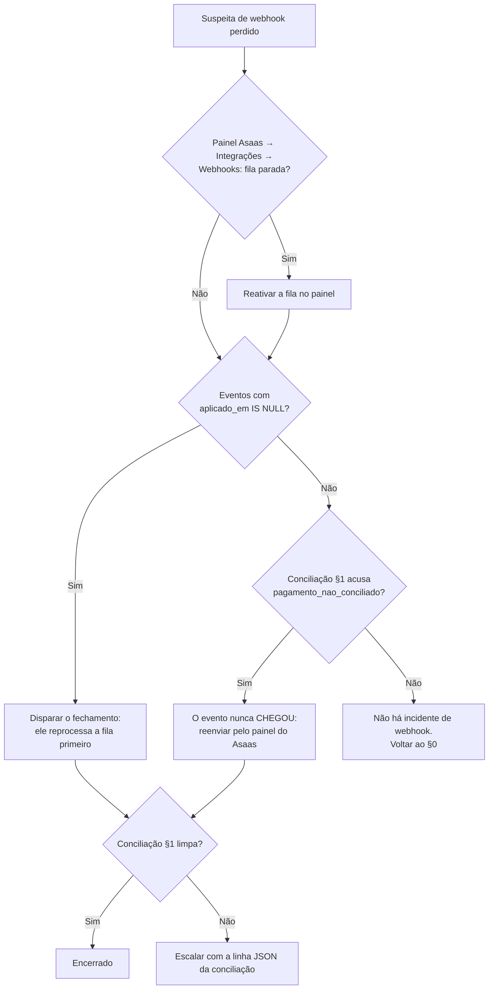

# Runbook Operacional e Conciliação de Billing (#375) — Implementation Plan

> **For agentic workers:** REQUIRED SUB-SKILL: Use superpowers:subagent-driven-development (recommended) or superpowers:executing-plans to implement this plan task-by-task. Steps use checkbox (`- [ ]`) syntax for tracking.

**Goal:** Entregar um runbook operacional de incidentes de billing (`infra/billing/runbook.md`) e uma rotina de conciliação **somente leitura** que compara o estado local (`billing_cycle` / `subscription`) com o estado real no Asaas e relata divergências, sem corrigir nada sozinha.

**Architecture:** Toda a lógica de conciliação mora no app (`src/lib/billing/conciliacao.ts`), exposta por uma rota interna autenticada por bearer (`POST /api/internal/billing/conciliar`). O gatilho é um `.mjs` magro, sem nenhuma dependência npm, que só faz um POST — a mesma decisão da #36/#156: a imagem Docker do job **não herda o `node_modules` do app**, e duplicar lógica de billing num `.mjs` paralelo já derrubou o motor de escalonamento em produção com CI verde. A conciliação **não escreve** — nem no banco, nem no gateway: um relatório que se auto-corrige é um caminho novo para cobrança duplicada, e a correção é ato de operador guiado pelo runbook.

**Tech Stack:** Next.js 16 (App Router, route handler `runtime = "nodejs"`), Drizzle ORM sobre Postgres pela role `iris_auth` (`authDb`), Vitest (unit + `.int.test.ts` contra Postgres real), Node 22 puro no `.mjs`, Docker (`infra/billing/`), Mermaid no runbook.

**Spec:** [GitHub issue #375](https://github.com/romulosutil/Iris/issues/375) — "[Billing/Infra] Runbook Operacional e Rotinas de Conciliação para Webhooks e Cobranças Asaas".

## Premissas de design (fechadas neste plano, pendentes de validação com o Rômulo)

O corpo da issue #375 lista escopo e critérios de aceite, mas não fecha os 7 pontos de handoff (`AGENTS.md` §5.2). Estas são as decisões que este plano toma — se alguma estiver errada, corrigir **aqui** antes de executar, não durante:

- **A1 — A conciliação é somente leitura.** Nenhum `UPDATE`, nenhum `POST` ao gateway. A saída é diagnóstico; a correção é procedimento humano do runbook.
- **A2 — Lógica no app, gatilho magro.** Rota interna + `.mjs` sem deps, igual a `fechamento-ciclo-billing.mjs`.
- **A3 — Sob demanda, não agendada.** Nenhum serviço novo no Easypanel; o script entra na imagem `infra/billing` já existente e é executado no console do container ou por `curl`.
- **A4 — Saída é UMA linha JSON no stdout**, mesmo contrato de observabilidade do fechamento (o log do Easypanel é o único observador).
- **A5 — Teto por passada, com sinalizador de truncamento.** Cada ciclo conferido é uma chamada HTTP ao Asaas; varredura sem teto é rate limit garantido. Truncamento nunca é silencioso.

## Global Constraints

- **Idioma:** documentação, copy, comentários de código e mensagens de commit em **pt-BR**. Conventional Commits (`feat(375): ...`, `docs(375): ...`).
- **Node:** >= 22. O `.mjs` usa só `fetch` nativo — **zero dependência npm**, e o `infra/billing/Dockerfile` continua **sem `npm install`**.
- **Banco:** nenhuma migração nesta entrega. `iris_auth` já tem `SELECT` em `asaas_webhook_event`, `billing_cycle` e `subscription`. Se alguma etapa parecer precisar de migração, **pare e reavalie** — provavelmente é escrita disfarçada, e escrita viola A1.
- **RLS:** a conciliação roda em `authDb` (role `iris_auth`), **nunca** em `withTenant()`. Não há sessão nem tenant a resolver, e `iris_auth` não tem grant em `patient` — o que mantém `withTenant()` como gargalo único de dado clínico.
- **Segredo:** o bearer da rota é `BILLING_JOB_TOKEN` (o mesmo do fechamento). Nunca impresso, nem truncado, em log nenhum.
- **Formatação:** rodar Prettier **só nos arquivos tocados** (`npx prettier --write <arquivos>`). `pnpm format` reformata o repositório inteiro, incluindo `.agents/` e worktrees aninhados.
- **Comandos de verificação:** `pnpm test` (unit), `pnpm test:rls` (é o script dos `.int.test.ts`, `--config vitest.integration.config.ts` — `vitest run` puro **coleta zero** neles), `pnpm typecheck`, `pnpm lint`.
- **Confira a contagem, não o verde:** um `.int.test.ts` que sai "0 tests" é vermelho disfarçado. Toda etapa de verificação abaixo diz o número esperado.

---

## File Structure

**Criar:**

- `src/lib/billing/conciliacao.ts` — classificadores puros de divergência + as duas varreduras (`conciliarCiclos`, `conciliarVinculos`) + os tipos do relatório. Uma responsabilidade: comparar local × gateway e nomear a diferença.
- `src/lib/billing/conciliacao.test.ts` — testes unitários dos classificadores (puros, sem banco, sem rede).
- `src/lib/billing/conciliacao.int.test.ts` — testes de integração das varreduras contra Postgres real, com dublê de provedor.
- `src/app/api/internal/billing/conciliar/route.ts` — rota interna, bearer, monta o relatório.
- `src/app/api/internal/billing/conciliar/route.test.ts` — testes da rota com os módulos de billing mockados.
- `scripts/conciliacao-billing.mjs` — gatilho magro (POST + resumo + exit code).
- `scripts/conciliacao-billing.test.mjs` — testes unitários do gatilho.
- `infra/billing/runbook.md` — runbook operacional (deliverable 1 da issue).

**Modificar:**

- `infra/billing/Dockerfile` — um `COPY` a mais para o script novo.
- `.env.example` — `BILLING_CONCILIACAO_URL`.
- `infra/README.md` — apontar para o runbook novo.

**Não tocar:** `src/db/schema.ts` (o guard `src/db/migrations-vs-main.test.ts` exige snapshot novo do Drizzle para **qualquer** diff nele, comentário incluso, e esta entrega não tem migração).

---

### Task 1: Classificadores puros de divergência

**Files:**

- Create: `src/lib/billing/conciliacao.ts`
- Test: `src/lib/billing/conciliacao.test.ts`

**Interfaces:**

- Consumes: `StatusCobranca` e `StatusAssinaturaProvider` de `@/lib/billing/provider/types` (`"pendente" | "paga" | "recusada" | "estornada"` e `"pendente" | "autorizada" | "pausada" | "cancelada"`).
- Produces:
  - `type ClasseDivergenciaCiclo`
  - `type ClasseDivergenciaVinculo`
  - `type EstadoRemotoCobranca = { encontrada: true; status: StatusCobranca; valorCentavos: number } | { encontrada: false }`
  - `function classificarDivergenciaCiclo(entrada: EntradaClassificacaoCiclo): ClasseDivergenciaCiclo | null`
  - `function classificarDivergenciaVinculo(statusLocal: string, statusRemoto: StatusAssinaturaProvider): ClasseDivergenciaVinculo | null`
  - `interface EntradaClassificacaoCiclo { statusLocal: string; valorLocalCentavos: number; agrupaDebito: boolean; remoto: EstadoRemotoCobranca }`

- [ ] **Step 1: Escrever os testes que falham**

Criar `src/lib/billing/conciliacao.test.ts`:

```ts
import { describe, expect, it } from "vitest";
import {
  classificarDivergenciaCiclo,
  classificarDivergenciaVinculo,
} from "./conciliacao";

function ciclo(over: Partial<Parameters<typeof classificarDivergenciaCiclo>[0]> = {}) {
  return {
    statusLocal: "aguardando_pagamento",
    valorLocalCentavos: 10_000,
    agrupaDebito: false,
    remoto: { encontrada: true as const, status: "pendente" as const, valorCentavos: 10_000 },
    ...over,
  };
}

describe("classificarDivergenciaCiclo", () => {
  it("não acusa nada quando local e gateway concordam", () => {
    expect(classificarDivergenciaCiclo(ciclo())).toBeNull();
    expect(
      classificarDivergenciaCiclo(
        ciclo({ statusLocal: "pago", remoto: { encontrada: true, status: "paga", valorCentavos: 10_000 } }),
      ),
    ).toBeNull();
    expect(
      classificarDivergenciaCiclo(
        ciclo({ statusLocal: "falhou", remoto: { encontrada: true, status: "recusada", valorCentavos: 10_000 } }),
      ),
    ).toBeNull();
  });

  it("cobrança que o gateway não conhece tem precedência sobre tudo", () => {
    expect(
      classificarDivergenciaCiclo(ciclo({ statusLocal: "pago", remoto: { encontrada: false } })),
    ).toBe("cobranca_inexistente_no_gateway");
  });

  it("dinheiro entrou e o ciclo não virou pago", () => {
    for (const statusLocal of ["apurado", "cobrado", "falhou", "aguardando_pagamento", "devido"]) {
      expect(
        classificarDivergenciaCiclo(
          ciclo({ statusLocal, remoto: { encontrada: true, status: "paga", valorCentavos: 10_000 } }),
        ),
      ).toBe("pagamento_nao_conciliado");
    }
  });

  it("recusa no gateway que o ciclo ainda não registrou", () => {
    expect(
      classificarDivergenciaCiclo(
        ciclo({ statusLocal: "aguardando_pagamento", remoto: { encontrada: true, status: "recusada", valorCentavos: 10_000 } }),
      ),
    ).toBe("recusa_nao_aplicada");
  });

  it("estorno tem precedência sobre pago_sem_lastro", () => {
    expect(
      classificarDivergenciaCiclo(
        ciclo({ statusLocal: "pago", remoto: { encontrada: true, status: "estornada", valorCentavos: 10_000 } }),
      ),
    ).toBe("estorno_nao_tratado");
  });

  it("ciclo pago sem pagamento correspondente no gateway", () => {
    expect(
      classificarDivergenciaCiclo(
        ciclo({ statusLocal: "pago", remoto: { encontrada: true, status: "pendente", valorCentavos: 10_000 } }),
      ),
    ).toBe("pago_sem_lastro");
  });

  it("valor divergente é a menor precedência", () => {
    expect(
      classificarDivergenciaCiclo(ciclo({ valorLocalCentavos: 9_900 })),
    ).toBe("valor_divergente");
  });

  it("NÃO compara valor quando o ciclo é âncora de débito agrupado", () => {
    // A cobrança da âncora carrega a soma de N ciclos `devido`; comparar com o
    // `valor_centavos` de UM deles acusaria divergência em todo agrupamento.
    expect(
      classificarDivergenciaCiclo(ciclo({ agrupaDebito: true, valorLocalCentavos: 9_900 })),
    ).toBeNull();
  });

  it("âncora de débito ainda é conferida por STATUS", () => {
    expect(
      classificarDivergenciaCiclo(
        ciclo({ agrupaDebito: true, statusLocal: "devido", remoto: { encontrada: true, status: "paga", valorCentavos: 30_000 } }),
      ),
    ).toBe("pagamento_nao_conciliado");
  });
});

describe("classificarDivergenciaVinculo", () => {
  it("não acusa nada quando concordam", () => {
    expect(classificarDivergenciaVinculo("active", "autorizada")).toBeNull();
    expect(classificarDivergenciaVinculo("setup_pending", "pendente")).toBeNull();
    expect(classificarDivergenciaVinculo("past_due", "autorizada")).toBeNull();
  });

  it("vínculo cancelado no gateway com assinatura viva aqui", () => {
    expect(classificarDivergenciaVinculo("active", "cancelada")).toBe("vinculo_cancelado_no_gateway");
    expect(classificarDivergenciaVinculo("past_due", "cancelada")).toBe("vinculo_cancelado_no_gateway");
  });

  it("vínculo pausado no gateway com assinatura ativa aqui", () => {
    expect(classificarDivergenciaVinculo("active", "pausada")).toBe("vinculo_pausado_no_gateway");
  });

  it("ativação autorizada no gateway que nunca chegou aqui", () => {
    expect(classificarDivergenciaVinculo("setup_pending", "autorizada")).toBe("ativacao_nao_aplicada");
  });

  it("assinatura ativa aqui sobre autorização que o gateway não deu", () => {
    expect(classificarDivergenciaVinculo("active", "pendente")).toBe("vinculo_nao_autorizado");
  });
});
```

- [ ] **Step 2: Rodar para ver falhar**

Run: `pnpm test src/lib/billing/conciliacao.test.ts`
Expected: FAIL — `Failed to resolve import "./conciliacao"`.

- [ ] **Step 3: Escrever a implementação mínima**

Criar `src/lib/billing/conciliacao.ts`:

```ts
import type {
  StatusAssinaturaProvider,
  StatusCobranca,
} from "@/lib/billing/provider/types";

/**
 * Conciliação de billing (#375) — comparação SOMENTE LEITURA entre o estado
 * local (`billing_cycle` / `subscription`) e o estado real no gateway.
 *
 * Nada aqui escreve. Nem no banco, nem no Asaas. O motivo não é preguiça: a
 * correção de uma divergência de faturamento é irreversível na maioria dos
 * ramos (emitir cobrança, revogar autorização de Pix Automático), e um
 * relatório que se auto-corrige é um segundo caminho de emissão convivendo com
 * `fecharCiclosVencendo` — sem a idempotência que o UNIQUE parcial de
 * `provider_charge_id` dá àquele. O que sai daqui é diagnóstico; a reação está
 * escrita em `infra/billing/runbook.md`.
 */

/** O que o gateway respondeu sobre UMA cobrança, já normalizado. */
export type EstadoRemotoCobranca =
  | { encontrada: true; status: StatusCobranca; valorCentavos: number }
  | { encontrada: false };

export type ClasseDivergenciaCiclo =
  /** O gateway não conhece o `provider_charge_id` que gravamos (404). */
  | "cobranca_inexistente_no_gateway"
  /** Pago no gateway, ciclo não fechado aqui — webhook perdido. */
  | "pagamento_nao_conciliado"
  /** Recusado no gateway, ciclo ainda esperando pagamento aqui. */
  | "recusa_nao_aplicada"
  /** Estornado no gateway; o ciclo não tem estado que represente isso. */
  | "estorno_nao_tratado"
  /** Ciclo `pago` aqui sem pagamento correspondente lá. */
  | "pago_sem_lastro"
  /** Mesmo status, valores diferentes. */
  | "valor_divergente";

export interface EntradaClassificacaoCiclo {
  statusLocal: string;
  valorLocalCentavos: number;
  /**
   * `true` quando OUTROS ciclos apontam para este via `debito_agrupado_em`
   * (#290): a cobrança da âncora carrega a soma da dívida, não o
   * `valor_centavos` desta linha. Comparar valor aqui acusaria divergência em
   * todo agrupamento — o status continua sendo conferido normalmente.
   */
  agrupaDebito: boolean;
  remoto: EstadoRemotoCobranca;
}

/**
 * A ORDEM dos ramos é a regra, não um detalhe de escrita:
 *
 * 1. "o gateway não conhece a cobrança" invalida qualquer outra leitura;
 * 2. estorno antes de `pago_sem_lastro`, porque estorno é o diagnóstico
 *    específico do mesmo sintoma genérico (pago aqui, não pago lá) e é o único
 *    que muda a reação do operador — há dinheiro a devolver ou já devolvido;
 * 3. valor por último, porque só faz sentido perguntar sobre valor quando os
 *    status já concordam.
 */
export function classificarDivergenciaCiclo(
  entrada: EntradaClassificacaoCiclo,
): ClasseDivergenciaCiclo | null {
  const { statusLocal, valorLocalCentavos, agrupaDebito, remoto } = entrada;

  if (!remoto.encontrada) return "cobranca_inexistente_no_gateway";

  if (remoto.status === "estornada") return "estorno_nao_tratado";

  if (statusLocal === "pago") {
    return remoto.status === "paga" ? null : "pago_sem_lastro";
  }

  if (remoto.status === "paga") return "pagamento_nao_conciliado";

  if (remoto.status === "recusada") {
    // `falhou` é justamente o estado que registra a recusa: concordam.
    return statusLocal === "falhou" ? null : "recusa_nao_aplicada";
  }

  // Status remoto `pendente` daqui para baixo. Só resta conferir valor.
  if (agrupaDebito) return null;
  if (remoto.valorCentavos !== valorLocalCentavos) return "valor_divergente";

  return null;
}

export type ClasseDivergenciaVinculo =
  | "vinculo_cancelado_no_gateway"
  | "vinculo_pausado_no_gateway"
  | "ativacao_nao_aplicada"
  | "vinculo_nao_autorizado";

/**
 * `statusLocal` é `subscription.status` como texto — `free_tier` e `canceled`
 * não chegam aqui porque a varredura não os seleciona (o primeiro não tem
 * vínculo; o segundo é terminal e concordar com um gateway que também cancelou
 * é o esperado).
 */
export function classificarDivergenciaVinculo(
  statusLocal: string,
  statusRemoto: StatusAssinaturaProvider,
): ClasseDivergenciaVinculo | null {
  if (statusRemoto === "cancelada") return "vinculo_cancelado_no_gateway";

  if (statusLocal === "setup_pending") {
    return statusRemoto === "autorizada" ? "ativacao_nao_aplicada" : null;
  }

  // `active` e `past_due` daqui para baixo: os dois exigem autorização viva.
  if (statusRemoto === "pausada") return "vinculo_pausado_no_gateway";
  if (statusRemoto === "pendente") return "vinculo_nao_autorizado";

  return null;
}
```

- [ ] **Step 4: Rodar e verificar que passa**

Run: `pnpm test src/lib/billing/conciliacao.test.ts`
Expected: PASS — **13 testes**, 2 arquivos de `describe`, 0 skipped.

- [ ] **Step 5: Teste de mutação — provar que os testes prendem a precedência**

Inverter os dois primeiros ramos de `classificarDivergenciaCiclo` (mover o `if (remoto.status === "estornada")` para **depois** do bloco `statusLocal === "pago"`) e rodar de novo.
Expected: FAIL em `"estorno tem precedência sobre pago_sem_lastro"`.
Reverter a mutação aplicando o patch inverso à mão — **não** usar `git checkout`, que apagaria o arquivo novo inteiro.

- [ ] **Step 6: Formatar e commitar**

```bash
npx prettier --write src/lib/billing/conciliacao.ts src/lib/billing/conciliacao.test.ts
git add src/lib/billing/conciliacao.ts src/lib/billing/conciliacao.test.ts
git commit -m "feat(375): classificadores de divergencia de conciliacao de billing"
```

---

### Task 2: Varredura de ciclos contra o gateway

**Files:**

- Modify: `src/lib/billing/conciliacao.ts` (acrescenta a varredura)
- Test: `src/lib/billing/conciliacao.int.test.ts`

**Interfaces:**

- Consumes: `classificarDivergenciaCiclo` (Task 1); `authDb` de `@/db/client`; `billingCycle` de `@/db/schema`; `BillingProviderError` de `@/lib/billing/provider/types`.
- Produces:
  - `const TETO_CONCILIACAO_POR_PASSADA = 100`
  - `const JANELA_CONCILIACAO_DIAS = 60`
  - `interface DivergenciaCiclo { cicloId: string; clinicId: string; providerChargeId: string; statusLocal: string; statusRemoto: string | null; valorLocalCentavos: number; valorRemotoCentavos: number | null; classe: ClasseDivergenciaCiclo }`
  - `interface FalhaConsultaCiclo { cicloId: string; providerChargeId: string; erro: string }`
  - `interface ResultadoConciliacaoCiclos { conferidos: number; divergencias: DivergenciaCiclo[]; falhas: FalhaConsultaCiclo[]; truncado: boolean }`
  - `async function conciliarCiclos(opcoes?: { limite?: number; janelaDias?: number; provider?: ProvedorDeConsulta }): Promise<ResultadoConciliacaoCiclos>`
  - `interface ProvedorDeConsulta { consultarCobranca(id: string): Promise<{ status: StatusCobranca; valorCentavos: number }>; consultarVinculo(id: string): Promise<{ status: StatusAssinaturaProvider }> }`

- [ ] **Step 1: Escrever os testes de integração que falham**

Criar `src/lib/billing/conciliacao.int.test.ts`:

```ts
import postgres from "postgres";
import { afterAll, beforeEach, describe, expect, it, vi } from "vitest";
import { hasDb } from "@tests/integration-env";

// Mesma razão dos demais .int.test.ts do repo: módulos do servidor puxam
// "server-only", que lança fora do bundle de servidor do Next.
vi.mock("server-only", () => ({}));

const { conciliarCiclos, TETO_CONCILIACAO_POR_PASSADA } = await import("./conciliacao");
const { BillingProviderError } = await import("./provider/types");

const describeSeDb = hasDb ? describe : describe.skip;

const CLINICA = "00000000-0000-0000-0000-000000375a01";
const SUB = "00000000-0000-0000-0000-000000375b01";

const owner = hasDb ? postgres(process.env.MIGRATION_DATABASE_URL!, { max: 2 }) : null;

async function criarAssinatura(): Promise<void> {
  await owner!`INSERT INTO clinic (id, nome) VALUES (${CLINICA}, 'Clínica #375')`;
  await owner!`
    INSERT INTO subscription
      (id, clinic_id, status, provider, provider_subscription_id, provider_customer_id)
    VALUES (${SUB}, ${CLINICA}, 'active'::subscription_status, 'asaas', 'vinc-375', 'cli-375')`;
}

async function criarCiclo(opcoes: {
  status: string;
  valorCentavos: number;
  providerChargeId: string | null;
  emitidaEm?: Date | null;
}): Promise<string> {
  const linhas = (await owner!`
    INSERT INTO billing_cycle
      (clinic_id, subscription_id, inicio, fim, status, valor_centavos,
       provider_charge_id, cobranca_emitida_em)
    VALUES (
      ${CLINICA}, ${SUB},
      ${new Date("2026-07-01T00:00:00Z")}, ${new Date("2026-07-31T00:00:00Z")},
      ${opcoes.status}::billing_cycle_status, ${opcoes.valorCentavos},
      ${opcoes.providerChargeId}, ${opcoes.emitidaEm ?? new Date()}
    )
    RETURNING id`) as unknown as { id: string }[];
  return linhas[0]!.id;
}

async function limpar(): Promise<void> {
  // DELETE escopado, nunca TRUNCATE: os .int.test.ts rodam em paralelo e um
  // TRUNCATE aqui vira deadlock e violação de FK em suíte alheia.
  await owner!`DELETE FROM billing_cycle WHERE clinic_id = ${CLINICA}`;
  await owner!`DELETE FROM subscription WHERE clinic_id = ${CLINICA}`;
  await owner!`DELETE FROM clinic WHERE id = ${CLINICA}`;
}

/** Dublê de provedor: objeto literal, não classe — nada aqui é `new`-ado. */
function provedorFake(mapa: Record<string, { status: string; valorCentavos: number } | "404" | Error>) {
  return {
    async consultarCobranca(id: string) {
      const r = mapa[id];
      if (r === undefined || r === "404") {
        throw new BillingProviderError(`Asaas respondeu 404 em GET /payments/${id}`, { status: 404, corpo: null });
      }
      if (r instanceof Error) throw r;
      return r as { status: never; valorCentavos: number };
    },
    async consultarVinculo() {
      throw new Error("não usado nesta suíte");
    },
  };
}

describeSeDb("conciliarCiclos", () => {
  beforeEach(async () => {
    await limpar();
    await criarAssinatura();
  });
  afterAll(async () => {
    if (owner) {
      await limpar();
      await owner.end();
    }
  });

  it("não acusa nada quando local e gateway concordam", async () => {
    await criarCiclo({ status: "pago", valorCentavos: 10_000, providerChargeId: "pay-ok" });
    const r = await conciliarCiclos({
      provider: provedorFake({ "pay-ok": { status: "paga", valorCentavos: 10_000 } }) as never,
    });
    expect(r.conferidos).toBe(1);
    expect(r.divergencias).toEqual([]);
    expect(r.falhas).toEqual([]);
    expect(r.truncado).toBe(false);
  });

  it("acusa pagamento não conciliado com os dois lados na linha", async () => {
    const id = await criarCiclo({
      status: "aguardando_pagamento", valorCentavos: 10_000, providerChargeId: "pay-perdido",
    });
    const r = await conciliarCiclos({
      provider: provedorFake({ "pay-perdido": { status: "paga", valorCentavos: 10_000 } }) as never,
    });
    expect(r.divergencias).toHaveLength(1);
    expect(r.divergencias[0]).toMatchObject({
      cicloId: id,
      clinicId: CLINICA,
      providerChargeId: "pay-perdido",
      classe: "pagamento_nao_conciliado",
      statusLocal: "aguardando_pagamento",
      statusRemoto: "paga",
      valorLocalCentavos: 10_000,
      valorRemotoCentavos: 10_000,
    });
  });

  it("404 do gateway vira divergência, não falha de consulta", async () => {
    await criarCiclo({ status: "pago", valorCentavos: 10_000, providerChargeId: "pay-sumida" });
    const r = await conciliarCiclos({ provider: provedorFake({}) as never });
    expect(r.falhas).toEqual([]);
    expect(r.divergencias[0]).toMatchObject({
      classe: "cobranca_inexistente_no_gateway",
      statusRemoto: null,
      valorRemotoCentavos: null,
    });
  });

  it("erro que NÃO é 404 vira falha isolada e não derruba a passada", async () => {
    await criarCiclo({ status: "pago", valorCentavos: 10_000, providerChargeId: "pay-500" });
    await criarCiclo({ status: "pago", valorCentavos: 20_000, providerChargeId: "pay-ok2" });
    const r = await conciliarCiclos({
      provider: provedorFake({
        "pay-500": new BillingProviderError("Asaas respondeu 500", { status: 500, corpo: null }),
        "pay-ok2": { status: "paga", valorCentavos: 20_000 },
      }) as never,
    });
    expect(r.conferidos).toBe(2);
    expect(r.falhas).toHaveLength(1);
    expect(r.falhas[0]!.providerChargeId).toBe("pay-500");
    expect(r.divergencias).toEqual([]);
  });

  it("ciclo sem provider_charge_id NUNCA entra na varredura", async () => {
    await criarCiclo({ status: "aberto", valorCentavos: 0, providerChargeId: null });
    await criarCiclo({ status: "apurado", valorCentavos: 5_000, providerChargeId: null });
    const r = await conciliarCiclos({ provider: provedorFake({}) as never });
    expect(r.conferidos).toBe(0);
  });

  it("ciclo fora da janela NUNCA entra na varredura", async () => {
    await criarCiclo({
      status: "pago", valorCentavos: 10_000, providerChargeId: "pay-velha",
      emitidaEm: new Date("2020-01-01T00:00:00Z"),
    });
    const r = await conciliarCiclos({ janelaDias: 60, provider: provedorFake({}) as never });
    expect(r.conferidos).toBe(0);
  });

  it("o teto FILTRA no SQL e marca truncado", async () => {
    for (let i = 0; i < 3; i++) {
      await criarCiclo({ status: "pago", valorCentavos: 10_000, providerChargeId: `pay-${i}` });
    }
    const r = await conciliarCiclos({
      limite: 2,
      provider: provedorFake({
        "pay-0": { status: "paga", valorCentavos: 10_000 },
        "pay-1": { status: "paga", valorCentavos: 10_000 },
        "pay-2": { status: "paga", valorCentavos: 10_000 },
      }) as never,
    });
    expect(r.conferidos).toBe(2);
    expect(r.truncado).toBe(true);
  });

  it("âncora de débito agrupado não acusa valor divergente", async () => {
    const ancora = await criarCiclo({
      status: "devido", valorCentavos: 10_000, providerChargeId: "pay-debito",
    });
    const filho = await criarCiclo({ status: "devido", valorCentavos: 20_000, providerChargeId: null });
    await owner!`UPDATE billing_cycle SET debito_agrupado_em = ${ancora} WHERE id = ${filho}`;
    const r = await conciliarCiclos({
      provider: provedorFake({ "pay-debito": { status: "pendente", valorCentavos: 30_000 } }) as never,
    });
    expect(r.conferidos).toBe(1);
    expect(r.divergencias).toEqual([]);
  });

  it("o teto padrão é 100", () => {
    expect(TETO_CONCILIACAO_POR_PASSADA).toBe(100);
  });
});
```

- [ ] **Step 2: Rodar para ver falhar**

Run: `pnpm test:rls src/lib/billing/conciliacao.int.test.ts`
Expected: FAIL — `conciliarCiclos is not a function`. Se sair **"0 tests"**, o `MIGRATION_DATABASE_URL` não está no `.env` e a suíte inteira foi pulada: corrigir o ambiente antes de seguir, porque verde com skip é vermelho disfarçado.

- [ ] **Step 3: Implementar a varredura**

Acrescentar ao fim de `src/lib/billing/conciliacao.ts`:

```ts
import { and, desc, isNotNull, ne, sql } from "drizzle-orm";
import { authDb } from "@/db/client";
import { billingCycle } from "@/db/schema";
import { AsaasProvider } from "@/lib/billing/provider";
import { BillingProviderError } from "@/lib/billing/provider/types";

/**
 * Teto por passada. Cada ciclo conferido é UMA chamada HTTP ao Asaas: varredura
 * sem teto é rate limit garantido no dia em que a base crescer. 100 é a mesma
 * ordem de grandeza dos demais tetos do módulo (20 por passada nas varreduras
 * que ESCREVEM; aqui pode ser maior porque nada é irreversível).
 *
 * Truncamento NUNCA é silencioso: `truncado` sobe no relatório e o operador
 * roda de novo. Um teto que não se anuncia lê-se como "conferi tudo".
 */
export const TETO_CONCILIACAO_POR_PASSADA = 100;

/**
 * Janela padrão de conferência, em dias, contada de `cobranca_emitida_em`.
 * Conciliação é diagnóstico do presente: reconferir cobrança de um ano atrás
 * gasta chamada de API para reafirmar o que já foi conciliado.
 */
export const JANELA_CONCILIACAO_DIAS = 60;

export interface ProvedorDeConsulta {
  consultarCobranca(
    id: string,
  ): Promise<{ status: StatusCobranca; valorCentavos: number }>;
  consultarVinculo(id: string): Promise<{ status: StatusAssinaturaProvider }>;
}

export interface DivergenciaCiclo {
  cicloId: string;
  clinicId: string;
  providerChargeId: string;
  statusLocal: string;
  statusRemoto: string | null;
  valorLocalCentavos: number;
  valorRemotoCentavos: number | null;
  classe: ClasseDivergenciaCiclo;
}

export interface FalhaConsultaCiclo {
  cicloId: string;
  providerChargeId: string;
  erro: string;
}

export interface ResultadoConciliacaoCiclos {
  conferidos: number;
  divergencias: DivergenciaCiclo[];
  falhas: FalhaConsultaCiclo[];
  truncado: boolean;
}

export async function conciliarCiclos(opcoes?: {
  limite?: number;
  janelaDias?: number;
  provider?: ProvedorDeConsulta;
}): Promise<ResultadoConciliacaoCiclos> {
  const limite = opcoes?.limite ?? TETO_CONCILIACAO_POR_PASSADA;
  const janelaDias = opcoes?.janelaDias ?? JANELA_CONCILIACAO_DIAS;
  // `AsaasProvider` direto, não `getBillingProvider()`: conciliar é conferir o
  // que já foi emitido, e qual gateway está ATIVO na env hoje não muda quem
  // emitiu a cobrança de ontem.
  const provider = opcoes?.provider ?? new AsaasProvider();

  /**
   * TODO filtro vai no WHERE, nunca depois do LIMIT. Uma linha inelegível que
   * entra pelo LIMIT e é descartada em JS gasta uma vaga do teto e, numa base
   * grande, faz a varredura relatar "conferi 100" tendo conferido 3.
   */
  const linhas = await authDb
    .select({
      cicloId: billingCycle.id,
      clinicId: billingCycle.clinicId,
      statusLocal: billingCycle.status,
      valorLocalCentavos: billingCycle.valorCentavos,
      providerChargeId: billingCycle.providerChargeId,
      agrupaDebito: sql<boolean>`EXISTS (
        SELECT 1 FROM ${billingCycle} AS filho
        WHERE filho.debito_agrupado_em = ${billingCycle.id}
      )`,
    })
    .from(billingCycle)
    .where(
      and(
        isNotNull(billingCycle.providerChargeId),
        ne(billingCycle.status, "aberto"),
        sql`${billingCycle.cobrancaEmitidaEm} >= now() - make_interval(days => ${janelaDias})`,
      ),
    )
    .orderBy(desc(billingCycle.cobrancaEmitidaEm))
    // +1 para SABER que há fila atrás sem uma segunda consulta de contagem.
    .limit(limite + 1);

  const truncado = linhas.length > limite;
  const lote = truncado ? linhas.slice(0, limite) : linhas;

  const divergencias: DivergenciaCiclo[] = [];
  const falhas: FalhaConsultaCiclo[] = [];

  for (const linha of lote) {
    const providerChargeId = linha.providerChargeId!;
    let remoto: EstadoRemotoCobranca;
    try {
      const atual = await provider.consultarCobranca(providerChargeId);
      remoto = {
        encontrada: true,
        status: atual.status,
        valorCentavos: atual.valorCentavos,
      };
    } catch (err) {
      // 404 é RESPOSTA, não falha: significa que o gateway não conhece o id que
      // gravamos, e isso é a divergência mais grave da lista. Qualquer outro
      // erro é falha de consulta — não sabemos nada sobre aquele ciclo, e
      // afirmar divergência aqui seria diagnóstico inventado.
      if (err instanceof BillingProviderError && err.status === 404) {
        remoto = { encontrada: false };
      } else {
        falhas.push({
          cicloId: linha.cicloId,
          providerChargeId,
          erro: err instanceof Error ? err.message : String(err),
        });
        continue;
      }
    }

    const classe = classificarDivergenciaCiclo({
      statusLocal: linha.statusLocal,
      valorLocalCentavos: linha.valorLocalCentavos,
      agrupaDebito: linha.agrupaDebito,
      remoto,
    });
    if (!classe) continue;

    divergencias.push({
      cicloId: linha.cicloId,
      clinicId: linha.clinicId,
      providerChargeId,
      statusLocal: linha.statusLocal,
      statusRemoto: remoto.encontrada ? remoto.status : null,
      valorLocalCentavos: linha.valorLocalCentavos,
      valorRemotoCentavos: remoto.encontrada ? remoto.valorCentavos : null,
      classe,
    });
  }

  return { conferidos: lote.length, divergencias, falhas, truncado };
}
```

Mover os `import` para o topo do arquivo (o bloco acima os lista por clareza; ESLint reprova import no meio do módulo).

- [ ] **Step 4: Rodar e verificar que passa**

Run: `pnpm test:rls src/lib/billing/conciliacao.int.test.ts`
Expected: PASS — **9 testes**, 0 skipped.

- [ ] **Step 5: Teste de mutação — provar que o filtro está no SQL**

Trocar `.limit(limite + 1)` por `.limit(limite)` e a linha `const truncado = linhas.length > limite` por `const truncado = false`.
Run: `pnpm test:rls src/lib/billing/conciliacao.int.test.ts`
Expected: FAIL em `"o teto FILTRA no SQL e marca truncado"`.
Reverter com patch inverso à mão.

- [ ] **Step 6: Verificar e commitar**

```bash
pnpm typecheck
npx prettier --write src/lib/billing/conciliacao.ts src/lib/billing/conciliacao.int.test.ts
git add src/lib/billing/conciliacao.ts src/lib/billing/conciliacao.int.test.ts
git commit -m "feat(375): varredura de conciliacao de ciclos contra o gateway"
```

---

### Task 3: Varredura de vínculos (assinaturas)

**Files:**

- Modify: `src/lib/billing/conciliacao.ts`
- Test: `src/lib/billing/conciliacao.int.test.ts` (acrescenta um `describeSeDb`)

**Interfaces:**

- Consumes: `classificarDivergenciaVinculo` (Task 1), `ProvedorDeConsulta` e `TETO_CONCILIACAO_POR_PASSADA` (Task 2), `subscription` de `@/db/schema`.
- Produces:
  - `interface DivergenciaVinculo { subscriptionId: string; clinicId: string; providerSubscriptionId: string; statusLocal: string; statusRemoto: string; classe: ClasseDivergenciaVinculo }`
  - `interface FalhaConsultaVinculo { subscriptionId: string; providerSubscriptionId: string; erro: string }`
  - `interface ResultadoConciliacaoVinculos { conferidos: number; divergencias: DivergenciaVinculo[]; falhas: FalhaConsultaVinculo[]; truncado: boolean }`
  - `async function conciliarVinculos(opcoes?: { limite?: number; provider?: ProvedorDeConsulta }): Promise<ResultadoConciliacaoVinculos>`

- [ ] **Step 1: Escrever os testes que falham**

Acrescentar a `src/lib/billing/conciliacao.int.test.ts` (e incluir `conciliarVinculos` no `await import("./conciliacao")` do topo):

```ts
const CLINICA_V = "00000000-0000-0000-0000-000000375c01";
const SUB_V = "00000000-0000-0000-0000-000000375d01";

async function criarAssinaturaV(status: string, vinculoId: string | null): Promise<void> {
  await owner!`INSERT INTO clinic (id, nome) VALUES (${CLINICA_V}, 'Clínica #375 vínculo')`;
  await owner!`
    INSERT INTO subscription
      (id, clinic_id, status, provider, provider_subscription_id, provider_customer_id)
    VALUES (${SUB_V}, ${CLINICA_V}, ${status}::subscription_status,
            ${vinculoId === null ? null : "asaas"}, ${vinculoId}, 'cli-375v')`;
}

async function limparV(): Promise<void> {
  await owner!`DELETE FROM billing_cycle WHERE clinic_id = ${CLINICA_V}`;
  await owner!`DELETE FROM subscription WHERE clinic_id = ${CLINICA_V}`;
  await owner!`DELETE FROM clinic WHERE id = ${CLINICA_V}`;
}

function provedorVinculo(mapa: Record<string, { status: string } | Error>) {
  return {
    async consultarCobranca() {
      throw new Error("não usado nesta suíte");
    },
    async consultarVinculo(id: string) {
      const r = mapa[id];
      if (r === undefined) throw new Error(`vínculo não mapeado: ${id}`);
      if (r instanceof Error) throw r;
      return r as { status: never };
    },
  };
}

describeSeDb("conciliarVinculos", () => {
  beforeEach(limparV);
  afterAll(limparV);

  it("não acusa nada quando concordam", async () => {
    await criarAssinaturaV("active", "vinc-ok");
    const r = await conciliarVinculos({
      provider: provedorVinculo({ "vinc-ok": { status: "autorizada" } }) as never,
    });
    expect(r.conferidos).toBe(1);
    expect(r.divergencias).toEqual([]);
  });

  it("acusa vínculo cancelado no gateway com assinatura ativa aqui", async () => {
    await criarAssinaturaV("active", "vinc-morto");
    const r = await conciliarVinculos({
      provider: provedorVinculo({ "vinc-morto": { status: "cancelada" } }) as never,
    });
    expect(r.divergencias[0]).toMatchObject({
      subscriptionId: SUB_V,
      clinicId: CLINICA_V,
      providerSubscriptionId: "vinc-morto",
      statusLocal: "active",
      statusRemoto: "cancelada",
      classe: "vinculo_cancelado_no_gateway",
    });
  });

  it("free_tier e canceled NUNCA entram na varredura", async () => {
    await criarAssinaturaV("free_tier", null);
    const r = await conciliarVinculos({ provider: provedorVinculo({}) as never });
    expect(r.conferidos).toBe(0);
  });

  it("erro de consulta vira falha isolada", async () => {
    await criarAssinaturaV("active", "vinc-500");
    const r = await conciliarVinculos({
      provider: provedorVinculo({ "vinc-500": new Error("Asaas respondeu 500") }) as never,
    });
    expect(r.divergencias).toEqual([]);
    expect(r.falhas).toHaveLength(1);
    expect(r.falhas[0]!.providerSubscriptionId).toBe("vinc-500");
  });
});
```

- [ ] **Step 2: Rodar para ver falhar**

Run: `pnpm test:rls src/lib/billing/conciliacao.int.test.ts -t conciliarVinculos`
Expected: FAIL — `conciliarVinculos is not a function`.

- [ ] **Step 3: Implementar**

Acrescentar a `src/lib/billing/conciliacao.ts`:

```ts
export interface DivergenciaVinculo {
  subscriptionId: string;
  clinicId: string;
  providerSubscriptionId: string;
  statusLocal: string;
  statusRemoto: string;
  classe: ClasseDivergenciaVinculo;
}

export interface FalhaConsultaVinculo {
  subscriptionId: string;
  providerSubscriptionId: string;
  erro: string;
}

export interface ResultadoConciliacaoVinculos {
  conferidos: number;
  divergencias: DivergenciaVinculo[];
  falhas: FalhaConsultaVinculo[];
  truncado: boolean;
}

/**
 * Só `setup_pending`, `active` e `past_due` entram: `free_tier` não tem vínculo
 * nenhum (e é por isso que `provider` é NULLABLE sem default, D29/#36), e
 * `canceled` é terminal — concordar com um gateway que também cancelou é o
 * esperado, e discordar dele não tem reação operacional definida.
 *
 * O 404 aqui NÃO é tratado como resposta, ao contrário da cobrança: um vínculo
 * que o gateway não conhece não distingue "revogado e expurgado" de "id errado
 * gravado", e as duas reações são opostas. Fica como falha de consulta, para o
 * operador olhar.
 */
export async function conciliarVinculos(opcoes?: {
  limite?: number;
  provider?: ProvedorDeConsulta;
}): Promise<ResultadoConciliacaoVinculos> {
  const limite = opcoes?.limite ?? TETO_CONCILIACAO_POR_PASSADA;
  const provider = opcoes?.provider ?? new AsaasProvider();

  const linhas = await authDb
    .select({
      subscriptionId: subscription.id,
      clinicId: subscription.clinicId,
      statusLocal: subscription.status,
      providerSubscriptionId: subscription.providerSubscriptionId,
    })
    .from(subscription)
    .where(
      and(
        isNotNull(subscription.providerSubscriptionId),
        inArray(subscription.status, ["setup_pending", "active", "past_due"]),
      ),
    )
    .orderBy(desc(subscription.atualizadoEm))
    .limit(limite + 1);

  const truncado = linhas.length > limite;
  const lote = truncado ? linhas.slice(0, limite) : linhas;

  const divergencias: DivergenciaVinculo[] = [];
  const falhas: FalhaConsultaVinculo[] = [];

  for (const linha of lote) {
    const providerSubscriptionId = linha.providerSubscriptionId!;
    let statusRemoto: StatusAssinaturaProvider;
    try {
      statusRemoto = (await provider.consultarVinculo(providerSubscriptionId))
        .status;
    } catch (err) {
      falhas.push({
        subscriptionId: linha.subscriptionId,
        providerSubscriptionId,
        erro: err instanceof Error ? err.message : String(err),
      });
      continue;
    }

    const classe = classificarDivergenciaVinculo(linha.statusLocal, statusRemoto);
    if (!classe) continue;

    divergencias.push({
      subscriptionId: linha.subscriptionId,
      clinicId: linha.clinicId,
      providerSubscriptionId,
      statusLocal: linha.statusLocal,
      statusRemoto,
      classe,
    });
  }

  return { conferidos: lote.length, divergencias, falhas, truncado };
}
```

Acrescentar `subscription` ao import de `@/db/schema` e `inArray` ao import de `drizzle-orm`, ambos no topo do arquivo.

- [ ] **Step 4: Rodar e verificar que passa**

Run: `pnpm test:rls src/lib/billing/conciliacao.int.test.ts`
Expected: PASS — **13 testes** (9 da Task 2 + 4 desta), 0 skipped.

- [ ] **Step 5: Verificar e commitar**

```bash
pnpm typecheck && pnpm lint
npx prettier --write src/lib/billing/conciliacao.ts src/lib/billing/conciliacao.int.test.ts
git add src/lib/billing/conciliacao.ts src/lib/billing/conciliacao.int.test.ts
git commit -m "feat(375): varredura de conciliacao de vinculos de assinatura"
```

---

### Task 4: Rota interna de conciliação

**Files:**

- Create: `src/app/api/internal/billing/conciliar/route.ts`
- Test: `src/app/api/internal/billing/conciliar/route.test.ts`

**Interfaces:**

- Consumes: `conciliarCiclos`, `conciliarVinculos` (Tasks 2 e 3); `listarCobrancasDeCicloNaoConciliadas` de `@/lib/billing/erro-aplicacao` (já existe, assinatura `(limite = 100) => Promise<CobrancaDeCicloNaoConciliada[]>`).
- Produces: `POST /api/internal/billing/conciliar`, bearer `BILLING_JOB_TOKEN`, corpo de resposta:
  ```jsonc
  {
    "ok": true,
    "quando": "2026-08-25T18:00:00.000Z",
    "ciclos": { "conferidos": 12, "divergencias": [], "falhas": [], "truncado": false },
    "vinculos": { "conferidos": 4, "divergencias": [], "falhas": [], "truncado": false },
    "cobrancasSemCiclo": [],
    "totalDivergencias": 0,
  }
  ```

- [ ] **Step 1: Escrever os testes que falham**

Criar `src/app/api/internal/billing/conciliar/route.test.ts`:

```ts
import { afterEach, beforeEach, describe, expect, it, vi } from "vitest";

vi.mock("server-only", () => ({}));

const dubles = vi.hoisted(() => ({
  conciliarCiclos: vi.fn(),
  conciliarVinculos: vi.fn(),
  listarCobrancasDeCicloNaoConciliadas: vi.fn(),
}));

vi.mock("@/lib/billing/conciliacao", () => ({
  conciliarCiclos: dubles.conciliarCiclos,
  conciliarVinculos: dubles.conciliarVinculos,
}));
vi.mock("@/lib/billing/erro-aplicacao", () => ({
  listarCobrancasDeCicloNaoConciliadas: dubles.listarCobrancasDeCicloNaoConciliadas,
}));

const { POST } = await import("./route");

const TOKEN = "token-de-teste-375";

function req(headers: Record<string, string> = {}): Request {
  return new Request("https://exemplo.test/api/internal/billing/conciliar", {
    method: "POST",
    headers,
  });
}

function vazio() {
  return { conferidos: 0, divergencias: [], falhas: [], truncado: false };
}

describe("POST /api/internal/billing/conciliar", () => {
  beforeEach(() => {
    vi.clearAllMocks();
    process.env.BILLING_JOB_TOKEN = TOKEN;
    dubles.conciliarCiclos.mockResolvedValue(vazio());
    dubles.conciliarVinculos.mockResolvedValue(vazio());
    dubles.listarCobrancasDeCicloNaoConciliadas.mockResolvedValue([]);
  });
  afterEach(() => {
    delete process.env.BILLING_JOB_TOKEN;
  });

  it("401 sem header", async () => {
    const r = await POST(req());
    expect(r.status).toBe(401);
    expect(dubles.conciliarCiclos).not.toHaveBeenCalled();
  });

  it("401 com token errado", async () => {
    const r = await POST(req({ authorization: `Bearer ${"x".repeat(TOKEN.length)}` }));
    expect(r.status).toBe(401);
  });

  it("401 quando a env não está configurada — nunca libera por ausência de segredo", async () => {
    delete process.env.BILLING_JOB_TOKEN;
    const r = await POST(req({ authorization: "Bearer qualquer" }));
    expect(r.status).toBe(401);
  });

  it("200 com o relatório completo", async () => {
    dubles.conciliarCiclos.mockResolvedValue({
      conferidos: 2,
      divergencias: [{ cicloId: "c1", classe: "pagamento_nao_conciliado" }],
      falhas: [],
      truncado: false,
    });
    dubles.conciliarVinculos.mockResolvedValue({
      conferidos: 1,
      divergencias: [{ subscriptionId: "s1", classe: "vinculo_cancelado_no_gateway" }],
      falhas: [],
      truncado: true,
    });
    dubles.listarCobrancasDeCicloNaoConciliadas.mockResolvedValue([{ asaasEventId: "evt-1" }]);

    const r = await POST(req({ authorization: `Bearer ${TOKEN}` }));
    expect(r.status).toBe(200);
    const corpo = await r.json();
    expect(corpo.ok).toBe(true);
    expect(corpo.ciclos.conferidos).toBe(2);
    expect(corpo.vinculos.truncado).toBe(true);
    expect(corpo.cobrancasSemCiclo).toHaveLength(1);
    // Soma das TRÊS fontes: as duas varreduras e a fila de eventos órfãos.
    expect(corpo.totalDivergencias).toBe(3);
  });

  it("a rota NUNCA escreve: nenhum módulo de mutação é importado", async () => {
    const fonte = await import("node:fs/promises").then((fs) =>
      fs.readFile(new URL("./route.ts", import.meta.url), "utf8"),
    );
    expect(fonte).not.toMatch(/fecharCiclosVencendo|conciliarPagamentoDeCiclo|aplicarStatusProvider|reprocessarEventosPendentes/);
  });

  it("falha de uma varredura não descarta a outra", async () => {
    dubles.conciliarVinculos.mockRejectedValue(new Error("gateway fora"));
    dubles.conciliarCiclos.mockResolvedValue({ ...vazio(), conferidos: 5 });
    const r = await POST(req({ authorization: `Bearer ${TOKEN}` }));
    expect(r.status).toBe(200);
    const corpo = await r.json();
    expect(corpo.ciclos.conferidos).toBe(5);
    expect(corpo.vinculosAbortado).toBe("gateway fora");
    expect(corpo.ok).toBe(false);
  });
});
```

- [ ] **Step 2: Rodar para ver falhar**

Run: `pnpm test src/app/api/internal/billing/conciliar/route.test.ts`
Expected: FAIL — `Failed to resolve import "./route"`.

- [ ] **Step 3: Implementar a rota**

Criar `src/app/api/internal/billing/conciliar/route.ts`:

```ts
import { timingSafeEqual } from "node:crypto";
import {
  conciliarCiclos,
  conciliarVinculos,
  type ResultadoConciliacaoCiclos,
  type ResultadoConciliacaoVinculos,
} from "@/lib/billing/conciliacao";
import { listarCobrancasDeCicloNaoConciliadas } from "@/lib/billing/erro-aplicacao";

/**
 * Conciliação manual de billing (#375).
 *
 * SOMENTE LEITURA. Nenhuma função de mutação é importada aqui, e há um teste
 * que varre o texto deste arquivo para garantir isso — a tentação de "já que
 * detectei, corrijo" é exatamente o caminho para uma segunda emissão de
 * cobrança convivendo com `fecharCiclosVencendo`, sem a idempotência que o
 * UNIQUE parcial de `provider_charge_id` dá àquela.
 *
 * Por que a lógica mora aqui e não no `.mjs` agendado: a imagem Docker do job
 * NÃO herda o `node_modules` do app (`infra/billing/Dockerfile` não roda
 * `npm install`, de propósito). É a mesma decisão de `fechar-ciclos/route.ts`.
 *
 * Autenticação: bearer fixo `BILLING_JOB_TOKEN`, comparado em tempo constante.
 */

export const runtime = "nodejs";
export const dynamic = "force-dynamic";

function mensagemDoErro(err: unknown): string {
  return err instanceof Error ? err.message : String(err);
}

/** Env ausente → false. Deploy sem segredo recusa tudo, nunca libera. */
function autorizado(header: string | null): boolean {
  const esperado = process.env.BILLING_JOB_TOKEN;
  if (!esperado || !header) return false;
  const prefixo = "Bearer ";
  if (!header.startsWith(prefixo)) return false;
  const a = Buffer.from(header.slice(prefixo.length), "utf8");
  const b = Buffer.from(esperado, "utf8");
  if (a.length !== b.length) return false;
  return timingSafeEqual(a, b);
}

export async function POST(request: Request): Promise<Response> {
  if (!autorizado(request.headers.get("authorization"))) {
    return Response.json({ error: "não autorizado" }, { status: 401 });
  }

  const vazioCiclos: ResultadoConciliacaoCiclos = {
    conferidos: 0,
    divergencias: [],
    falhas: [],
    truncado: false,
  };
  const vazioVinculos: ResultadoConciliacaoVinculos = { ...vazioCiclos };

  // Cada varredura tem `try/catch` PRÓPRIO, e as três são independentes: uma
  // etapa que cai não pode descartar o diagnóstico que as outras já produziram.
  // Este JSON é a única memória da passada — 500 seco apagaria o resto.
  let ciclos = vazioCiclos;
  let ciclosAbortado: string | null = null;
  try {
    ciclos = await conciliarCiclos();
  } catch (err) {
    ciclosAbortado = mensagemDoErro(err);
    console.error("[billing-conciliacao] varredura de ciclos abortou", err);
  }

  let vinculos = vazioVinculos;
  let vinculosAbortado: string | null = null;
  try {
    vinculos = await conciliarVinculos();
  } catch (err) {
    vinculosAbortado = mensagemDoErro(err);
    console.error("[billing-conciliacao] varredura de vínculos abortou", err);
  }

  /**
   * Terceiro braço: dinheiro que ENTROU sem ciclo correspondente. As duas
   * varreduras acima partem de `billing_cycle` / `subscription`, então são
   * cegas para uma cobrança nossa que o gateway conhece e o banco não. Esta
   * consulta parte do outro lado — da fila de eventos de webhook — e reavalia o
   * estado VIVO do ciclo, sem ler o carimbo histórico de `erro_aplicacao`.
   */
  let cobrancasSemCiclo: Awaited<
    ReturnType<typeof listarCobrancasDeCicloNaoConciliadas>
  > = [];
  let cobrancasSemCicloAbortado: string | null = null;
  try {
    cobrancasSemCiclo = await listarCobrancasDeCicloNaoConciliadas();
  } catch (err) {
    cobrancasSemCicloAbortado = mensagemDoErro(err);
    console.error("[billing-conciliacao] fila de eventos órfãos abortou", err);
  }

  const totalDivergencias =
    ciclos.divergencias.length +
    vinculos.divergencias.length +
    cobrancasSemCiclo.length;

  const abortou =
    ciclosAbortado !== null ||
    vinculosAbortado !== null ||
    cobrancasSemCicloAbortado !== null;

  return Response.json({
    // `ok` é "a passada rodou inteira", não "não achou nada": relatório com
    // divergências é uma conciliação que FUNCIONOU.
    ok: !abortou,
    quando: new Date().toISOString(),
    ciclos,
    ciclosAbortado,
    vinculos,
    vinculosAbortado,
    cobrancasSemCiclo,
    cobrancasSemCicloAbortado,
    totalDivergencias,
  });
}
```

- [ ] **Step 4: Rodar e verificar que passa**

Run: `pnpm test src/app/api/internal/billing/conciliar/route.test.ts`
Expected: PASS — **6 testes**.

- [ ] **Step 5: Teste de mutação — provar que o 401 por env ausente não é acidental**

Trocar `if (!esperado || !header) return false;` por `if (!header) return false;` e rodar.
Expected: FAIL em `"401 quando a env não está configurada"` (a comparação lançaria ou passaria). Reverter com patch inverso.

- [ ] **Step 6: Verificar e commitar**

```bash
pnpm typecheck && pnpm lint
npx prettier --write src/app/api/internal/billing/conciliar/route.ts src/app/api/internal/billing/conciliar/route.test.ts
git add src/app/api/internal/billing/conciliar
git commit -m "feat(375): rota interna somente leitura de conciliacao de billing"
```

---

### Task 5: Gatilho `.mjs` da conciliação

**Files:**

- Create: `scripts/conciliacao-billing.mjs`
- Test: `scripts/conciliacao-billing.test.mjs`

**Interfaces:**

- Consumes: a rota da Task 4 (contrato de corpo já fixado ali).
- Produces (exportados para teste): `montarRequisicao(url, token)`, `executarConciliacao(fetchImpl, { url, token, timeoutMs })`, `resumoDoCorpo(corpo)`.

- [ ] **Step 1: Escrever os testes que falham**

Criar `scripts/conciliacao-billing.test.mjs`:

```js
import { describe, expect, it, vi } from "vitest";
import {
  executarConciliacao,
  montarRequisicao,
  resumoDoCorpo,
} from "./conciliacao-billing.mjs";

describe("montarRequisicao", () => {
  it("POST com bearer e sem corpo de mutação", () => {
    const { url, init } = montarRequisicao("https://x.test/c", "segredo");
    expect(url).toBe("https://x.test/c");
    expect(init.method).toBe("POST");
    expect(init.headers.authorization).toBe("Bearer segredo");
    // A conciliação não tem parâmetro de execução: nada de `dryRun`, porque
    // nada nela escreve. Corpo com opção sugeriria que há um modo que escreve.
    expect(init.body).toBeUndefined();
  });
});

describe("executarConciliacao", () => {
  it("distingue timeout de rede de status — nunca afirma UMA causa", async () => {
    const timeout = Object.assign(new Error("abortado"), { name: "TimeoutError" });
    const r1 = await executarConciliacao(vi.fn().mockRejectedValue(timeout), {
      url: "u", token: "t", timeoutMs: 5,
    });
    expect(r1).toMatchObject({ ok: false, falha: "timeout", status: null });

    const r2 = await executarConciliacao(vi.fn().mockRejectedValue(new Error("ECONNREFUSED")), {
      url: "u", token: "t",
    });
    expect(r2).toMatchObject({ ok: false, falha: "rede" });

    const r3 = await executarConciliacao(
      vi.fn().mockResolvedValue({ ok: false, status: 500, text: async () => "boom" }),
      { url: "u", token: "t" },
    );
    expect(r3).toMatchObject({ ok: false, falha: "status", status: 500, corpo: "boom" });
  });

  it("propaga o corpo no caminho de sucesso", async () => {
    const r = await executarConciliacao(
      vi.fn().mockResolvedValue({ ok: true, status: 200, text: async () => '{"totalDivergencias":0}' }),
      { url: "u", token: "t" },
    );
    expect(r).toMatchObject({ ok: true, status: 200, corpo: '{"totalDivergencias":0}' });
  });
});

describe("resumoDoCorpo", () => {
  it("levanta o que muda a reação do operador", () => {
    const corpo = JSON.stringify({
      totalDivergencias: 3,
      ciclos: { conferidos: 10, truncado: true, falhas: [{ cicloId: "c" }], divergencias: [1, 2] },
      vinculos: { conferidos: 2, truncado: false, falhas: [], divergencias: [3] },
      cobrancasSemCiclo: [{ asaasEventId: "e" }],
      ciclosAbortado: null,
      vinculosAbortado: "gateway fora",
    });
    expect(resumoDoCorpo(corpo)).toEqual({
      totalDivergencias: 3,
      ciclosConferidos: 10,
      ciclosTruncado: true,
      vinculosConferidos: 2,
      vinculosTruncado: false,
      falhasDeConsulta: 1,
      cobrancasSemCiclo: 1,
      ciclosAbortado: null,
      vinculosAbortado: "gateway fora",
      cobrancasSemCicloAbortado: null,
    });
  });

  it("corpo não-JSON volta tudo nulo, sem lançar", () => {
    expect(resumoDoCorpo("<html>proxy</html>").totalDivergencias).toBeNull();
    expect(resumoDoCorpo(undefined).ciclosConferidos).toBeNull();
  });

  it("chave AUSENTE é null, nunca zero", () => {
    // Corpo de uma rota ANTIGA não tem a chave, e `0` é resposta diferente de
    // "a rota nem relatou". Ler `undefined` como zero afirmaria "conferi tudo e
    // não achei nada" sem ter medido.
    expect(resumoDoCorpo("{}").ciclosConferidos).toBeNull();
    expect(resumoDoCorpo("{}").ciclosTruncado).toBeNull();
  });
});
```

- [ ] **Step 2: Rodar para ver falhar**

Run: `pnpm test scripts/conciliacao-billing.test.mjs`
Expected: FAIL — `Failed to resolve import "./conciliacao-billing.mjs"`.

- [ ] **Step 3: Implementar o gatilho**

Criar `scripts/conciliacao-billing.mjs`:

```js
/**
 * Conciliação manual de billing (#375).
 *
 * UMA passada e sai. NÃO é agendado — é executado sob demanda pelo operador,
 * seguindo `infra/billing/runbook.md`.
 *
 * O que ele NÃO faz: não fala com o Postgres, não fala com o Asaas, não corrige
 * nada. Faz UM POST autenticado numa rota interna do Next, e é a rota, em
 * TypeScript dentro do app, que compara os dois lados. A razão é a #156: a
 * imagem Docker de job não herda o `node_modules` do app, e um import novo que
 * não chegou lá derrubou o motor de escalonamento em produção com CI verde.
 * Zero dependência npm aqui — só o `fetch` nativo do Node 22.
 *
 * Env obrigatórias:
 *   BILLING_CONCILIACAO_URL  ex.: https://irisclinica.ia.br/api/internal/billing/conciliar
 *   BILLING_JOB_TOKEN        mesmo segredo do fechamento. NUNCA é impresso.
 *
 * Execução:
 *   node scripts/conciliacao-billing.mjs
 *
 * Exit code: 0 = passada completa e sem divergência. 1 = qualquer outra coisa
 * (falha no disparo, etapa abortada, ou divergência encontrada) — porque as
 * três exigem um humano.
 */

import { fileURLToPath } from "node:url";

const PREFIXO = "[conciliacao-billing]";

export function montarRequisicao(url, token) {
  return {
    url,
    init: {
      method: "POST",
      headers: { authorization: `Bearer ${token}` },
    },
  };
}

export async function executarConciliacao(
  fetchImpl,
  { url, token, timeoutMs = 120000 } = {},
) {
  const { url: alvo, init } = montarRequisicao(url, token);

  let resposta;
  try {
    resposta = await fetchImpl(alvo, {
      ...init,
      signal: AbortSignal.timeout(timeoutMs),
    });
  } catch (err) {
    const timeout = err?.name === "TimeoutError" || err?.name === "AbortError";
    return {
      ok: false,
      status: null,
      corpo: null,
      falha: timeout ? "timeout" : "rede",
      erro: timeout
        ? `sem resposta em ${timeoutMs}ms (timeout do cliente; a conciliação pode ter rodado do outro lado)`
        : String(err?.message ?? err),
    };
  }

  let corpo;
  try {
    corpo = await resposta.text();
  } catch (err) {
    corpo = `<falha ao ler o corpo da resposta: ${String(err?.message ?? err)}>`;
  }

  if (!resposta.ok) {
    return {
      ok: false,
      status: resposta.status,
      corpo,
      falha: "status",
      erro: `HTTP ${resposta.status} — corpo recebido: ${corpo}`,
    };
  }

  return { ok: true, status: resposta.status, corpo };
}

/** Número só quando a rota de fato relatou um número; ausente é `null`. */
function num(valor) {
  return typeof valor === "number" ? valor : null;
}
function bool(valor) {
  return typeof valor === "boolean" ? valor : null;
}
function tamanho(valor) {
  return Array.isArray(valor) ? valor.length : null;
}

export function resumoDoCorpo(corpo) {
  const vazio = {
    totalDivergencias: null,
    ciclosConferidos: null,
    ciclosTruncado: null,
    vinculosConferidos: null,
    vinculosTruncado: null,
    falhasDeConsulta: null,
    cobrancasSemCiclo: null,
    ciclosAbortado: null,
    vinculosAbortado: null,
    cobrancasSemCicloAbortado: null,
  };
  if (typeof corpo !== "string") return vazio;
  let d;
  try {
    d = JSON.parse(corpo);
  } catch {
    return vazio;
  }
  if (d === null || typeof d !== "object") return vazio;

  const ciclos = d.ciclos ?? {};
  const vinculos = d.vinculos ?? {};
  const falhasCiclos = tamanho(ciclos.falhas);
  const falhasVinculos = tamanho(vinculos.falhas);

  return {
    totalDivergencias: num(d.totalDivergencias),
    ciclosConferidos: num(ciclos.conferidos),
    ciclosTruncado: bool(ciclos.truncado),
    vinculosConferidos: num(vinculos.conferidos),
    vinculosTruncado: bool(vinculos.truncado),
    falhasDeConsulta:
      falhasCiclos === null && falhasVinculos === null
        ? null
        : (falhasCiclos ?? 0) + (falhasVinculos ?? 0),
    cobrancasSemCiclo: tamanho(d.cobrancasSemCiclo),
    ciclosAbortado: d.ciclosAbortado ?? null,
    vinculosAbortado: d.vinculosAbortado ?? null,
    cobrancasSemCicloAbortado: d.cobrancasSemCicloAbortado ?? null,
  };
}

async function main() {
  const url = process.env.BILLING_CONCILIACAO_URL;
  const token = process.env.BILLING_JOB_TOKEN;

  const faltando = [];
  if (!url) faltando.push("BILLING_CONCILIACAO_URL");
  if (!token) faltando.push("BILLING_JOB_TOKEN");
  if (faltando.length > 0) {
    console.error(
      `${PREFIXO} ERRO: variável(is) de ambiente ausente(s): ${faltando.join(", ")}.`,
    );
    process.exit(1);
  }

  const resultado = await executarConciliacao(globalThis.fetch, { url, token });
  const resumo = resumoDoCorpo(resultado.corpo);

  // UMA linha JSON: o log do Easypanel é o único observador, e linha única
  // sobrevive a interleaving de stdout. O token não entra aqui, nem truncado.
  console.log(
    JSON.stringify({
      job: "conciliacao-billing",
      quando: new Date().toISOString(),
      ok: resultado.ok,
      status: resultado.status,
      falha: resultado.falha ?? null,
      erro: resultado.erro ?? null,
      ...resumo,
      corpo: resultado.corpo ?? null,
    }),
  );

  const abortou =
    resumo.ciclosAbortado !== null ||
    resumo.vinculosAbortado !== null ||
    resumo.cobrancasSemCicloAbortado !== null;
  const truncou = resumo.ciclosTruncado === true || resumo.vinculosTruncado === true;
  const achou = (resumo.totalDivergencias ?? 0) > 0;

  if (truncou) {
    // Truncamento NUNCA é silencioso: uma passada que parou no teto com fila
    // atrás lê-se como "conferi tudo" se ninguém disser o contrário.
    console.error(
      `${PREFIXO} ATENÇÃO: a passada parou no TETO e há fila não conferida. Rode de novo.`,
    );
  }
  if (!resultado.ok || abortou || achou) {
    console.error(
      `${PREFIXO} conciliação exige atenção humana:` +
        ` disparo=${resultado.ok ? "ok" : resultado.falha}` +
        `, divergências=${resumo.totalDivergencias ?? "?"}` +
        `, falhasDeConsulta=${resumo.falhasDeConsulta ?? "?"}` +
        `, abortos=[ciclos=${resumo.ciclosAbortado ?? "não"}, vinculos=${resumo.vinculosAbortado ?? "não"}, orfaos=${resumo.cobrancasSemCicloAbortado ?? "não"}].` +
        ` Siga infra/billing/runbook.md — NADA foi corrigido automaticamente.`,
    );
    process.exit(1);
  }

  process.exit(0);
}

if (process.argv[1] && fileURLToPath(import.meta.url) === process.argv[1]) {
  main();
}
```

- [ ] **Step 4: Rodar e verificar que passa**

Run: `pnpm test scripts/conciliacao-billing.test.mjs`
Expected: PASS — **6 testes**.

- [ ] **Step 5: Teste de mutação — provar que "chave ausente ≠ zero"**

Trocar `function num(valor) { return typeof valor === "number" ? valor : null; }` por `return valor ?? null;` e depois por `return Number(valor) || 0;`. A segunda forma deve quebrar.
Run: `pnpm test scripts/conciliacao-billing.test.mjs`
Expected: FAIL em `"chave AUSENTE é null, nunca zero"`. Reverter com patch inverso.

- [ ] **Step 6: Verificar e commitar**

```bash
pnpm lint
npx prettier --write scripts/conciliacao-billing.mjs scripts/conciliacao-billing.test.mjs
git add scripts/conciliacao-billing.mjs scripts/conciliacao-billing.test.mjs
git commit -m "feat(375): gatilho magro da conciliacao manual de billing"
```

---

### Task 6: Wiring de infraestrutura e ambiente

**Files:**

- Modify: `infra/billing/Dockerfile`
- Modify: `.env.example`
- Modify: `infra/README.md`

- [ ] **Step 1: Acrescentar o script à imagem do job de billing**

Em `infra/billing/Dockerfile`, logo abaixo do `COPY scripts/fechamento-ciclo-billing.mjs ...`:

```dockerfile
# Conciliação manual (#375). Entra na MESMA imagem de propósito: é uma rotina
# sob demanda, não um serviço — não há laço, não há CMD novo, não há serviço
# novo no Easypanel. O operador roda no console do container já em execução:
#   node scripts/conciliacao-billing.mjs
# Continua valendo o "zero npm install" acima: este script também só usa fetch.
COPY scripts/conciliacao-billing.mjs ./scripts/conciliacao-billing.mjs
```

- [ ] **Step 2: Documentar a env nova**

Em `.env.example`, imediatamente abaixo do bloco de `BILLING_JOB_URL`:

```bash
# Conciliação manual de billing (#375) — rotina SOB DEMANDA, somente leitura.
# Mesmo `BILLING_JOB_TOKEN` do fechamento: é a mesma fronteira de confiança
# (rota interna do app) e um segundo segredo para o mesmo perímetro só aumenta
# a superfície sem separar nada.
# BILLING_CONCILIACAO_URL=https://irisclinica.ia.br/api/internal/billing/conciliar
```

- [ ] **Step 3: Apontar o runbook a partir do README de infra**

Em `infra/README.md`, na seção que descreve o serviço de billing, acrescentar uma linha:

```markdown
> **Incidente de billing?** O procedimento está em [`infra/billing/runbook.md`](billing/runbook.md): reentrega de webhook, cobrança presa, suspensão/reativação manual e conciliação (#375).
```

- [ ] **Step 4: Verificar que a imagem constrói e o script existe dentro dela**

```bash
docker build -f infra/billing/Dockerfile -t iris-billing-teste .
docker run --rm iris-billing-teste node -e "import('/app/scripts/conciliacao-billing.mjs').then(m => console.log(Object.keys(m).sort().join(',')))"
```

Expected: `executarConciliacao,montarRequisicao,resumoDoCorpo`
Se sair `ERR_MODULE_NOT_FOUND`, o `COPY` está com caminho relativo a `infra/billing/` em vez da raiz do repo — o Easypanel builda com contexto na raiz.

- [ ] **Step 5: Rodar a conciliação de ponta a ponta contra o app local**

Com `pnpm dev` no ar e `BILLING_JOB_TOKEN` no `.env`:

```bash
BILLING_CONCILIACAO_URL=http://localhost:3000/api/internal/billing/conciliar \
BILLING_JOB_TOKEN="$(grep '^BILLING_JOB_TOKEN=' .env | cut -d= -f2-)" \
node scripts/conciliacao-billing.mjs
```

Expected: uma linha JSON com `"job":"conciliacao-billing"` e `"status":200`. Numa base local sem cobrança emitida, `ciclosConferidos` é `0` e o exit code é `0`.
Se sair `401`, o token do `.env` não é o que o app carregou — reinicie o `pnpm dev` depois de mexer no `.env`.

- [ ] **Step 6: Commitar**

```bash
npx prettier --write .env.example infra/README.md
git add infra/billing/Dockerfile .env.example infra/README.md
git commit -m "chore(375): wiring da conciliacao na imagem de billing e na env"
```

---

### Task 7: Runbook operacional

**Files:**

- Create: `infra/billing/runbook.md`

Este é o deliverable 1 da issue e fecha os três critérios de aceite. É documento de operação: cada procedimento tem gatilho, comando exato, e **como saber que deu certo**.

- [ ] **Step 1: Escrever o runbook**

Criar `infra/billing/runbook.md` com esta estrutura e conteúdo:

````markdown
# Runbook — Incidentes de Billing e Conciliação (Asaas)

> Escopo: cobrança pós-paga via Pix Automático no Asaas (#36). Este documento é
> para **operação**, não para desenvolvimento — cada procedimento diz o gatilho,
> o comando exato e como confirmar que funcionou.
>
> **Regra que não se negocia:** nenhuma ferramenta deste runbook corrige billing
> sozinha. A conciliação (#375) é **somente leitura**. Toda correção é ato
> humano, deliberado, e a maioria é **irreversível** — emitir cobrança gasta
> dinheiro real da clínica; cortar por carência revoga a autorização de Pix
> Automático, e a volta exige que a clínica autorize de novo no app do banco.

## 0. Mapa rápido

| Sintoma                                             | Vá para |
| --------------------------------------------------- | ------- |
| Webhook do Asaas parou de chegar / fila com falhas   | §2      |
| Ciclo preso em `aguardando_pagamento`                | §3      |
| Ciclo em `falhou` e a clínica diz que pagou          | §3      |
| Assinatura em `past_due` que precisa voltar          | §4      |
| Depois de qualquer manutenção / deploy / rotação     | §5      |
| "Será que os dois lados batem?"                      | §1      |

## 1. Conciliação (o diagnóstico)

Compara o estado local com o estado real no Asaas e nomeia as diferenças.
Não altera nada.

```bash
# No console do container `billing` (Easypanel → serviço billing → Console):
node scripts/conciliacao-billing.mjs
```

Saída: **uma linha JSON**. Exit code `0` = passada completa e sem divergência.
Qualquer outro valor exige um humano.

### Classes de divergência e a reação de cada uma

| Classe                             | O que aconteceu                                                  | Reação                                     |
| ---------------------------------- | ---------------------------------------------------------------- | ------------------------------------------ |
| `pagamento_nao_conciliado`         | Pago no Asaas, ciclo não fechou aqui. Webhook perdido.            | §2 (reprocessar a fila)                    |
| `recusa_nao_aplicada`              | Recusado no Asaas, ciclo ainda esperando aqui.                    | §2, depois §3                              |
| `estorno_nao_tratado`              | Estornado no Asaas. Não há estado local que represente isso.      | Escalar — decisão de produto, não de infra  |
| `pago_sem_lastro`                  | Ciclo `pago` aqui sem pagamento correspondente lá. **Grave.**     | Escalar imediatamente. Não mexer no banco.  |
| `cobranca_inexistente_no_gateway`  | O Asaas não conhece o `provider_charge_id` que gravamos.          | Conferir se a chave de API é do ambiente certo (sandbox × produção) antes de qualquer outra hipótese |
| `valor_divergente`                 | Mesmo status, valores diferentes.                                 | Escalar — sinal de emissão fora do fluxo    |
| `vinculo_cancelado_no_gateway`     | Autorização revogada lá, assinatura viva aqui.                    | §4                                          |
| `vinculo_pausado_no_gateway`       | Autorização pausada lá, assinatura `active` aqui.                 | §4                                          |
| `ativacao_nao_aplicada`            | Autorizado lá, `setup_pending` aqui. Webhook de ativação perdido. | §2                                          |
| `vinculo_nao_autorizado`           | `active` aqui sobre autorização que o Asaas nunca deu. **Grave.** | Escalar imediatamente                       |
| `cobrancasSemCiclo` (lista à parte) | Dinheiro entrou e não há ciclo apontando para a cobrança.        | §3.3                                        |

**`falhasDeConsulta` não é divergência.** Significa que não conseguimos
perguntar ao Asaas sobre aquela linha — não sabemos nada sobre ela. Rode de
novo antes de tirar conclusão.

**`ciclosTruncado` / `vinculosTruncado` = `true`** significa que a passada parou
no teto (100 por varredura) e **há fila não conferida**. Rode de novo.

## 2. Webhook: reentrega e reprocessamento

### 2.1 Como o webhook falha (e por que 5xx é proibido)

A fila do Asaas para depois de **15 falhas consecutivas**, e evento não entregue
**some em 14 dias**. Por isso `POST /api/hooks/asaas` responde `200` mesmo
quando não consegue aplicar o efeito: a entrega fica persistida em
`asaas_webhook_event` com `aplicado_em IS NULL`, e a varredura
`reprocessarEventosPendentes` (que roda no início de **todo** fechamento de
ciclo) tenta de novo. Trocar isso por 5xx trocaria um efeito atrasado por um
webhook desligado.

### 2.2 Diagnóstico



Consulta da fila pendente (psql, console do `iris-postgres`, `-U iris`):

```sql
SELECT asaas_event_id, evento, processado_em, erro_aplicacao
FROM asaas_webhook_event
WHERE aplicado_em IS NULL
ORDER BY processado_em DESC
LIMIT 50;
```

> **Cuidado ao ler `erro_aplicacao`:** é um carimbo **histórico**, verdade do
> instante da gravação e nunca reavaliado. `aplicado_em` preenchido **com**
> `erro_aplicacao` é estado legítimo e comum (cobrança de ativação sem ciclo,
> evento de outra aplicação). "Deu errado" **não** é `erro_aplicacao IS NOT
> NULL`. Quem reavalia o estado vivo é a conciliação do §1.

### 2.3 Reprocessar

A varredura de pendentes roda no começo do fechamento de ciclo. Para dispará-la
sem fechar ciclo nenhum, use o modo de ensaio:

```bash
node scripts/fechamento-ciclo-billing.mjs --dry-run
```

> ⚠️ `--dry-run` **não** desliga `reprocessarEventosPendentes` — e é isso que se
> quer aqui: o reprocessamento é idempotente (reconsulta o gateway pelo id), e é
> a apuração/emissão que o ensaio suprime.

**Como saber que deu certo:** rodar a consulta do §2.2 de novo e ver a linha
sair da fila, e a conciliação do §1 parar de acusar `pagamento_nao_conciliado`
para aquele ciclo.

### 2.4 Reenviar pelo painel do Asaas

Quando o evento **nunca chegou** (não está em `asaas_webhook_event`):
Painel Asaas → Integrações → Webhooks → histórico de entregas → reenviar.

> O corpo do webhook do Asaas **não é autenticado** (o token é fixo no header,
> não é HMAC sobre o corpo). Por isso a rota nunca confia no estado que veio no
> evento: ela reconsulta o Asaas pelo id. Reenviar um evento antigo é seguro —
> o efeito aplicado é o do estado **atual** da cobrança.

## 3. Cobrança presa

### 3.1 `aguardando_pagamento` que não anda

1. Rodar o §1. Se acusar `pagamento_nao_conciliado` → §2.
2. Se o Asaas também diz `pendente`: não há incidente. O Pix Automático tem
   janela de retentativa e `comandarRetentativasPendentes` corre no fechamento.
3. Se passou do vencimento e nada aconteceu: `aplicarBackstopDePrazo` carimba
   D+7 a partir de `vencimento_cobranca`. Conferir se essa coluna está
   preenchida — nula significa cobrança que nunca foi emitida.

### 3.2 `falhou` e a clínica afirma que pagou

Rodar o §1. Se acusar `pagamento_nao_conciliado`, o dinheiro entrou e o webhook
se perdeu → §2. **Nunca** editar `billing_cycle.status` à mão: `pago` é o único
estado que encerra a cobrança, e escrevê-lo sem o `provider_charge_id`
correspondente deixa a fatura sem lastro (a divergência `pago_sem_lastro` do
§1 existe justamente para pegar isso).

### 3.3 Dinheiro sem ciclo (`cobrancasSemCiclo`)

Cobrança nossa que o Asaas conhece e o banco não. Duas causas comuns, com
reações opostas:

- **Corrida benigna:** o evento `PAYMENT_CREATED` chegou antes de
  `billing_cycle.provider_charge_id` persistir. A linha **some sozinha** na
  próxima conciliação. Rodar o §1 de novo antes de escalar.
- **Emissão órfã:** a cobrança existe e nenhum ciclo aponta para ela. Escalar —
  não emitir nada novo, porque a segunda emissão vira cobrança duplicada.

## 4. Suspensão e reativação manual (`past_due`)

> ⚠️ **Irreversível.** O corte por carência vencida
> (`cancelarAssinaturasComCarenciaVencida`) **revoga a autorização de Pix
> Automático** no banco pagador. A volta não é um `UPDATE`: exige que a clínica
> autorize novamente no app do banco dela. Não force o corte para "limpar" o
> estado.

Ordem correta, e ela é a regra: o fechamento emite as cobranças do dia
(produzindo as recusas que carimbam `past_due`), depois vêm as retentativas,
e o corte é **por último**. Rodar o corte antes cortaria uma clínica cuja
cobrança ainda ia ser tentada.

**Suspender:** não há botão. A suspensão é consequência da carência vencida
(`past_due_desde` + `carencia_dias`, padrão 10). Se o negócio precisa suspender
antes, é decisão do Rômulo — abrir issue, não mexer no banco.

**Reativar:** a clínica refaz a autorização de Pix Automático pela tela de
assinatura. O débito acumulado dos ciclos `devido` é agrupado numa cobrança só,
ancorada no ciclo `devido` mais antigo (#290) — por isso `valor_divergente`
nunca é acusado numa âncora de agrupamento.

**Como saber que deu certo:** o §1 deixa de acusar
`vinculo_cancelado_no_gateway` / `vinculo_nao_autorizado` para aquela clínica, e
`subscription.status` volta a `active` pela via do webhook — não pela mão.

## 5. Checklist de validação de webhooks pós-manutenção

Rodar **depois de**: deploy, rotação de `ASAAS_WEBHOOK_TOKEN` ou
`BILLING_PROVIDER_API_KEY`, mudança de domínio, restauração de backup, ou
qualquer alteração no serviço `billing` do Easypanel.

- [ ] **A rota está no ar.** `curl -s -o /dev/null -w '%{http_code}' -X POST https://irisclinica.ia.br/api/hooks/asaas` → **401**. `401` prova que a rota existe e recusa sem token; `404` ou `502` é incidente. `401` **não** prova que o token do painel está certo.
- [ ] **O token bate.** Painel Asaas → Integrações → Webhooks → "Enviar teste". A entrega tem de aparecer como sucesso no painel **e** produzir linha nova em `asaas_webhook_event`. Só o painel não basta.
- [ ] **A fila está ativa.** Painel Asaas → Webhooks: a fila não pode estar parada por falhas consecutivas.
- [ ] **Os eventos certos estão marcados no painel.** A rota é agnóstica ao nome do evento — um evento **não marcado no painel simplesmente não chega**, e nada aqui acusa isso. Conferir a lista visualmente.
- [ ] **A chave de API é do ambiente certo.** `BILLING_PROVIDER_API_KEY` de sandbox contra `ASAAS_BASE_URL` de produção produz `cobranca_inexistente_no_gateway` em massa no §1 — o sintoma parece perda de dado e é configuração.
- [ ] **A env foi de fato aplicada.** No Easypanel, salvar variável **não** aplica: exige clicar em "Implantar". Conferir no console do container: `printenv | grep -c ASAAS_WEBHOOK_TOKEN` → `1`.
- [ ] **A fila pendente está vazia** (consulta do §2.2), ou está encolhendo entre duas leituras.
- [ ] **A conciliação sai limpa:** `node scripts/conciliacao-billing.mjs` com exit code `0` e `totalDivergencias: 0`.
- [ ] **Se `truncado: true`,** rodar de novo até sair `false` — senão o item acima afirma "limpo" sobre uma amostra.

## 6. O que NUNCA fazer

- `UPDATE billing_cycle SET status = 'pago'` à mão. Ver §3.2.
- Reexecutar `fechamento-ciclo-billing.mjs` sem `--dry-run` após uma passada que já emitiu cobrança — o próprio script avisa disso no stderr, e a reação certa é reexecutar **a etapa** que caiu, não a varredura inteira.
- Devolver 5xx no webhook por falha de aplicação. Ver §2.1.
- Tratar `erro_aplicacao IS NOT NULL` como "deu errado". Ver §2.2.
- Concluir qualquer coisa a partir de uma conciliação com `truncado: true` ou com `falhasDeConsulta > 0`.
````

- [ ] **Step 2: Verificar que o Mermaid renderiza e os links resolvem**

```bash
npx prettier --check infra/billing/runbook.md
node -e "const t=require('fs').readFileSync('infra/billing/runbook.md','utf8'); const a=(t.match(/\`\`\`/g)||[]).length; if(a%2){throw new Error('cerca de código ímpar: '+a)}; console.log('cercas balanceadas:',a)"
```

Expected: `cercas balanceadas: <número par>`. Abrir o arquivo no preview do VS Code e confirmar que o diagrama `mermaid` desenha (um `flowchart` que não desenha vira bloco de texto cru no GitHub).

- [ ] **Step 3: Conferir cada afirmação verificável do runbook contra o código**

Não presumir — medir. Rodar e confirmar que cada uma bate:

```bash
grep -n "TETO_CONCILIACAO_POR_PASSADA = " src/lib/billing/conciliacao.ts   # deve ser 100
grep -n "carenciaDias.*default(10)" src/db/schema.ts                        # carência padrão 10
grep -n "reprocessarEventosPendentes()" src/app/api/internal/billing/fechar-ciclos/route.ts  # roda antes do fechamento, sem depender de dryRun
```

Se qualquer número do runbook não bater com o código, **corrigir o runbook** — documento de operação que mente é pior que documento ausente.

- [ ] **Step 4: Commitar**

```bash
git add infra/billing/runbook.md
git commit -m "docs(375): runbook operacional de incidentes de billing e conciliacao"
```

---

### Task 8: Fechamento — verificação completa e PR

- [ ] **Step 1: Suíte inteira**

```bash
pnpm typecheck && pnpm lint && pnpm test && pnpm test:rls
```

Expected: tudo verde. **Conferir a contagem de `pnpm test:rls`** — se o número de arquivos passados cair em relação ao `main`, ou se aparecerem "skipped", o `MIGRATION_DATABASE_URL` não está configurado e a suíte de integração não rodou.

- [ ] **Step 2: Build**

```bash
rm -rf .next && pnpm build
```

Expected: sucesso. (`.next` stale já produziu falso-negativo em arquivo gerado neste repo.)

- [ ] **Step 3: Atualizar o grafo e o backlog**

```bash
graphify update .
```

Registrar em `BACKLOG.md` as decisões A1–A5 acima como propostas pendentes de validação com o Rômulo.

- [ ] **Step 4: Abrir o PR**

```bash
gh pr create --draft --base main \
  --title "feat(375): runbook operacional e conciliacao de billing" \
  --body-file <arquivo com a descrição>
```

> Sempre `--body-file`, nunca `--body` com texto longo inline: o escape do
> PowerShell já truncou o corpo de uma issue deste repo para 26 bytes.
>
> A descrição precisa conter as premissas A1–A5, porque quem revisa vê só o
> diff. E o corpo precisa da keyword **em inglês** (`Closes #375`) — PR em
> pt-BR não fecha issue.

---

## Self-Review

**1. Cobertura da spec:**

| Critério de aceite da #375                                | Task    |
| ---------------------------------------------------------- | ------- |
| Runbook com fluxograma de recuperação de incidentes        | 7       |
| Reentrega/reprocessamento de webhooks                      | 7 (§2)  |
| Diagnóstico de `aguardando_pagamento` / `falhou`           | 7 (§3)  |
| Suspensão e reativação manual em `past_due`                | 7 (§4)  |
| Script/rotina de conciliação banco × gateway               | 1–6     |
| Relatório de faturas emitidas e liquidadas                 | 4 (corpo da rota: `ciclos.conferidos` + divergências por classe) |
| Checklist de validação de webhooks pós-manutenção          | 7 (§5)  |

**2. Placeholders:** nenhum "TBD"/"similar à Task N". Todo passo tem comando ou código.

**3. Consistência de tipos:** `ProvedorDeConsulta` (Task 2) é o mesmo contrato consumido na Task 3; `ResultadoConciliacaoCiclos` / `ResultadoConciliacaoVinculos` (Tasks 2 e 3) são os tipos que a rota (Task 4) devolve e que `resumoDoCorpo` (Task 5) lê pelas chaves `ciclos.*` / `vinculos.*`; `EstadoRemotoCobranca` (Task 1) é o que a Task 2 constrói a partir do `try/catch` do 404.

**Lacuna conhecida, deliberada:** não há tela. A issue pede "script ou rotina administrativa", e a UI de billing é a #D36 — construir tela aqui alargaria o escopo sem pedido.
