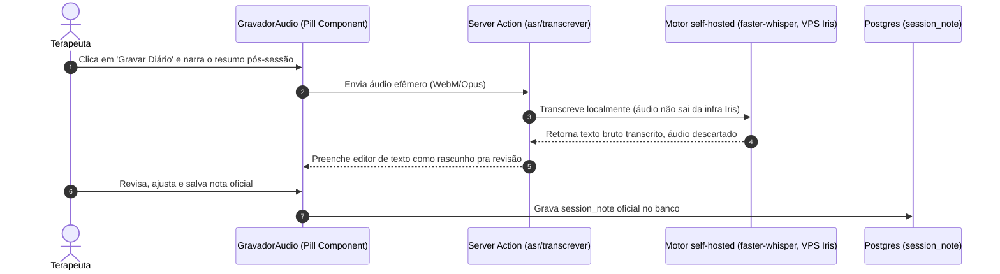

# Design Spec — Issue #72: Fase 6b - Ditado de Voz (Captura Local & Pipeline ASR)

> **Status:** 🟡 V1 pronto pra spec de execução (`/tlc-spec-driven`) — escopo fechado
> **Data:** 02/08/2026 · revisão 24/08/2026 (3 modos, provedor Google) · revisão 30/08/2026 (V1 sem custo, self-hosted, só Modo 2)
> **Autor:** Tech Lead & Painel (Product Manager, Product Designer, Psicólogo Clínico)
> **Issue GitHub:** [#72](https://github.com/romulosutil/Iris/issues/72)

## 1. Contexto de Negócio & Objetivos

### 1.1 O Problema

O registro manual da sessão é a maior dor diária do terapeuta. Digitação é
sempre disponível, mas lenta; um assistente de voz reduz o atrito — desde que
não vire ponto único de falha (nem técnico, nem de consentimento) que bloqueie
o registro.

### 1.2 A Solução — modos de captura, sempre com fallback garantido

| Modo | Descrição | Consentimento | Escopo |
| --- | --- | --- | --- |
| **1. Digitação** | Terapeuta digita a nota, como hoje. | Nenhum extra (já MVP). | ✅ Em produção. |
| **2. Ditado assíncrono** | Terapeuta grava 1+ áudios curtos pós-sessão, narrando com a própria voz (estilo áudio de WhatsApp). Paciente não fala no áudio. | Cláusula ASR discriminada (`termo-consentimento-titular-adulto.md` §8.1). | ✅ **Escopo do V1 (esta issue).** |
| **3. Gravação de sessão** | Fone de ouvido com supressão de ruído durante o atendimento inteiro, priorizando a voz do profissional. Sempre permite complemento por texto — a gravação pode ficar incompleta. | Cláusula ASR discriminada + ciência de captação incidental de ambiente (já desenhada, §8.1/§9.1 dos termos). | ⏸️ **Fora do V1** — adiado por decisão de produto (reduzir superfície de entrega), não por gap técnico ou de consentimento. Design abaixo (§4) fica preservado para retomada. |

**Regra de produto inegociável:** nenhum modo é obrigatório nem exclusivo.
Recusa do titular ao modo 2 nunca bloqueia o registro da sessão — o
profissional sempre pode cair para o modo 1. O sistema nunca é desenhado
ASR-only.

O áudio do modo 2 é **majoritariamente a voz do profissional** — não uma
gravação deliberada do paciente. Isso classifica o risco como "nota de
trabalho do profissional com dado de saúde do paciente relatado nela" (mesma
natureza do texto do diário já tratado hoje), não "gravação biométrica do
paciente/menor".

---

## 2. Especificação Técnica V1 (Modo 2 — ditado assíncrono, self-hosted)

### 2.1 Por que self-hosted, e o que isso muda no gate legal

V1 entra em produção **sem custo de provedor externo**. Google (Gemini
multimodal / Cloud Speech-to-Text) foi a opção aprovada na revisão de
24/08/2026, mas exige tier **pago** para ativar Zero Data Retention
(`dpa-asr-audio.md` §2) — incompatível com a restrição de custo zero do V1.

**Decisão:** motor ASR **self-hosted** (Whisper/faster-whisper) rodando na
própria VPS do produto. Efeito colateral bom, não só custo zero: o áudio
**nunca sai da infra Iris** → não há transferência internacional (LGPD Art.
33) → o capítulo inteiro de DPA/SCC/ZDR (`dpa-asr-audio.md` §2, §5) **fica
sem objeto para o V1** — não é "mais barato", é "não se aplica".

O que **continua exigido**, porque é sobre captação e retenção de áudio de
paciente, não sobre transferência a terceiro:
- Cláusula de consentimento ASR discriminada (já existe, §8.1 do termo
  adulto / §9.1 do termo de curatela — ver D59).
- Purga garantida do áudio bruto (local e servidor) após transcrição.
- Feature flag `FEATURE_FLAG_ASR_ENABLED` — no V1 não é mais trava de DPA
  pendente, é trava de maturidade/qualidade (ligar só depois de validar
  precisão do motor em PT-BR clínico).

Google volta a ser opção se o self-hosted não performar (latência/qualidade
PT-BR) — ver §4.

### 2.2 Captura & Persistência Local

- Componente `AudioCapture` (Pill): dual-codec (`webm;opus` em navegadores
  modernos, `mp4;aac` em iOS).
- Múltiplos áudios curtos por sessão (lista, não um único blob) — modo 2 é
  "vários recados", não uma sessão inteira.
- Armazenamento em IndexedDB `audio_drafts` no cliente durante o registro.
  Purga garantida no logout e pós-confirmação de upload, além do flush em
  `window.online`.

### 2.3 Pipeline ASR & Fallback

- Interface `AsrProvider`: desacopla a aplicação do motor. Implementação V1:
  `SelfHostedAsrProvider`, chamando faster-whisper na VPS via server action
  interna (áudio nunca trafega para fora da infra Iris).
- `StubAsrProvider` em CI e testes.
- Retenção do áudio bruto: deleção imediata pós-transcrição aceita; TTL de 7
  dias só como janela de falha (retry), nunca retenção definitiva.
- Fallback: em caso de falha de transcrição, o áudio é preservado localmente
  e o terapeuta pode ouvir e digitar manualmente no editor (cai pro modo 1).
- Texto transcrito entra no diário como **rascunho com indicador de IA**,
  exigindo revisão e confirmação do terapeuta antes de salvar — nunca grava
  direto.

### 2.4 Tasks Atomizadas (V1)

- [ ] **T1 - Componente de Gravação**: `src/components/ui/gravador-audio.tsx`, primitivo Pill, estados de gravação (idle/gravando/processando/erro), múltiplos áudios por sessão.
- [ ] **T2 - Captura + IndexedDB**: `MediaRecorder` (WebM/Opus, fallback MP4/AAC iOS), persistência em `audio_drafts`, purga no logout/pós-upload/`window.online`.
- [ ] **T3 - Motor ASR self-hosted**: provisionar faster-whisper na VPS (serviço próprio, molde `infra/billing/` — gatilho magro), `SelfHostedAsrProvider` implementando `AsrProvider`.
- [ ] **T4 - Server Action de Transcrição**: `src/app/(app)/sessoes/asr/logic.ts`, chama T3 via rede interna, aplica TTL de 7 dias em falha / deleção imediata em sucesso.
- [ ] **T5 - Feature Flag**: `FEATURE_FLAG_ASR_ENABLED` (gate de maturidade, não de DPA), `StubAsrProvider` em CI/teste.
- [ ] **T6 - Testes Automatizados**: ver §3.

---

## 3. Plano de Verificação

1. Teste unitário de `StubAsrProvider` simulando transcrição sem chamadas de rede.
2. Teste de purga do IndexedDB `audio_drafts` ao efetuar logout.
3. Teste de que recusa de consentimento ASR não bloqueia salvar `SessionNote` via modo 1.
4. Teste de retenção: áudio deletado imediatamente pós-transcrição aceita; áudio de falha expira em 7 dias.
5. Teste de fallback: falha de transcrição preserva áudio local e permite digitação manual.

---

## 4. Modo 3 (Gravação de Sessão) — adiado, design preservado

Fora do V1 por decisão de produto (§1.2), não por gap técnico ou legal. Fica
registrado para retomada.

- **Captura:** fone de ouvido com supressão de ruído (`noiseSuppression: true`
  no `getUserMedia`), priorizando o microfone do profissional, sessão inteira.
  Sempre expõe campo de texto livre pro profissional complementar trechos que
  a gravação não capturar por completo.
- **Consentimento:** cláusula ASR discriminada + ciência de captação
  incidental de ambiente — já desenhada (§8.1/§9.1 dos termos), continua
  válida se for retomado.
- **Motivo técnico do adiamento:** transcrição "ao vivo" (aparecendo durante
  a fala) exige streaming (VAD + chunking incremental) — Whisper batch não
  serve. Sem GPU na VPS, Whisper `medium`/`large` roda mais devagar que tempo
  real em CPU pura (sessão de 45min podendo levar mais que 45min pra
  transcrever): infeasível como "ao vivo" com o hardware atual.
- **Se retomado:** reavaliar Google (Gemini multimodal / Cloud
  Speech-to-Text) como motor — volume de sessão inteira pode exceder o que a
  VPS self-hosted aguenta; nesse caso o gate de DPA (`dpa-asr-audio.md`) volta
  a valer.

---

## Histórico de decisões

| Data | Mudança |
| --- | --- |
| 02/08/2026 | Rascunho inicial, 2 modos (digitação + ditado). |
| 24/08/2026 | Expandido para 3 modos (+ gravação de sessão inteira). Provedor aprovado: Google (Gemini multimodal / Cloud Speech-to-Text), gated por DPA (`dpa-asr-audio.md`). |
| 30/08/2026 | Restrição de custo zero do Rômulo: Google sai do V1 (exige tier pago pra ZDR). V1 vira self-hosted (Whisper/faster-whisper na VPS), sem transferência internacional, sem gate de DPA. Escopo do V1 restrito ao Modo 2; Modo 3 adiado (design preservado em §4). Documento reorganizado (era nota de patch sobre corpo desatualizado) pra refletir o V1 como conteúdo principal. |
