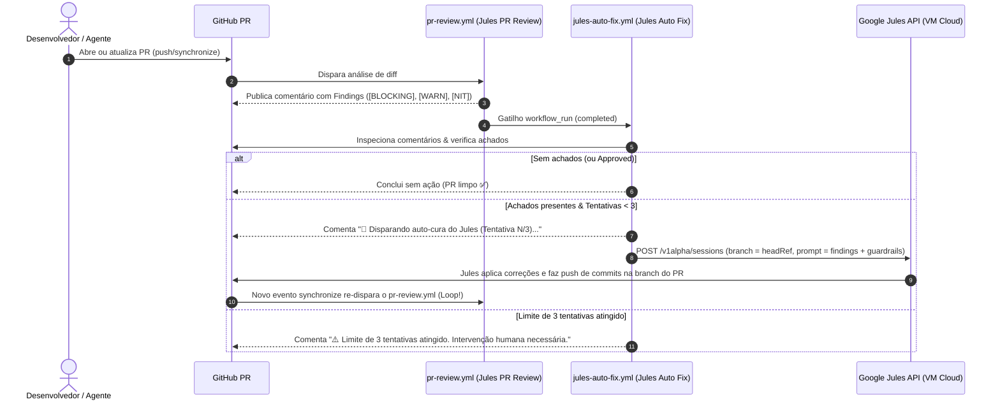

# Design: Jules Self-Healing Loop (`jules-auto-fix.yml`)

## 1. Contexto e Objetivo

No ecossistema do Iris, o fluxo de revisão de Pull Requests é executado automaticamente pelo workflow `.github/workflows/pr-review.yml` (`Jules PR Review`), utilizando a action `sanjay3290/jules-pr-reviewer@v1`. Ao concluir, o revisor adiciona um comentário estruturado no PR contendo um resumo, veredito e uma seção de achados (**Findings**) categorizados em três níveis de severidade:

- `[BLOCKING]`: Falhas críticas de segurança, corretude ou violações graves de guardrails.
- `[WARN]`: Preocupações relevantes não-bloqueantes.
- `[NIT]` (ou variações como `init`): Sugestões de legibilidade, consistência ou melhorias menores.

Atualmente, quando esses achados aparecem, a resolução depende de intervenção manual ou de uma nova issue. O objetivo deste design é estabelecer um **Self-Healing Loop** (circuito de auto-cura) autônomo através do workflow `.github/workflows/jules-auto-fix.yml`.

---

## 2. Arquitetura do Self-Healing Loop



---

## 3. Especificação do Workflow (`jules-auto-fix.yml`)

### 3.1 Gatilho, Concorrência e Permissões

- **Trigger:** `on: workflow_run` monitorando `workflows: ["Jules PR Review"]` com `types: [completed]`.
- **Condição:** `if: github.event.workflow_run.conclusion == 'success'` (garante que a revisão foi concluída com sucesso e o comentário já foi publicado).
- **Concorrência:**
  ```yaml
  concurrency:
    group: jules-auto-fix-${{ github.event.workflow_run.pull_requests[0].number || github.event.workflow_run.head_branch }}
    cancel-in-progress: true
  ```
- **Permissões Mínimas:**
  - `pull-requests: write` (para ler e criar comentários no PR).
  - `contents: write` (inspeção de refs e metadados).
  - `issues: write` (gerenciamento de comentários de issue/PR).

### 3.2 Passo a Passo do Job (`auto-fix`)

1. **Resolução de Contexto do PR com Fallback (GitHub Script):**
   - Extrai o PR associado via `github.event.workflow_run.pull_requests[0]`.
   - Caso `pull_requests` esteja vazio (edge-case de re-runs), consulta `octokit.rest.pulls.list` filtrando por `head: `${owner}:${head_branch}`` ou `head_sha`.
   - Valida se o PR não é rascunho (_draft_). Se for draft, encerra silenciosamente.

2. **Extração e Análise de Findings:**
   - Lista os comentários do PR e localiza o comentário mais recente do revisor Jules (identificado pelo marcador `<!-- jules-pr-reviewer -->` ou cabeçalho `## Findings` / `Jules PR Reviewer`).
   - Avalia a presença de achados com regex estrita na seção de achados: `/(?:\[BLOCKING\]|\[WARN\]|\[NIT\]|\[init\])/i`.
   - Verifica se o veredito não é aprovação pura sem achados (`VERDICT: approve` com 0 itens).
   - Extrai o texto completo dos findings e o contexto dos arquivos sinalizados.

3. **Guarda Anti-Loop Recursivo e Reset Humano:**
   - Analisa o histórico de commits do PR e os comentários de rastreamento `<!-- jules-auto-fix-attempt: N -->`.
   - Se um novo commit de autor humano/externo for detectado, o contador de tentativas consecutivas é reiniciado para 0.
   - **Teto Máximo:** 3 tentativas consecutivas automatizadas por ciclo.
   - Se `tentativas >= 3`:
     - Publica comentário de alerta no PR solicitando revisão humana.
     - Finaliza o workflow com status de aviso/sucesso sem chamar a API do Jules.

4. **Publicação do Comentário de Notificação:**
   - Publica um comentário no PR indicando:
     - Número da tentativa (`Tentativa N de 3`).
     - Resumo da quantidade de achados encontrados.
     - Informação de que o Jules foi acionado para aplicar as correções na branch do PR.

5. **Invocação da API do Google Jules:**
   - Consulta `GET https://jules.googleapis.com/v1alpha/sources` com `x-goog-api-key: ${{ secrets.JULES_API_KEY }}` para resolver o nome canônico do source correspondente a `romulosutil/iris` (ex: `sources/github/romulosutil/iris` ou `sources/...`).
   - Realiza chamada HTTP `POST` para `https://jules.googleapis.com/v1alpha/sessions`.
   - **Contexto da Branch:** `githubRepoContext.startingBranch = <pr_head_branch>`.
   - **Prompt Estruturado (em PT-BR):**
     - Lista dos findings exatos a serem corrigidos.
     - Guardrails mandatórios do Iris (`AGENTS.md` e `CLAUDE.md`):
       - Commits convencionais e mensagens em Português (PT-BR).
       - Isolamento multi-tenant com `app_clinic_id_exigido()`.
       - Design System _Espectro Brutal_ (sem estilo ad-hoc).
       - Execução e validação de `pnpm typecheck`, `pnpm lint` e `pnpm test`.
       - Push direto na branch de trabalho do PR.

---

## 4. Tratamento de Erros e Casos de Borda

| Cenário de Borda                      | Comportamento Esperado                                                    |
| :------------------------------------ | :------------------------------------------------------------------------ |
| **PR sem achados (Aprovado / Limpo)** | O script identifica 0 findings e encerra com sucesso sem chamar o Jules.  |
| **PR em estado Draft**                | Ignorado conforme guardrail do Iris.                                      |
| **Erro na chamada à API do Jules**    | Adiciona comentário de falha no PR com detalhes do erro para diagnóstico. |
| **Loop infinito de revisões**         | Travamento rígido no 3º ciclo com comentário de escalonamento humano.     |
| **Novo commit humano**                | Reseta o contador de tentativas consecutivas para 0.                      |
| **PR de fork externo**                | Não executa (secrets não compartilhados, segurança LGPD e isolamento).    |

---

## 5. Plano de Validação

1. **Validação de Sintaxe do Workflow:**
   - Validação da estrutura YAML do workflow `.github/workflows/jules-auto-fix.yml`.
   - Teste de regex dos marcadores (`BLOCKING`, `WARN`, `NIT`, `init`).
2. **Simulação de Payload & Script:**
   - Execução controlada da lógica do `github-script` para parsing de comentários e extração de findings.
3. **Verificação de Regras do Repositório:**
   - Conformidade com `AGENTS.md`, `CLAUDE.md` e guardrails de segurança.
