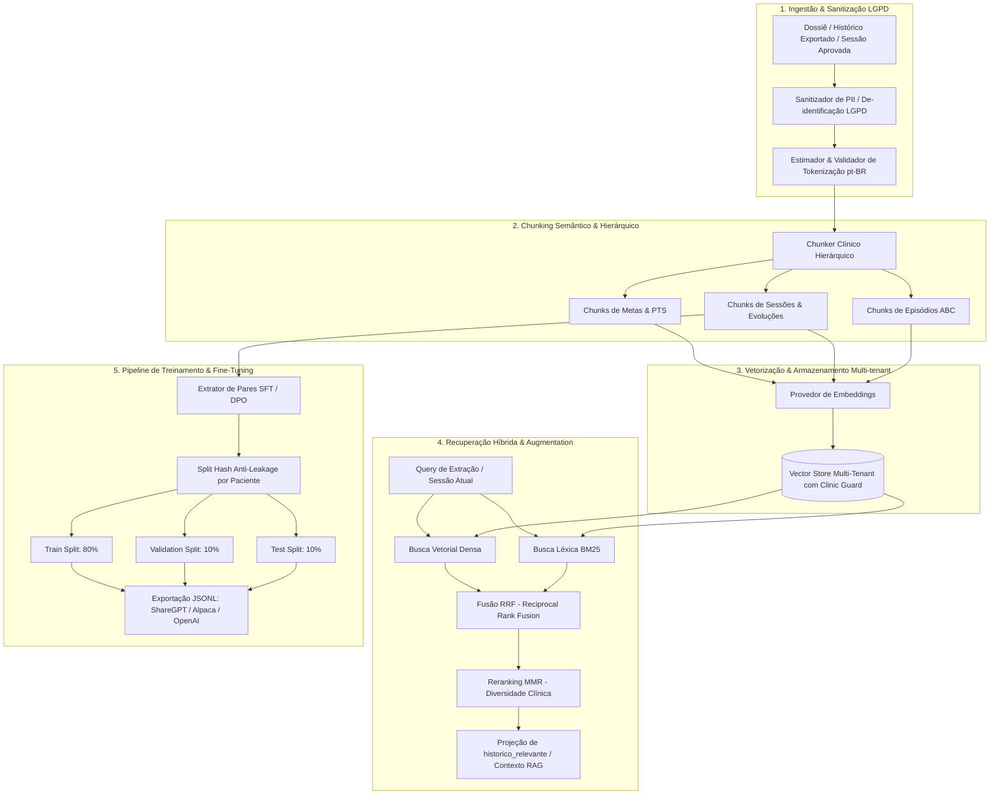

# Design Spec — D11 (Issue #120): Pipeline de Tokenização, Indexação RAG e Treinamento sobre Históricos Clínicos Exportados

> **Status:** 🟢 Especificação Arquitetural Aprovada & Em Implementação  
> **Data:** 16/08/2026  
> **Autor:** Tech Lead & Especialista em RAG / IA Clínica  
> **Issue GitHub / Débito:** [#120](https://github.com/romulosutil/Iris/issues/120) / **D11** (`BACKLOG.md`)  
> **Camadas Impactadas:** Governança em 3 Camadas (Camada 1 - Extração / `historico_relevante`, Camada 2 - Relatórios / `convenio-narrativo`, Ativo de Dados da Empresa)

---

## 1. Contexto de Negócio & Objetivos Clínicos

### 1.1 O Problema e a Oportunidade

A plataforma **Iris** opera intervenções terapêuticas infantis multidisciplinares (Análise do Comportamento Aplicada - ABA, Fonoaudiologia, Terapia Ocupacional, TCC/Psicologia Infantil) sob o modelo de **governança em 3 camadas**:

1. A IA sugere evidências clínicas a partir do relato/diário da sessão (Camada 1).
2. O terapeuta revisa, aprova ou corrige (Camada 2).
3. O coordenador valida e gera relatórios auditáveis (Camada 3).

Com a consolidação do módulo de exportação de prontuários em PDF/A e dossiês integrais (Issue #120 / D11), a clínica gera continuamente registros estruturados de alta fidelidade ecológica.
Sem um pipeline de **RAG (Retrieval-Augmented Generation)** e **Fine-Tuning**, o sistema enfrenta duas limitações:

1. **Janela de Contexto & Amnésia Clínica:** O agente de extração precisa saber se um comportamento atual contradiz o histórico longitudinal do paciente (Regra R14: inconsistência com histórico / regressão ou perda de independência). Enviar todo o histórico acumulado de meses/anos de terapia estoura a janela de contexto e dilui a atenção do modelo.
2. **Ativo de Dados & Especialização:** Os modelos genéricos de linguagem não conhecem as peculiaridades terminológicas de intervenções comportamentais brasileiras (ex: mandos vocais sob motivação direta, tatos ecóicos, esquivas com topografia de fuga, protocolos VB-MAPP, PEDI, DENVER). Transformar as sessões aprovadas em pares supervisionados (SFT/DPO) permite treinar e afinar modelos proprietários com alto rigor clínico.

### 1.2 Objetivos do Pipeline D11

- **Preservação e Sanitização LGPD:** De-identificação estrita de dados clínicos antes da vetorização ou treinamento (Art. 13 e 18 da LGPD), removendo PII enquanto preserva termos clínicos e temporais.
- **Chunking Semântico Orientado ao Domínio:** Segmentação hierárquica respeitando as fronteiras de sessões, marcos do PTS (Plano Terapêutico Singular) e episódios ABC.
- **Indexação Vetorial Multi-tenant (RLS):** Garantia matemática de isolamento por `clinic_id`, impedindo contaminação de dados entre clínicas.
- **Busca Híbrida (Dense + BM25) com RRF e MMR:** Recuperação de alta precisão combinando termos exatos da clínica comportamental com similaridade semântica, aplicando diversificação temporal.
- **Geração de Datasets de Treinamento (SFT / DPO):** Estruturação de dados aprovados por terapeutas em formatos de instrução (ShareGPT/Alpaca/OpenAI) com particionamento estrito por paciente (evitando data leakage entre treino e teste).

---

## 2. Arquitetura do Pipeline



---

## 3. Especificação Técnica dos Módulos

### 3.1 Sanitizador LGPD (`src/lib/rag/sanitizer.ts`)

- **Regra 1 (Remoção de PII Direta):** Substitui nomes de pacientes, cuidadores, terapeutas, CPFs, RGs, telefones, e-mails, endereços e marcas por tokens sintéticos consistentes (`[PACIENTE_PSEUDO_X]`, `[PROFISSIONAL_Y]`, `[RESPONSAVEL_Z]`).
- **Regra 2 (Preservação Semântica Clínica):** Mantém intactos:
  - Idade do paciente em meses/anos (`3a 4m`, `42 meses`).
  - Nomes de protocolos (`VB-MAPP`, `PEDI`, `DENVER`, `ABLLS-R`).
  - Domínios comportamentais (`mando`, `tato`, `ecoico`, `intraverbal`, `imitação motora`, `brincar independente`, `auto-cuidado`).
  - Níveis de ajuda (`independente`, `dica_verbal`, `dica_gestual`, `modelacao`, `dica_fisica`).
  - Registros funcionais ABC (Antecedente, Comportamento, Consequência).
  - Metas clínicas e marcos pactuados.

### 3.2 Tokenizador & Gestão de Janela de Contexto (`src/lib/rag/tokenizer.ts`)

- Modelagem de contagem de tokens otimizada para texto clínico em Português (pt-BR).
- Fator de expansão BPE médio para pt-BR: $\approx 1.35 \times \text{palavras}$.
- Cálculo de limites orçamentários por chamada:
  $$\text{Tokens}_{\text{total}} = \text{Tokens}_{\text{prompt}} + \text{Tokens}_{\text{historico\_rag}} + \text{Tokens}_{\text{sessao\_atual}} \le \text{Limite}_{\text{janela}}$$

### 3.3 Chunker Clínico Hierárquico (`src/lib/rag/chunker.ts`)

- Chunks estruturados com cabeçalho de metadados ricos injetados:
  ```text
  [METADADOS: CLINICA=c1 | PACIENTE=p1_pseudo | MODALIDADE=aba | DATA=2026-08-10 | DOMINIOS=mando,tato]
  Conteúdo da evolução clínica da sessão...
  ```
- Estratégia de segmentação:
  1. `chunkSize`: 384 tokens (janela ideal para relatos de sessão clínica).
  2. `chunkOverlap`: 48 tokens (preserva transições e co-referências).
  3. Divisão respeitando fronteiras de parágrafo e pontuação sentencial.

### 3.4 Vector Store Multi-tenant (`src/lib/rag/vector-store.ts`)

- **Isolamento Inegociável:** Toda inserção, deleção e busca exige `clinicId`. A busca nunca consulta vetores fora do `clinicId` especificado.
- Operações de Similaridade:
  - Similaridade de Cosseno:
    $$\text{CosSim}(\mathbf{u}, \mathbf{v}) = \frac{\mathbf{u} \cdot \mathbf{v}}{\|\mathbf{u}\|_2 \|\mathbf{v}\|_2}$$
- Filtros de metadados: filtragem por `patientId`, `disciplina`, `dataInicio`, `dataFim`, `dominios`.

### 3.5 Recuperação Híbrida, RRF e MMR (`src/lib/rag/retriever.ts`)

- **Reciprocal Rank Fusion (RRF):**
  Combina a lista ordenada da busca densa ($R_{\text{dense}}$) e da busca léxica BM25 ($R_{\text{BM25}}$):
  $$\text{RRF\_Score}(d) = \sum_{m \in \{\text{dense}, \text{BM25}\}} \frac{1}{k + r_m(d)} \quad (k = 60)$$
- **Maximal Marginal Relevance (MMR):**
  Para evitar que as 5 sessões recuperadas sejam todas do mesmo dia ou repitam o mesmo relato idêntico:
  $$\text{MMR} = \operatorname{argmax}_{d_i \in R \setminus S} \left[ \lambda \operatorname{Sim}_1(d_i, q) - (1 - \lambda) \max_{d_j \in S} \operatorname{Sim}_2(d_i, d_j) \right]$$
  onde $\lambda = 0.7$ (70% relevância, 30% diversidade).
- **Projeção para `historico_relevante`:**
  Formata os chunks recuperados no formato canônico consumido pelo Agente de Extração (`protocol_id`, `dominio_id`, `resumo`).

### 3.6 Pipeline de Treinamento e Fine-Tuning (`src/lib/rag/training-pipeline.ts`)

- Converte sessões com extrações aprovadas em pares de treinamento:
  - **SFT (Supervised Fine-Tuning):** `(Input Context + Diário da Sessão) -> Extrações Estruturadas Aprovadas`.
  - **DPO (Direct Preference Optimization):** Pares `(Prompt, Chosen=Extração Aprovada, Rejected=Sugestão IA antes de correção ou erro sintético)`.
- **Anti-Leakage Partitioning:**
  A partição em Train (80%), Val (10%), Test (10%) é feita por **Hash do Paciente** ($h(\text{patientId}) \pmod{100}$). Todas as sessões de um paciente ficam no mesmo split, impedindo que o modelo decore o paciente no treino e seja avaliado nele no teste.

---

## 4. Análise Adversarial & Guardrails de Segurança

| Hipótese de Falha / Risco                                                                                                  | Mitigação Arquitetural                                                                                                                        |
| :------------------------------------------------------------------------------------------------------------------------- | :-------------------------------------------------------------------------------------------------------------------------------------------- |
| **Vazamento Cross-Tenant:** Clínica A recuperar vetores de histórico da Clínica B.                                         | O `VectorStore` exige `clinicId` obrigatório em todo método e isola os buckets. Teste de penetração unitário valida rejeição de cross-tenant. |
| **Vazamento de PII em Modelos Externos:** Envio de nomes ou CPFs para APIs de embeddings ou modelos de terceiros.          | O `Sanitizer` LGPD roda **antes** da tokenização e vetorização. Dados brutos nunca chegam ao embedding.                                       |
| **Overfitting / Vazamento em Datasets de Treino:** Sessões do mesmo paciente no conjunto de treino e no conjunto de teste. | Particionamento determinístico por hash do identificador do paciente (`patientId`), garantindo independência estatística dos folds.           |
| **Alucinação / Contradição no Agente:** Modelo sugerir evolução positiva quando o histórico mostra perda de repertório.    | O RAG injeta explicitamente o `historico_relevante` com baseline e nível de ajuda anterior, acionando a regra **R14** de inconsistência.      |

---

## 5. Critérios de Aceite & Definição de Pronto (DoD)

1. **Módulos Core Implementados e Tipados:** `sanitizer.ts`, `tokenizer.ts`, `chunker.ts`, `embedding.ts`, `vector-store.ts`, `retriever.ts`, `training-pipeline.ts`, `dossier-loader.ts`.
2. **Testes Unitários:** 100% de cobertura nos módulos RAG com testes de conformidade LGPD, isolamento multi-tenant, fusão RRF, particionamento anti-leakage e projeção canônica.
3. **Qualidade de Código:** `pnpm typecheck` e `pnpm lint` executam com 0 erros.
4. **Atualização da Documentação:** `BACKLOG.md` atualizado com o status de D11.
