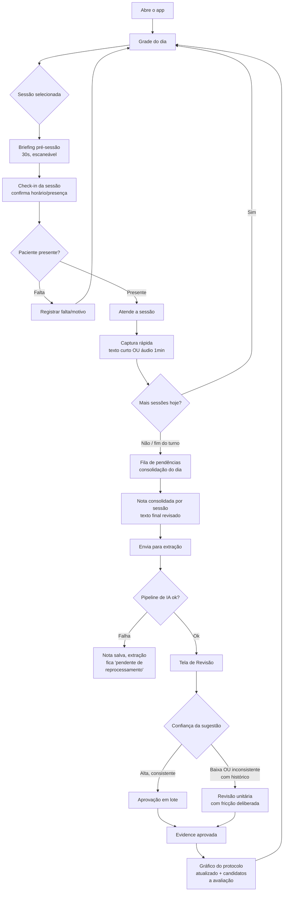
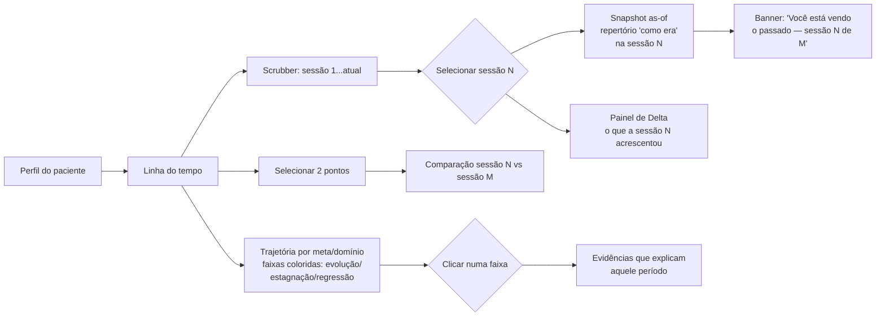
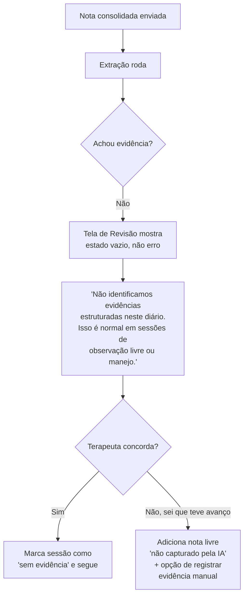
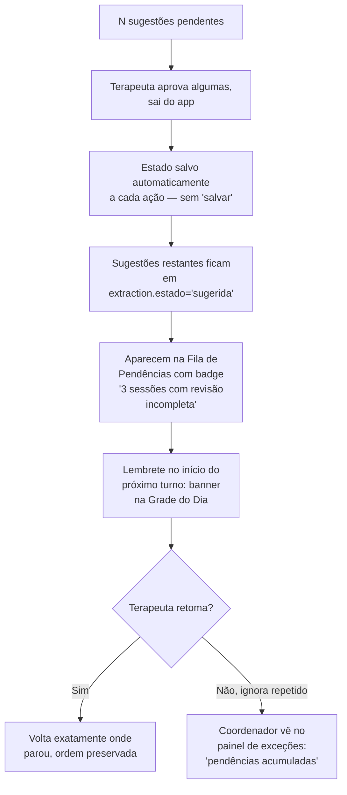
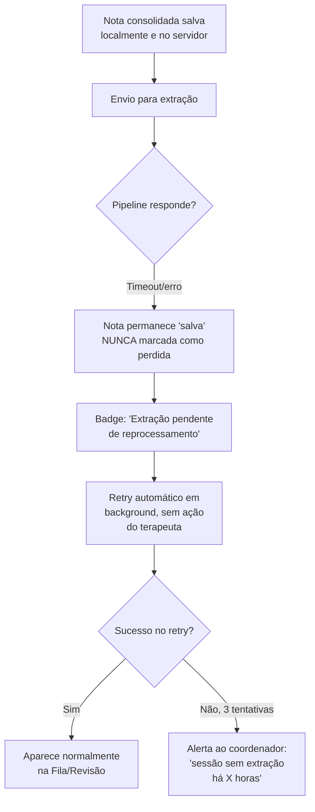
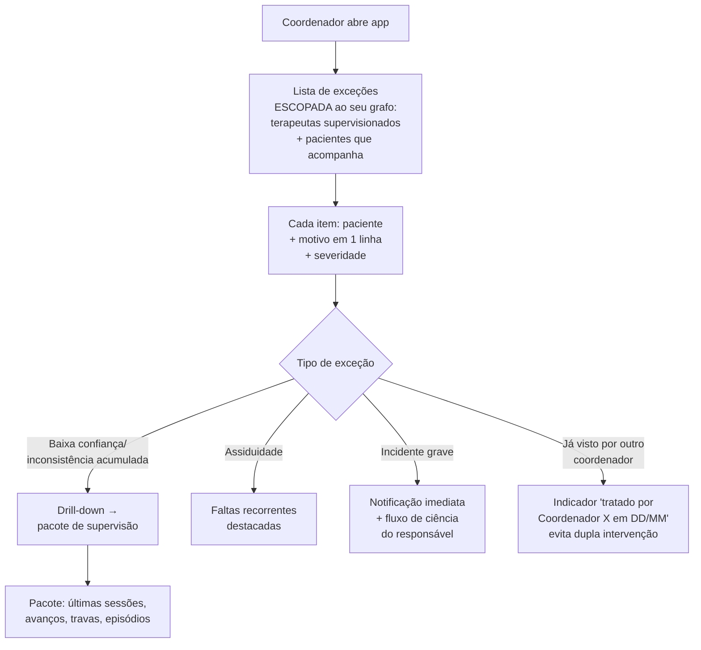
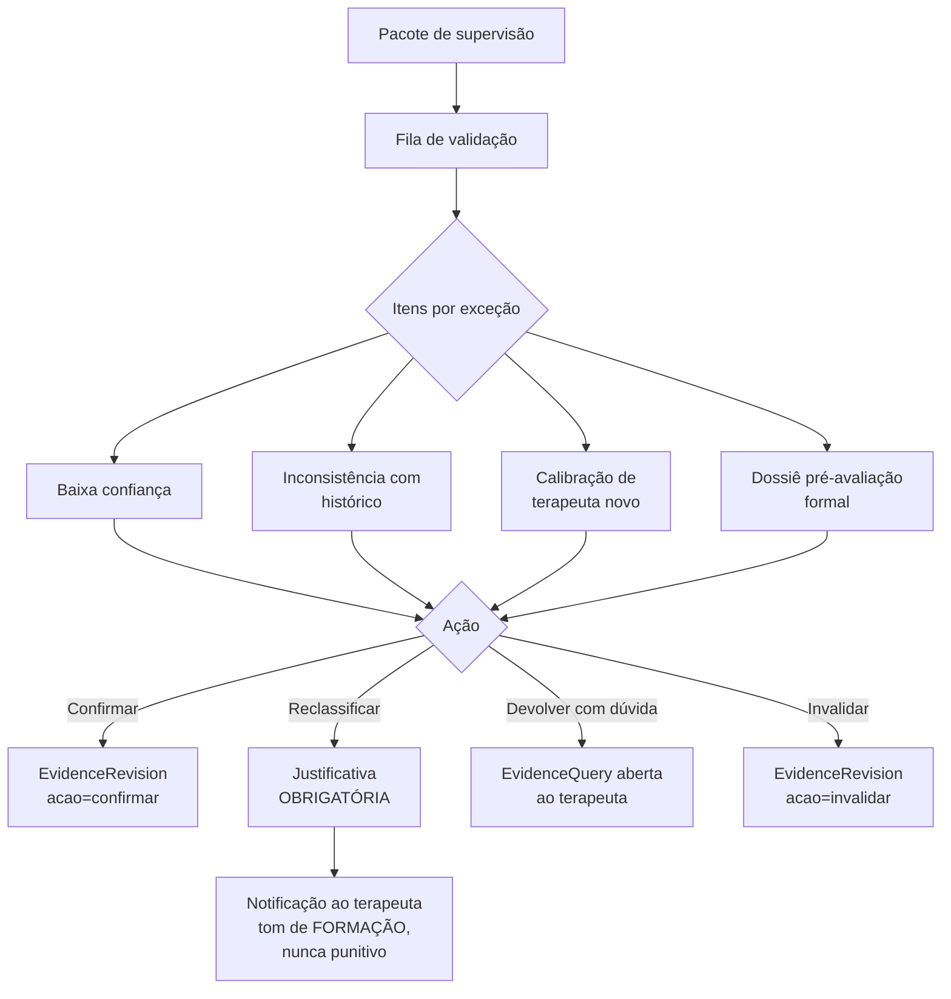
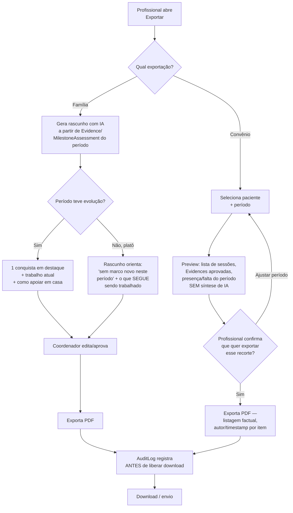

# User Flows e UX — Jornada do Terapeuta e do Coordenador (Prompt 3)

Resultado da execução do Prompt 3 (`docs/prompts/serie-de-prompts.md`), com
ajustes incorporados antes/durante a execução (ver `BACKLOG.md`, seção A): (1)
cadastro clínico do paciente + configuração de `PatientProtocol` pelo
coordenador — gap identificado em revisão com Rômulo, resolvido no modelo em
`modelo-de-dados.md` seção 2.9; (2) dossiê BRUTO de auditoria de convênio
(sessões/evidências/presença de um período, sem síntese de IA) — validado por
sinal de campo (primeira pergunta de uma terapeuta ao ver o protótipo foi
sobre exportar para convênio) e CONFIRMADO para o MVP, Fase 5, tier Clínica
(distinto do relatório de convênio NARRATIVO, que segue fast-follow do tier
Convênio — ver `modelo-de-negocio.md` seção 4 e `modelo-de-dados.md` seção 5).

Contexto de uso assumido: 7-8 atendimentos/dia, intervalos de ~10 min que viram 3. Mobile-first para o terapeuta; desktop aceitável para o coordenador. Registro
em dois tempos: captura rápida (corredor, texto ou áudio) + consolidação no fim
do dia. Não desenhado aqui: portal/login da família (fora do escopo, ver
"Não fazer" do Prompt 3).

---

## 0. Princípios de design que atravessam todos os flows

1. **A IA nunca decide sozinha** — toda sugestão (`Extraction`) nasce em estado
   `sugerida`; vira `Evidence` só com ação humana. A UI nunca deixa isso
   ambíguo: cor, texto e posição sempre marcam "isto ainda não é fato".
2. **Fricção é uma ferramenta, não um bug** — em baixa confiança ou inconsistência
   com o histórico, o produto DEVE ficar mais lento de propósito. Aprovação em
   lote existe só onde o risco de rubber-stamping é baixo (alta confiança).
3. **O diário nunca se perde** — captura local antes de qualquer confirmação de
   rede; se a extração falhar, o texto/áudio já está salvo e visível.
4. **"Candidato" ≠ "conquistado"** — todo estado provisório (candidato a
   avaliação, candidata a dominada) tem tratamento visual DELIBERADAMENTE
   diferente de um marco/meta efetivamente fechado, para não criar falsa
   sensação de progresso automático.
5. **Transparência sem vigilância** — o terapeuta sempre sabe o que o
   coordenador vê dele; nada de métrica oculta.

---

## 1. Flow principal do terapeuta



**Justificativa:** o loop fecha na grade do dia de propósito — o terapeuta não
"sai" do app para revisar em outro lugar; revisão e consolidação são estações
do mesmo fluxo circular do dia, não uma tarefa administrativa à parte.

### 1.1 Briefing pré-sessão

Uma tela, escaneável em 30 segundos, pensada para ser lida em pé, no corredor,
com a criança ao lado.

```
┌─────────────────────────────────┐
│ ← Grade          Sessão 47 · Vitor│
│ hoje 14h · Sala 2                 │
├─────────────────────────────────┤
│ ÚLTIMA SESSÃO (sessão 46, 3 dias) │
│ • Mando espontâneo p/ "água" 🆕   │
│ • Tato "cachorro" com dica gestual│
│ • 1 episódio ABC (fuga de tarefa) │
├─────────────────────────────────┤
│ METAS DE HOJE (3 ativas)          │
│ ☐ Mando independente (5 itens)    │
│ ☐ Tato de animais (dica→indep.)   │
│ ☐ Ouvinte: segue 2 instruções     │
├─────────────────────────────────┤
│ ⚠ ALERTA DE MANEJO                │
│ Fuga de tarefa recorrente com     │
│ atividades de mesa >10min         │
├─────────────────────────────────┤
│ 🎯 REFORÇADORES ATUAIS            │
│ Bolhas de sabão, iPad (5min),     │
│ elogio social forte               │
├─────────────────────────────────┤
│         [ Iniciar sessão ]        │
└─────────────────────────────────┘
```

**Justificativa:** 3 linhas por seção, sem scroll em telas pequenas comuns;
o alerta de manejo fica isolado visualmente (não misturado ao histórico) porque
é a informação que evita o pior desfecho da sessão, não só contexto.

### 1.2 A tela de Revisão — o coração do produto

Layout lado a lado: à esquerda o trecho literal do diário (fonte da verdade,
nunca editado), à direita a sugestão da IA como CARTÃO editável.

```
┌──────────────────────────────────────────────────────────┐
│ Revisão · Sessão 47 · Vitor          [ 6 sugestões ]       │
├───────────────────────────┬──────────────────────────────┤
│ TRECHO DO DIÁRIO           │ SUGESTÃO DA IA                │
│                             │                                │
│ "...pedi água e ele apontou│ 🟢 ALTA CONFIANÇA             │
│  e falou 'á' sozinho, sem  │ Mando independente — "água"   │
│  eu pedir pra ele falar."  │ Meta: Mando independente      │
│                             │ Marco: VB-MAPP Mando Nível 3  │
│                             │ [Aprovar]  [Editar]  [Rejeitar]│
├───────────────────────────┼──────────────────────────────┤
│ "...tentei o cachorro de   │ 🟡 BAIXA CONFIANÇA             │
│  novo, ele olhou pra mim   │ Tato independente — "cachorro"│
│  e falou 'au au' baixinho, │ ⚠ Terapeuta precisa confirmar │
│  acho que sem eu pedir"    │ se houve dica ou não           │
│                             │ [Revisar →]                    │
├───────────────────────────┼──────────────────────────────┤
│ "...ele apontou o balanço  │ 🔴 INCONSISTENTE COM HISTÓRICO│
│  e falou 'anço' sem ajuda" │ Tato independente — nunca fez  │
│                             │ esse marco nem com dica antes  │
│                             │ ⚠ Confirme com atenção         │
│                             │ [Revisar →]                    │
└───────────────────────────┴──────────────────────────────┘
      [ Aprovar as 3 de alta confiança em lote ]
```

Comportamento:

- **Alta confiança**: botão de aprovação em lote no rodapé, some da lista uma a
  uma conforme aprovadas individualmente também é possível.
- **Baixa confiança / inconsistente**: SEM botão de aprovação direta — o
  terapeuta precisa abrir ("Revisar →") e passar por uma tela de confirmação
  com um campo obrigatório de "nível de ajuda observado" antes de poder
  aprovar. É fricção deliberada (princípio 2).
- **Editar/discordar**: o terapeuta pode trocar o alvo sugerido (ex.: a IA
  sugeriu "tato" e ele marca "mando") — a Evidence salva carrega
  `sugestao_original` + `classificacao_final`, preservando as duas (dataset de
  divergência, seção F do backlog).

### 1.3 Gráfico do protocolo — "candidato" sem parecer conquistado

```
┌─────────────────────────────────────────┐
│ Vitor · Protocolo: VB-MAPP + PROC          │
│                                             │
│ Mando  ████████████░░░░  Nível 3 (8/12)     │
│ Tato   ██████░░░░░░░░░░  Nível 2 (4/12)     │
│         ╰─ 🔷 candidato a avaliação          │
│            (3 evidências em 2 sessões —     │
│            ainda não é marco confirmado)    │
│ Ouvinte████░░░░░░░░░░░░  Nível 1 (2/12)     │
└─────────────────────────────────────────┘
```

**Justificativa:** losango pontilhado azul ("candidato") é visualmente distinto
do preenchimento sólido verde (marco confirmado por `MilestoneAssessment`) —
mesma gramática de cor usada na tela de Revisão (nunca reutilizar "verde
aprovado" para "provável").

---

## 1b. Linha do tempo do paciente (terapeuta e coordenador)



- **Scrubber**: um slider horizontal com marcadores de sessão; ao arrastar, o
  gráfico do protocolo inteiro "volta no tempo" para o `SessionSnapshot`
  daquele número. Um banner fixo no topo ("📍 Vendo sessão 45 de 120 —
  [Voltar ao presente]") evita que alguém confunda passado com estado atual.
- **Delta da sessão**: painel lateral compacto — "Sessão 45 acrescentou: 1
  evidência nova (mando independente), 1 primeiro acerto independente (tato
  cachorro), 0 episódios ABC."
- **Trajetória**: uma faixa horizontal por meta/domínio, colorida por trecho
  (verde=evolução, cinza=estagnação, laranja=regressão), clicável — clicar
  abre a lista de Evidences daquele trecho, nunca um julgamento textual da IA
  (a segmentação é cálculo determinístico, decisão 2.5 do modelo de dados).
- **Comparação**: duas colunas lado a lado (sessão 45 | sessão 120) por
  meta/domínio, com a diferença de nível de ajuda destacada.

**Justificativa:** o scrubber existe porque "me mostra a sessão 45" é uma
pergunta literal que coordenador e supervisor fazem em reunião de caso — a UI
precisa responder isso em um gesto, não uma consulta.

---

## 2. Flows de exceção (obrigatórios)

### 2.1 IA não encontrou nenhuma evidência no diário



**Justificativa:** ausência de evidência é tratada como estado normal, não
como falha — muitas sessões são legitimamente de manejo/observação. O caminho
manual existe para não deixar o terapeuta sem saída quando sabe que houve
progresso e a IA não capturou.

### 2.2 IA sugeriu marco errado e o terapeuta corrige

```mermaid
flowchart TD
    A[Cartão de sugestão] --> B[Terapeuta clica 'Editar']
    B --> C[Abre seletor de alvo\nmeta/marco/protocolo]
    C --> D[Terapeuta escolhe o\nalvo correto]
    D --> E[Confirma nível de ajuda\ne resultado]
    E --> F[Evidence salva com\nsugestao_original\n+ classificacao_final]
    F --> G[Contribui ao dataset\nde divergência\n(fast-follow F)]
```

**Justificativa:** a correção nunca apaga a sugestão original — ela vira dado
de calibração do agente, não é descartada.

### 2.3 Terapeuta abandona a revisão no meio



**Justificativa:** não existe "perder o lugar" — cada aprovação é atômica e
persistida; o sistema cobra de volta via lembrete, e escala ao coordenador só
se o padrão se repetir (não pune uma única distração).

### 2.4 Falha do pipeline de IA



**Justificativa:** a garantia "o diário nunca se perde" é literal aqui — a nota
já está salva ANTES da tentativa de extração; a falha é só de uma etapa
posterior e opcional (a IA é conveniência, o registro clínico não depende dela).

### 2.5 Ditado por voz com transcrição ruim

```mermaid
flowchart TD
    A[Captura rápida por áudio] --> B[Upload confirmado\n(fila de reenvio se cair)]
    B --> C[Transcrição automática]
    C --> D[Terapeuta vê o texto\nna consolidação do dia]
    D --> E{Transcrição faz sentido?}
    E -->|Sim| F[Segue para extração]
    E -->|Não/trechos estranhos| G[Terapeuta ouve o áudio\noriginal lado a lado\ne corrige o texto]
    G --> H[Áudio original permanece\nanexado — nunca é\nsubstituído, só o texto\né corrigido]
    H --> F
```

**Justificativa:** o áudio bruto nunca desaparece mesmo depois de corrigido o
texto — é a fonte de verdade final se um dia houver questionamento sobre o
que foi realmente dito.

---

## 3. Estados de confiança na UI

| Estado                             | Cor/ícone                                       | Comportamento de aprovação                                                                                 | Por quê                                                                                                     |
| ---------------------------------- | ----------------------------------------------- | ---------------------------------------------------------------------------------------------------------- | ----------------------------------------------------------------------------------------------------------- |
| **Alta confiança**                 | 🟢 verde, cartão compacto                       | Aprovação em lote habilitada + aprovação individual                                                        | Baixo risco de erro; lote existe para não represar o dia do terapeuta                                       |
| **Baixa confiança**                | 🟡 amarelo, cartão expandido por padrão         | SEM lote; exige abrir "Revisar →" e confirmar nível de ajuda antes de aprovar                              | Fricção deliberada — evita que "baixa confiança" vire sinônimo de "aprova igual"                            |
| **Inconsistente com histórico**    | 🔴 vermelho, cartão expandido + ícone de alerta | Mesma fricção da baixa confiança + trecho do histórico anterior exibido lado a lado para comparação direta | É o cenário de maior risco de erro silencioso (regressão real vs. erro de extração) — merece o maior atrito |
| **Candidato a avaliação/dominada** | 🔷 azul pontilhado (nunca sólido)               | Não é "aprovável" — é um flag informativo até a ação humana (agendar avaliação / decidir domínio)          | Preserva o princípio "candidato ≠ conquistado" (seção 0)                                                    |

Regra anti-rubber-stamping: se um terapeuta aprovar em lote 3 sessões seguidas
SEM nunca abrir um cartão individual (mesmo de alta confiança), a próxima
sessão força a expansão de pelo menos 1 cartão aleatório antes de liberar o
lote — fricção estatística leve, não bloqueio.

---

## 4. Jornada do coordenador (versão mínima)

### 4.1 Cadastro clínico do paciente + protocolo de referência

```mermaid
flowchart TD
    A[Recepção cadastra\nADMINISTRATIVO\ncontato/convênio/consentimento LGPD] --> B[Paciente existe\nsem perfil clínico]
    B --> C[Coordenador abre\ncadastro CLÍNICO]
    C --> D[Perfil clínico:\ndiagnóstico/hipótese,\nmedicações, alergias,\ncontatos de emergência]
    D --> E[Seleciona PROTOCOLO(S)\nDE REFERÊNCIA ativos\npara este paciente]
    E --> F{Um protocolo\nou combinação?}
    F -->|Um só| G[Ex.: só Denver]
    F -->|Combinação| H[Ex.: PROC + VB-MAPP\nsimultâneos]
    G --> I[PatientProtocol\ncriado, vigência inicia]
    H --> I
    I --> J[Compõe equipe de\ncuidado inicial\nCareTeamMembership]
    J --> K[Paciente pronto para\nreceber metas —\ngráfico do protocolo\nmostra estado vazio]
```

**Justificativa:** separar administrativo de clínico não é burocracia — é a
mesma fronteira que a RLS já impõe (`admin_recepcao` nunca vê dado clínico);
o fluxo de cadastro só torna essa fronteira visível como dois atos, dois
donos, dois momentos.

```
┌─────────────────────────────────────────────┐
│ Novo paciente · Cadastro clínico · Miguel S. │
├─────────────────────────────────────────────┤
│ Protocolo(s) de referência                    │
│  ☑ PROC — desde 09/07/2026                    │
│  ☑ VB-MAPP — desde 09/07/2026                 │
│  ☐ ABLLS-R                                    │
│  ☐ Denver (ESDM)                              │
│  + adicionar outro protocolo                  │
│                                                │
│  ℹ Combinar protocolos é comum — cada meta     │
│    pode mapear marcos de mais de um.          │
│                                                │
│              [ Salvar e continuar ]           │
└─────────────────────────────────────────────┘
```

### 4.2 Entrada por exceções



```
┌───────────────────────────────────────────┐
│ Exceções · Coordenador Camila               │
├───────────────────────────────────────────┤
│ 🔴 Miguel S. — 3 evidências inconsistentes  │
│    com histórico esta semana        [Ver →] │
│ 🟠 Sofia L. — 2 faltas seguidas      [Ver →] │
│    ✓ já visto por Coord. Ana, 08/07          │
│ 🔴 Lucas P. — incidente grave registrado    │
│    (severidade alta), ontem 16h30   [Ver →] │
│ 🟡 Vitor R. — terapeuta novo, calibração    │
│    de 5 sessões pendente             [Ver →] │
├───────────────────────────────────────────┤
│         Dashboard consolidado (secundário)   │
└───────────────────────────────────────────┘
```

**Justificativa:** o dashboard fica deliberadamente em segundo plano — a
entrada por exceções é a que corresponde ao trabalho real do coordenador
("quem precisa de mim agora"), não a visão panorâmica.

### 4.3 Equipe de cuidado visível no perfil do paciente

```
┌───────────────────────────────────────────┐
│ Miguel S. · Equipe de cuidado                │
├───────────────────────────────────────────┤
│ Ana T. — ABA, terapeuta_referencia           │
│   desde 03/2026                              │
│ Dra. Camila — ABA, coordenador_referencia    │
│   desde 03/2026                              │
│ Rafael M. — Fono, terapeuta_referencia       │
│   desde 05/2026                              │
│ João P. — ABA, substituto                    │
│   09/07/2026 apenas (sessão de hoje)         │
├───────────────────────────────────────────┤
│ Linha do tempo mostra autor de cada          │
│ sessão/evidência (ex.: "sessão 45 — Ana T.") │
└───────────────────────────────────────────┘
```

### 4.4 Criação e revisão de metas

```mermaid
flowchart TD
    A[Coordenador + terapeuta\na partir do dossiê/avaliação] --> B[Nova meta]
    B --> C[Descrição em\nlinguagem simples]
    C --> D[Disciplina]
    D --> E[Mapeamento opcional\na marco(s) de protocolo]
    E --> F[CRITÉRIO DE DOMÍNIO\nvia formulário estruturado]
    F --> G["N acertos independentes\nem M sessões consecutivas"]
    G --> H[Meta 'ativa']
    H --> I[Ciclo de revisão\n8-12 semanas]
    I --> J[Revisão de ciclo:\nlista de metas + status]
    J --> K{Candidata a dominada?}
    K -->|Sim| L[Dossiê que sustenta\na candidatura exibido]
    L --> M[Coordenador decide:\ndominar / manter / ajustar]
    K -->|Não| N[Segue ativa,\npróxima revisão agendada]
```

```
┌───────────────────────────────────────────┐
│ Nova meta · Miguel S.                        │
├───────────────────────────────────────────┤
│ Descrição: "Pedir água sozinho, sem dica"    │
│ Disciplina: ● ABA  ○ Fono  ○ TO              │
│ Mapear a marco(s): VB-MAPP Mando N3 [+]      │
│                                                │
│ Critério de domínio                           │
│  N acertos independentes: [3]                │
│  em M sessões consecutivas: [3]               │
│  (não texto livre — evita ambiguidade)        │
│                                                │
│ Ciclo de revisão: 10 semanas                  │
│              [ Criar meta ]                   │
└───────────────────────────────────────────┘
```

**Justificativa:** critério de domínio é formulário, não texto livre, porque
é ele que a máquina de "candidata a dominada" (decisão 2.4 do modelo de
dados) precisa avaliar deterministicamente — texto livre quebraria isso.

### 4.5 Fila de validação do coordenador



```
┌───────────────────────────────────────────┐
│ Validação · Miguel S. · item 2 de 5          │
├───────────────────────────────────────────┤
│ Trecho: "...apontou o cachorro e falou      │
│ 'au au' sem eu pedir nada"                   │
│                                                │
│ Classificado como: Tato independente          │
│                                                │
│ ⚠ Checklist de confusões clássicas (ABA)      │
│  ☐ Mando vs. tato — a criança QUERIA algo    │
│    ou estava NOMEANDO? Reler o contexto.      │
│  ☐ Ecoico vs. tato independente               │
│                                                │
│ [Confirmar] [Reclassificar ▾] [Devolver com   │
│  dúvida] [Invalidar]                          │
└───────────────────────────────────────────┘
```

Notificação ao terapeuta (reclassificação):

```
🔔 Dra. Camila revisou uma evidência da sessão 47 (Miguel)
   Reclassificado: tato → mando
   "Pelo contexto ('apontou o cachorro' sem pedido prévio da
   terapeuta), parece mando por objeto, não tato. Ótima
   observação registrada — só ajustando a categoria."
   [Ver evidência]
```

**Justificativa:** o tom é explicitamente de formação ("ótima observação
registrada") mesmo ao corrigir — reclassificação é dado de calibração do
time, não erro pessoal.

### 4.6 Exportação: relatório da família (narrativo) e dossiê de convênio (bruto)

**Decisão confirmada (09/07/2026):** os dois caminhos ficam no MVP (Fase 5),
mas são artefatos DIFERENTES — o relatório da família é narrativo (IA sintetiza

- coordenador edita); o dossiê de convênio é uma LISTAGEM bruta do período,
  sem síntese de IA, porque o consumidor é um auditor de operadora, não a
  família — ele quer verificar que o que foi cobrado bate com o que foi
  registrado, não uma história de progresso.

**Acesso por tier (revisado 09/07/2026):** o **dossiê para convênio** também
é visível no tier Diário — quem abre a tela de Exportar ali é o próprio
profissional (não um "coordenador" formal; no freelancer/autônomo é a mesma
pessoa, ver `Clinic.responsavel_conta_id` em `modelo-de-dados.md` decisão
2.11), e só o tile "Dossiê para convênio" aparece, escopado aos próprios
pacientes. O **relatório da família** continua exclusivo do tier Clínica
(depende do módulo coordenador). Nos wireframes abaixo, "Coordenador" no
fluxo do dossiê deve ser lido como "profissional com acesso de exportação"
(coordenador no tier Clínica, o próprio terapeuta no tier Diário) — o
relatório da família mantém "Coordenador" estrito.



Tela **Exportar** — tier Clínica (as duas opções):

```
┌───────────────────────────────────────────┐
│ Exportar · Miguel S.                         │
├───────────────────────────────────────────┤
│  [ 👪 Relatório para a família ]             │
│      PDF narrativo · conquistas + apoio      │
│      em casa · via IA, você revisa e aprova  │
│                                                │
│  [ 🏥 Dossiê para convênio ]                 │
│      PDF factual · sessões, evidências e      │
│      presença de um período — sem síntese     │
└───────────────────────────────────────────┘
```

Tela **Exportar** — tier Diário (só o dossiê, sem o relatório da família,
que depende do módulo coordenador):

```
┌───────────────────────────────────────────┐
│ Exportar · Miguel S.                         │
├───────────────────────────────────────────┤
│  [ 🏥 Dossiê para convênio ]                 │
│      PDF factual · sessões, evidências e      │
│      presença de um período — sem síntese     │
└───────────────────────────────────────────┘
```

```
┌───────────────────────────────────────────┐
│ Dossiê para convênio · Miguel S.             │
├───────────────────────────────────────────┤
│ Período: [ 01/06/2026 ]  a  [ 30/06/2026 ]   │
│                                                │
│ Este dossiê vai incluir:                      │
│  • 8 sessões realizadas, 1 falta justificada  │
│  • 14 evidências aprovadas (autor + data)     │
│  • 0 episódios de incidente grave              │
│                                                │
│ ℹ Documento factual, sem interpretação —      │
│   cada linha remete à sessão/evidência de      │
│   origem, auditável ponto a ponto.             │
│                                                │
│         [ Gerar dossiê em PDF ]               │
└───────────────────────────────────────────┘
```

**Justificativa:** o preview antes de gerar existe porque exportar dado
clínico de um menor é ato sensível (mesmo princípio do `AuditLog` obrigatório)
— o coordenador precisa ver exatamente o recorte antes de confirmar, não só
depois. Separar visualmente "narrativo" de "factual" evita que o auditor da
operadora receba por engano um documento com linguagem de progresso emocional
em vez de registro objetivo (risco real: convênios podem exigir "folha de
registro fria", ver `modelo-de-negocio.md` seção sobre non-goals).

### 4.7 Transparência anti-vigilância

```
┌───────────────────────────────────────────┐
│ Minha atividade · Ana T. (terapeuta)         │
├───────────────────────────────────────────┤
│ Sessões com diário preenchido: 92% (23/25)   │
│ Tempo médio até consolidação: 3h40           │
│                                                │
│ ℹ O que a Dra. Camila (coordenadora) vê:      │
│   as mesmas duas métricas acima, agregadas    │
│   por semana — NÃO vê tempo por sessão        │
│   individual nem conteúdo antes da aprovação. │
└───────────────────────────────────────────┘
```

**Justificativa:** mostrar ao terapeuta exatamente o que o coordenador enxerga
(mesmo texto, mesmo número) é o que transforma a métrica de "vigilância velada"
em "regra do jogo conhecida" — validação já apontada pela pesquisa simulada
(Tema 8) e pelo non-goal de coleta trial-by-trial.

---

## 5. Wireframes das telas principais (texto/ASCII)

As telas 1.1, 1.2, 1.3, 4.1, 4.2, 4.5 e 4.6 já foram desenhadas acima, em
contexto. Consolidando as 7 exigidas pelo prompt + 2 adicionais que surgiram
dos ajustes desta rodada:

1. **Grade do dia** (terapeuta)
2. **Diário/captura** (terapeuta)
3. **Fila de pendências** (terapeuta)
4. **Revisão** (terapeuta) — ver 1.2
5. **Gráfico do protocolo** (terapeuta/coordenador) — ver 1.3
6. **Lista de exceções do coordenador** — ver 4.2
7. **Revisão do relatório da família** — ver 4.6
8. _(adicional)_ Cadastro clínico + protocolo — ver 4.1
9. _(adicional)_ Fila de validação do coordenador — ver 4.5

### 5.1 Grade do dia

```
┌─────────────────────────────────┐
│ Hoje, ter 09/07          ⚙ Ana T. │
├─────────────────────────────────┤
│ 09:00  Sofia L.        ✓ feito    │
│ 10:00  Lucas P.        ✓ feito    │
│ 11:00  Miguel S.       ● agora    │
│ 14:00  Vitor R.        ○           │
│ 15:00  Camila F.       ○           │
├─────────────────────────────────┤
│ ⚠ 2 sessões com revisão pendente  │
│   da semana passada    [Ver →]    │
├─────────────────────────────────┤
│      [ Fila de pendências (3) ]   │
└─────────────────────────────────┘
```

**Justificativa:** o banner de pendências fica sempre visível no topo da grade
— é o "não deixa esquecer" do flow 2.3 (abandono no meio da revisão).

### 5.2 Diário/captura

```
┌─────────────────────────────────┐
│ ← Miguel S.        Sessão 47      │
│ 🏷 ABA · alimenta VB-MAPP+ABLLS-R │
│    (toca pra trocar)              │
├─────────────────────────────────┤
│  ◉ Texto     ○ Áudio              │
│                                    │
│  ┌──────────────────────────┐    │
│  │ Pediu água e apontou,     │    │
│  │ falou "á" sozinho...      │    │
│  │                            │    │
│  └──────────────────────────┘    │
│                                    │
│  🎙 [ Gravar áudio rápido ]        │
│  (privado, ninguém ouve exceto    │
│   você até a consolidação)        │
│                                    │
│         [ Salvar captura ]        │
└─────────────────────────────────┘
```

**Justificativa:** a nota de privacidade do áudio ("ninguém ouve exceto você")
existe porque a captura acontece no corredor com outras pessoas por perto —
reduz a hesitação em gravar (Tema 4, persona Aline). O chip de protocolo
(decisão 2.10 de `modelo-de-dados.md`) vem PRÉ-PREENCHIDO pela disciplina do
profissional daquela sessão — na maioria das vezes o terapeuta nem repara
nele. Só fica relevante quando o mesmo profissional alterna entre famílias
diferentes com o mesmo paciente (ex.: sessão estruturada vs. sessão
naturalista/Denver) — aí o toque pra trocar evita que a IA tente encaixar o
relato numa família errada. Nunca aparece como pergunta obrigatória, sempre
como estado corrigível.

### 5.3 Fila de pendências

```
┌─────────────────────────────────┐
│ Fila de pendências · fim do dia   │
├─────────────────────────────────┤
│ Sofia L. — captura rápida salva   │
│   [ Consolidar → ]                │
│ Lucas P. — captura rápida salva   │
│   [ Consolidar → ]                │
│ Miguel S. — 6 sugestões prontas   │
│   [ Revisar → ]                   │
├─────────────────────────────────┤
│ ⚠ Vitor R. (ontem) — extração     │
│   ainda pendente de               │
│   reprocessamento    [Detalhes →] │
└─────────────────────────────────┘
```

---

## 6. Microcopy em pt-BR dos momentos críticos

**Estado vazio (sem evidência na sessão):**

> "Não identificamos evidências estruturadas neste diário. Isso é normal em
> sessões de observação livre, manejo comportamental ou dias mais difíceis.
> Se você percebeu um avanço que não apareceu aqui, pode registrar
> manualmente."

**Confirmação de aprovação (individual):**

> "Evidência aprovada e registrada no histórico de Miguel."
> _(sem "sucesso!" nem excesso de celebração — é registro clínico, não gamificação)_

**Confirmação de aprovação em lote:**

> "3 evidências de alta confiança aprovadas. Elas entram no histórico de
> Miguel exatamente como você revisou."

**Erro do pipeline de extração:**

> "Seu diário está salvo e seguro. A leitura automática das evidências está
> demorando mais que o normal — vamos tentar de novo em segundo plano, sem
> que você precise fazer nada."

**Aviso de que sugestões de IA exigem validação profissional (primeira vez
que o terapeuta abre a tela de Revisão):**

> "As sugestões abaixo foram geradas automaticamente a partir do seu diário.
> Nenhuma delas vira parte do histórico clínico do paciente até você
> confirmar. Você pode aprovar, editar ou rejeitar cada uma."

**Confirmação de exportação (relatório da família):**

> "Relatório exportado em PDF. Lembrete: este documento contém dados de saúde
> de um menor — use apenas os canais autorizados pela família para envio
> (ex.: WhatsApp do responsável cadastrado). A exportação foi registrada no
> log de auditoria."

**Preview do dossiê de convênio (antes de gerar):**

> "Este dossiê é um documento factual — sem interpretação ou narrativa — pronto
> para auditoria. Confira o período antes de gerar."

**Confirmação de exportação (dossiê de convênio):**

> "Dossiê exportado em PDF. Documento factual, sem síntese de IA — cada item
> remete à sessão ou evidência de origem. A exportação foi registrada no log
> de auditoria."

---

## 7. Tabela consolidada de estados de UI

| Tela                              | Estados possíveis                                                                                                                                 | Transição principal        |
| --------------------------------- | ------------------------------------------------------------------------------------------------------------------------------------------------- | -------------------------- |
| Briefing pré-sessão               | normal · sem sessão anterior (paciente novo) · sessão substituta (banner "você está substituindo")                                                | → Check-in                 |
| Captura                           | vazio · rascunho salvo localmente · upload pendente · upload confirmado · upload falhou (fila de reenvio)                                         | → Consolidação             |
| Fila de pendências                | vazio (dia limpo) · com capturas a consolidar · com revisões pendentes · com extração falha                                                       | → Revisão / Consolidação   |
| Revisão                           | sem sugestões (estado vazio 2.1) · alta confiança pendente · baixa confiança pendente · inconsistente pendente · tudo revisado                    | → Gráfico do protocolo     |
| Gráfico do protocolo              | vazio (sem protocolo ainda — pré 4.1) · vazio (protocolo definido, sem evidência ainda) · em progresso · candidato a avaliação · marco confirmado | → Linha do tempo           |
| Linha do tempo                    | presente · visualizando passado (scrubber ativo) · comparando 2 pontos                                                                            | → Gráfico / Perfil         |
| Lista de exceções (coordenador)   | vazia (sem exceções — estado raro, celebrar brevemente) · com itens · item já tratado por outro coordenador                                       | → Pacote de supervisão     |
| Fila de validação                 | com itens por categoria · vazia                                                                                                                   | → Notificação ao terapeuta |
| Exportação — relatório da família | rascunho gerado · editado · exportado                                                                                                             | → PDF + AuditLog           |
| Exportação — dossiê de convênio   | seleção de período · preview factual · exportado                                                                                                  | → PDF + AuditLog           |

---

## 8. O que fica para o Prompt 4

- Job assíncrono de extração e retry (flow 2.4) — desenho técnico da fila/retry.
- Persistência local da captura de áudio antes do upload confirmado (NFR já
  registrada no backlog) — estratégia de armazenamento no device.
- Alocar o dossiê de auditoria de convênio à Fase 5 no plano de fases
  (decisão confirmada — ver `BACKLOG.md` e `modelo-de-negocio.md` seção 4).
