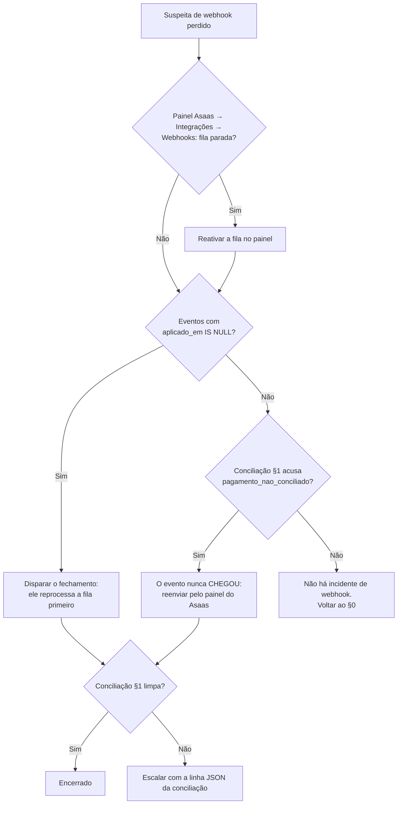

# Runbook — Incidentes de Billing e Conciliação (Asaas)

> Escopo: cobrança pós-paga via Pix Automático no Asaas (#36). Este documento é
> para **operação**, não para desenvolvimento — cada procedimento diz o gatilho,
> o comando exato e como confirmar que funcionou.
>
> **Regra que não se negocia:** nenhuma ferramenta deste runbook corrige billing
> sozinha. A conciliação (#375) é **somente leitura**. Toda correção é ato
> humano, deliberado, e a maioria é **irreversível** — emitir cobrança gasta
> dinheiro real da clínica; cortar por carência revoga a autorização de Pix
> Automático, e a volta exige que a clínica autorize de novo no app do banco.

## 0. Mapa rápido

| Sintoma                                            | Vá para |
| -------------------------------------------------- | ------- |
| Webhook do Asaas parou de chegar / fila com falhas | §2      |
| Ciclo preso em `aguardando_pagamento`              | §3      |
| Ciclo em `falhou` e a clínica diz que pagou        | §3      |
| Assinatura em `past_due` que precisa voltar        | §4      |
| Depois de qualquer manutenção / deploy / rotação   | §5      |
| "Será que os dois lados batem?"                    | §1      |

## 1. Conciliação (o diagnóstico)

Compara o estado local com o estado real no Asaas e nomeia as diferenças.
Não altera nada.

```bash
# No console do container `billing` (Easypanel → serviço billing → Console):
node scripts/conciliacao-billing.mjs
```

Saída: **uma linha JSON**. Exit code `0` = passada completa e sem divergência.
Qualquer outro valor exige um humano.

### Classes de divergência e a reação de cada uma

| Classe                              | O que aconteceu                                                   | Reação                                                                                               |
| ----------------------------------- | ----------------------------------------------------------------- | ---------------------------------------------------------------------------------------------------- |
| `pagamento_nao_conciliado`          | Pago no Asaas, ciclo não fechou aqui. Webhook perdido.            | §2 (reprocessar a fila)                                                                              |
| `recusa_nao_aplicada`               | Recusado no Asaas, ciclo ainda esperando aqui.                    | §2, depois §3                                                                                        |
| `estorno_nao_tratado`               | Estornado no Asaas. Não há estado local que represente isso.      | Escalar — decisão de produto, não de infra                                                           |
| `pago_sem_lastro`                   | Ciclo `pago` aqui sem pagamento correspondente lá. **Grave.**     | Escalar imediatamente. Não mexer no banco.                                                           |
| `cobranca_inexistente_no_gateway`   | O Asaas não conhece o `provider_charge_id` que gravamos.          | Conferir se a chave de API é do ambiente certo (sandbox × produção) antes de qualquer outra hipótese |
| `valor_divergente`                  | Mesmo status, valores diferentes.                                 | Escalar — sinal de emissão fora do fluxo                                                             |
| `vinculo_cancelado_no_gateway`      | Autorização revogada lá, assinatura viva aqui.                    | §4                                                                                                   |
| `vinculo_pausado_no_gateway`        | Autorização pausada lá, assinatura `active` aqui.                 | §4                                                                                                   |
| `ativacao_nao_aplicada`             | Autorizado lá, `setup_pending` aqui. Webhook de ativação perdido. | §2                                                                                                   |
| `vinculo_nao_autorizado`            | `active` aqui sobre autorização que o Asaas nunca deu. **Grave.** | Escalar imediatamente                                                                                |
| `cobrancasSemCiclo` (lista à parte) | Dinheiro entrou e não há ciclo apontando para a cobrança.         | §3.3                                                                                                 |

**`falhasDeConsulta` não é divergência.** Significa que não conseguimos
perguntar ao Asaas sobre aquela linha — não sabemos nada sobre ela. Rode de
novo antes de tirar conclusão.

**`ciclosTruncado` / `vinculosTruncado` = `true`** significa que a passada parou
no teto (100 por varredura) e **há fila não conferida**. Rode de novo.

## 2. Webhook: reentrega e reprocessamento

### 2.1 Como o webhook falha (e por que 5xx é proibido)

A fila do Asaas para depois de **15 falhas consecutivas**, e evento não entregue
**some em 14 dias**. Por isso `POST /api/hooks/asaas` responde `200` mesmo
quando não consegue aplicar o efeito: a entrega fica persistida em
`asaas_webhook_event` com `aplicado_em IS NULL`, e a varredura
`reprocessarEventosPendentes` (que roda no início de **todo** fechamento de
ciclo) tenta de novo. Trocar isso por 5xx trocaria um efeito atrasado por um
webhook desligado.

### 2.2 Diagnóstico



Consulta da fila pendente (psql, console do `iris-postgres`, `-U iris`):

```sql
SELECT asaas_event_id, evento, processado_em, erro_aplicacao
FROM asaas_webhook_event
WHERE aplicado_em IS NULL
ORDER BY processado_em DESC
LIMIT 50;
```

> **Cuidado ao ler `erro_aplicacao`:** é um carimbo **histórico**, verdade do
> instante da gravação e nunca reavaliado. `aplicado_em` preenchido **com**
> `erro_aplicacao` é estado legítimo e comum (cobrança de ativação sem ciclo,
> evento de outra aplicação). "Deu errado" **não** é `erro_aplicacao IS NOT
NULL`. Quem reavalia o estado vivo é a conciliação do §1.

### 2.3 Reprocessar

A varredura de pendentes roda no começo do fechamento de ciclo. Para dispará-la
sem fechar ciclo nenhum, use o modo de ensaio:

```bash
node scripts/fechamento-ciclo-billing.mjs --dry-run
```

> ⚠️ `--dry-run` **não** desliga `reprocessarEventosPendentes` — e é isso que se
> quer aqui: o reprocessamento é idempotente (reconsulta o gateway pelo id), e é
> a apuração/emissão que o ensaio suprime.

**Como saber que deu certo:** rodar a consulta do §2.2 de novo e ver a linha
sair da fila, e a conciliação do §1 parar de acusar `pagamento_nao_conciliado`
para aquele ciclo.

### 2.4 Reenviar pelo painel do Asaas

Quando o evento **nunca chegou** (não está em `asaas_webhook_event`):
Painel Asaas → Integrações → Webhooks → histórico de entregas → reenviar.

> O corpo do webhook do Asaas **não é autenticado** (o token é fixo no header,
> não é HMAC sobre o corpo). Por isso a rota nunca confia no estado que veio no
> evento: ela reconsulta o Asaas pelo id. Reenviar um evento antigo é seguro —
> o efeito aplicado é o do estado **atual** da cobrança.

## 3. Cobrança presa

### 3.1 `aguardando_pagamento` que não anda

1. Rodar o §1. Se acusar `pagamento_nao_conciliado` → §2.
2. Se o Asaas também diz `pendente`: não há incidente. O Pix Automático tem
   janela de retentativa e `comandarRetentativasPendentes` corre no fechamento.
3. Se passou do vencimento e nada aconteceu: `aplicarBackstopDePrazo` carimba
   D+7 a partir de `vencimento_cobranca`. Conferir se essa coluna está
   preenchida — nula significa cobrança que nunca foi emitida.

### 3.2 `falhou` e a clínica afirma que pagou

Rodar o §1. Se acusar `pagamento_nao_conciliado`, o dinheiro entrou e o webhook
se perdeu → §2. **Nunca** editar `billing_cycle.status` à mão: `pago` é o único
estado que encerra a cobrança, e escrevê-lo sem o `provider_charge_id`
correspondente deixa a fatura sem lastro (a divergência `pago_sem_lastro` do
§1 existe justamente para pegar isso).

### 3.3 Dinheiro sem ciclo (`cobrancasSemCiclo`)

Cobrança nossa que o Asaas conhece e o banco não. Duas causas comuns, com
reações opostas:

- **Corrida benigna:** o evento `PAYMENT_CREATED` chegou antes de
  `billing_cycle.provider_charge_id` persistir. A linha **some sozinha** na
  próxima conciliação. Rodar o §1 de novo antes de escalar.
- **Emissão órfã:** a cobrança existe e nenhum ciclo aponta para ela. Escalar —
  não emitir nada novo, porque a segunda emissão vira cobrança duplicada.

## 4. Suspensão e reativação manual (`past_due`)

> ⚠️ **Irreversível.** O corte por carência vencida
> (`cancelarAssinaturasComCarenciaVencida`) **revoga a autorização de Pix
> Automático** no banco pagador. A volta não é um `UPDATE`: exige que a clínica
> autorize novamente no app do banco dela. Não force o corte para "limpar" o
> estado.

Ordem correta, e ela é a regra: o fechamento emite as cobranças do dia
(produzindo as recusas que carimbam `past_due`), depois vêm as retentativas,
e o corte é **por último**. Rodar o corte antes cortaria uma clínica cuja
cobrança ainda ia ser tentada.

**Suspender:** não há botão. A suspensão é consequência da carência vencida
(`past_due_desde` + `carencia_dias`, padrão 10). Se o negócio precisa suspender
antes, é decisão do Rômulo — abrir issue, não mexer no banco.

**Reativar:** a clínica refaz a autorização de Pix Automático pela tela de
assinatura. O débito acumulado dos ciclos `devido` é agrupado numa cobrança só,
ancorada no ciclo `devido` mais antigo (#290) — por isso `valor_divergente`
nunca é acusado numa âncora de agrupamento.

**Como saber que deu certo:** o §1 deixa de acusar
`vinculo_cancelado_no_gateway` / `vinculo_nao_autorizado` para aquela clínica, e
`subscription.status` volta a `active` pela via do webhook — não pela mão.

## 5. Checklist de validação de webhooks pós-manutenção

Rodar **depois de**: deploy, rotação de `ASAAS_WEBHOOK_TOKEN` ou
`BILLING_PROVIDER_API_KEY`, mudança de domínio, restauração de backup, ou
qualquer alteração no serviço `billing` do Easypanel.

- [ ] **A rota está no ar.** `curl -s -o /dev/null -w '%{http_code}' -X POST https://irisclinica.ia.br/api/hooks/asaas` → **401**. `401` prova que a rota existe e recusa sem token; `404` ou `502` é incidente. `401` **não** prova que o token do painel está certo.
- [ ] **O token bate.** Painel Asaas → Integrações → Webhooks → "Enviar teste". A entrega tem de aparecer como sucesso no painel **e** produzir linha nova em `asaas_webhook_event`. Só o painel não basta.
- [ ] **A fila está ativa.** Painel Asaas → Webhooks: a fila não pode estar parada por falhas consecutivas.
- [ ] **Os eventos certos estão marcados no painel.** A rota é agnóstica ao nome do evento — um evento **não marcado no painel simplesmente não chega**, e nada aqui acusa isso. Conferir a lista visualmente.
- [ ] **A chave de API é do ambiente certo.** `BILLING_PROVIDER_API_KEY` de sandbox contra `ASAAS_BASE_URL` de produção produz `cobranca_inexistente_no_gateway` em massa no §1 — o sintoma parece perda de dado e é configuração.
- [ ] **A env foi de fato aplicada.** No Easypanel, salvar variável **não** aplica: exige clicar em "Implantar". Conferir no console do container: `printenv | grep -c ASAAS_WEBHOOK_TOKEN` → `1`.
- [ ] **A fila pendente está vazia** (consulta do §2.2), ou está encolhendo entre duas leituras.
- [ ] **A conciliação sai limpa:** `node scripts/conciliacao-billing.mjs` com exit code `0` e `totalDivergencias: 0`.
- [ ] **Se `truncado: true`,** rodar de novo até sair `false` — senão o item acima afirma "limpo" sobre uma amostra.

## 6. O que NUNCA fazer

- `UPDATE billing_cycle SET status = 'pago'` à mão. Ver §3.2.
- Reexecutar `fechamento-ciclo-billing.mjs` sem `--dry-run` após uma passada que já emitiu cobrança — o próprio script avisa disso no stderr, e a reação certa é reexecutar **a etapa** que caiu, não a varredura inteira.
- Devolver 5xx no webhook por falha de aplicação. Ver §2.1.
- Tratar `erro_aplicacao IS NOT NULL` como "deu errado". Ver §2.2.
- Concluir qualquer coisa a partir de uma conciliação com `truncado: true` ou com `falhasDeConsulta > 0`.
